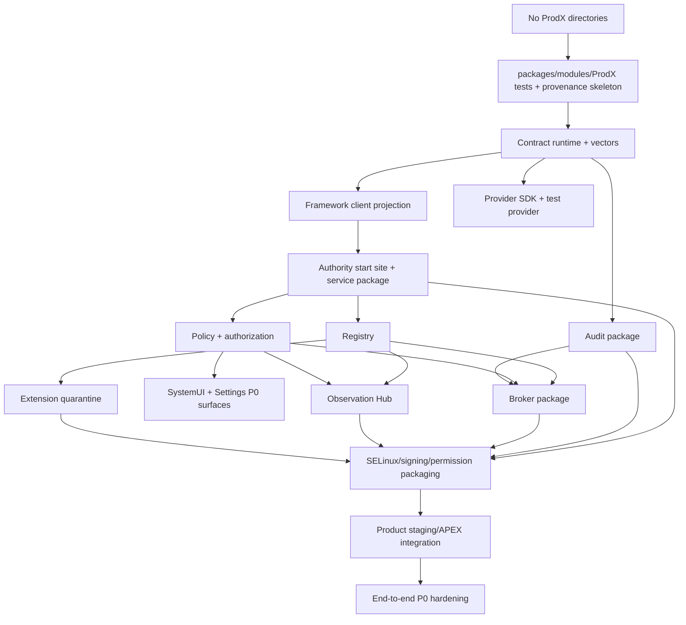
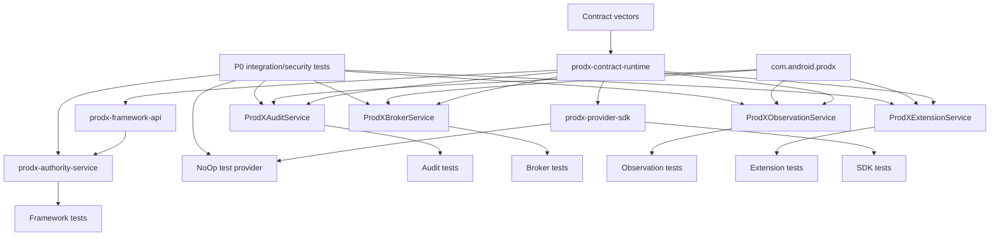
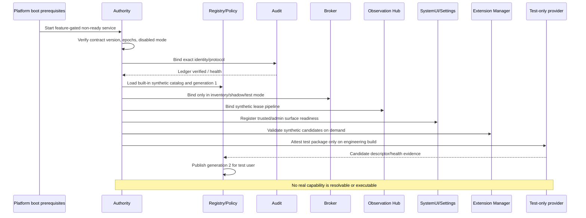
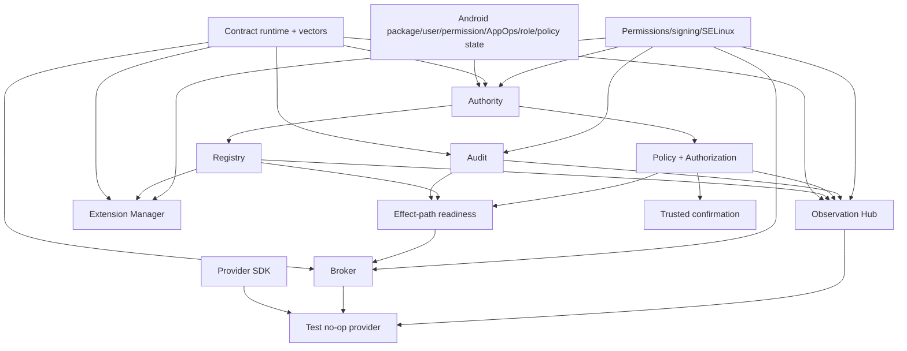
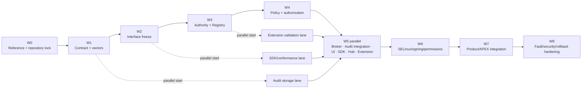

# ProdX P0 Runtime Implementation Specification

Version: 1.0.0-draft-freeze  
Date: 2026-07-14  
Status: Master P0 engineering plan; no implementation artifacts  
Scope: Empty Android 16 source tree through P0 release gate

## 0. Authority and immutable inputs

This document is the authoritative implementation plan for the ProdX P0
Runtime. It converts the frozen architecture into deterministic engineering
work without changing the architecture or defining production source syntax.

Immutable inputs:

| Reference | Authority | SHA-256 |
|---|---|---|
| `ProdX-Runtime-Architecture-Foundation-20260714.zip` | Security invariants, capability investigation, Android subsystem evidence, P0 scope | `ee03e61c7ffa77c7d0dedf8d5b1e69a972925fd67a5919a83f6e6a8a92c3a2ec` |
| `ProdX-Runtime-Contract-Specification-20260714.md` | Runtime objects, canonical serialization, state, compatibility, errors | `7c7743700c468847ef547bbbc22dcc9d1b027df0fee9e92895faee071706d886` |
| `ProdX-Runtime-Skeleton-Specification-20260714.md` | Repositories, modules, processes, SELinux domains, boot and update placement | `f332bace6730a290dcaff5a7703d8e499eac08dcd309cee63a31248997bffbd6` |
| Capability Investigation inside the Foundation archive | Source-tree inventory, service/HAL/package/SELinux/runtime evidence and bridge classification | Integrity covered by the Foundation archive manifest/hash |

This specification does not contain or authorize production Kotlin, Java, C++,
Rust, AIDL, SELinux policy, Android manifests, Soong files, product configuration,
or build scripts. It names the artifacts and targets that later engineering
tasks must create. Any code or interface review occurs as a tracked milestone,
not as part of this planning deliverable.

Precedence remains: Foundation security intent, Contract object semantics,
Skeleton physical placement, then this document's work sequence. A task that
would violate a higher reference is rejected rather than locally redesigned.

## 1. P0 outcome and non-goals

### 1.1 Required P0 outcome

P0 ends with a bootable, disabled-by-default capability runtime foundation that
can:

1. load and validate the frozen contract schemas and conformance vectors;
2. derive trusted caller/user/profile/attribution context;
3. start a minimal Authority in `system_server`;
4. publish immutable Registry generations from built-in test descriptors;
5. compute deterministic deny/allow/obligation decisions in shadow mode;
6. mint and verify parameter-bound, short-lived synthetic authorizations;
7. bind dedicated Broker, Audit, Observation, and Extension processes;
8. reserve and append tamper-evident synthetic transaction audit records;
9. exercise trusted SystemUI confirmation and Settings administration using
   test-only transactions with no Android side effect;
10. validate Provider Framework/SDK behavior using a test-only no-op provider;
11. validate subscription leases and synthetic observation/event delivery;
12. quarantine and validate synthetic extension metadata without execution;
13. survive service death, user switch/unlock/stop, package replacement,
   rollback simulation, unclean restart, stale version and malformed input;
14. prove through SELinux/signing/permission tests that model, broker, extension,
   and test provider cannot obtain generic Android authority; and
15. ship no real executable Android capability provider.

### 1.2 P0 execution modes

P0 supports only these ordered modes:

| Mode | Behavior | Release use |
|---|---|---|
| `DISABLED` | Authority may report disabled health; no dedicated runtime binding required | Product default and safe fallback |
| `INVENTORY_ONLY` | Contract, identity, built-in registry and infrastructure health; no request authorization | First integration stage |
| `SHADOW_POLICY` | Synthetic/test proposals resolve and evaluate; decisions/audit recorded; dispatch prohibited | P0 primary validation mode |
| `TEST_NO_OP` | Only the test package/no-op provider under test harness may receive synthetic authorization | Engineering builds and automated tests only |

`READ_ONLY_PROVIDER`, `REVERSIBLE_ACTION`, `EXTENSION_EXECUTION`, and all real
provider modes are P1 or later.

### 1.3 Non-goals and prohibited P0 work

- No battery, Wi-Fi, package, calendar, media, ROM, OEM, diagnostic, or other
  real provider implementation.
- No model inference requirement; a deterministic synthetic proposer is used in
  tests. Reasoning and Learning engines remain absent from the P0 product graph.
- No public third-party SDK/API commitment. Provider SDK is system/internal and
  conformance-focused.
- No HAL, native daemon, kernel, vendor service, content provider, arbitrary
  intent, shell, property, path, URI, or generic Binder bridge.
- No modification to existing Android permission/AppOps/role/device-policy
  semantics.
- No dynamic extension execution. Extension Manager validates/quarantines only.
- No network service, cloud dependency, remote model, telemetry export, or
  cross-device delegation.
- No production APEX update rollout until platform/APEX compatibility and
  rollback tests pass; platform-OTA staging may be used first.

## 2. Global engineering controls

### 2.1 Required branch and baseline controls

Before any P0 source task begins, record the Android manifest revision, product
configuration, JDK/build environment, Foundation/Contract/Skeleton hashes, and
the planned P0 specification hash in a checked-in provenance record. All P0
changes use a dedicated topic stack with one logical milestone per change set.
Unrelated device reconstruction changes are excluded.

Every change set must be independently revertible and must leave Android
bootable with ProdX disabled. No milestone may depend on an unreviewed local
patch from a later milestone.

### 2.2 Definition of ready for a task

A task may enter implementation only when:

- all prerequisite milestones are complete and their artifact hashes recorded;
- relevant contract object schemas/state transitions are frozen;
- consumed and exposed logical interfaces in Section 5 are assigned owners;
- source directory, target, process/domain and update unit match the Skeleton;
- positive, negative, death/restart and compatibility tests are written as test
  cases or fixtures before production behavior;
- permission/AppOps/user/profile/data/SELinux/signing implications are reviewed;
- rollback is a clean revert or feature-disabled state with preserved boot; and
- no real capability is accidentally reachable.

### 2.3 Definition of done for a milestone

Completion requires target compilation, owned unit tests, dependency/API checks,
negative/security cases, target-specific device tests, no new broad permission
or SELinux allow rule, documentation/provenance update, and a demonstrated
rollback. “Compiles” alone is never completion.

### 2.4 Change gates

| Gate | Meaning | Required approval |
|---|---|---|
| G0 Reference lock | Immutable inputs and threat invariants accepted | Architecture, platform security |
| G1 Contract lock | Canonical schemas, vectors, error/state catalogs accepted | Contract, security, privacy |
| G2 Interface lock | Logical endpoint ownership and technology-specific interface review complete | Framework API, Binder, security |
| G3 Process/build lock | Targets, UIDs, domains, packaging and dependencies accepted | Build/Soong, Mainline, SELinux |
| G4 Subsystem unit-ready | Individual subsystem passes isolated tests | Owning team |
| G5 Shadow integration | End-to-end synthetic transaction/observation/extension paths pass | Runtime integration, SystemUI, Settings |
| G6 Security/recovery | Fuzz, death, multi-user, downgrade, rollback and policy-negative gates pass | Security, privacy, release |
| G7 P0 freeze | Product defaults disabled/inventory-only; no real provider | Platform release board |

## 3. Exact repository and modification map

Directories are created only in the milestone listed. “Target” is the planned
Android build target name to be declared later; this document creates none.

| Repository path | Planned ownership/content | Planned targets | First write milestone |
|---|---|---|---|
| `packages/modules/ProdX/` | Top-level runtime module ownership, version/provenance and test aggregation | `com.android.prodx`, `prodx-p0` | P0-01 |
| `packages/modules/ProdX/framework/` | Canonical contract codec, schema validator and shared internal runtime values | `prodx-contract-runtime`, `prodx-contract-test-vectors` | P0-02 |
| `packages/modules/ProdX/sdk/` | Provider-facing system/internal SDK and validator | `prodx-provider-sdk` | P0-10 |
| `packages/modules/ProdX/service/broker/` | Dedicated Broker package/process | `ProdXBrokerService` | P0-09 |
| `packages/modules/ProdX/service/observation/` | Observation Hub and Event Pipeline | `ProdXObservationService` | P0-11 |
| `packages/modules/ProdX/service/audit/` | Audit/recovery package and ledger | `ProdXAuditService` | P0-07 |
| `packages/modules/ProdX/service/extension/` | Extension quarantine/validation package | `ProdXExtensionService` | P0-12 |
| `packages/modules/ProdX/providers/test/` | Test-only no-op provider; never in production product package set | `ProdXNoOpTestProvider` | P0-10 |
| `packages/modules/ProdX/apex/` | APEX packaging/compatibility metadata after platform-staging proof | `com.android.prodx` | P0-14 |
| `packages/modules/ProdX/sepolicy/` | Module process/file/service policy source after IPC graph freeze | `prodx-sepolicy-module` | P0-13 |
| `packages/modules/ProdX/tests/` | Host/device/fuzz/integration/conformance suites and synthetic fixtures | Test targets in Section 4 | P0-01 |
| `frameworks/base/core/java/android/app/prodx/` | Stable system/private client and contract projection | `prodx-framework-api` as part of framework build | P0-03 |
| `frameworks/base/services/core/java/com/android/server/prodx/` | Authority, Registry, Policy and authorization core | `prodx-authority-service` linked into `services` | P0-04 |
| `frameworks/base/services/tests/servicestests/src/com/android/server/prodx/` | Authority/Registry/Policy framework tests | `ProdXFrameworkServiceTests` | P0-04 |
| `frameworks/base/services/java/com/android/server/SystemServer.java` | One reviewed feature-gated Authority start site only | Existing `services` target | P0-04 |
| `frameworks/base/packages/SystemUI/src/com/android/systemui/prodx/` | Trusted test confirmation/auth/indicator UI | Existing `SystemUI` target | P0-08 |
| `frameworks/base/packages/SystemUI/tests/src/com/android/systemui/prodx/` | Trusted UI unit/device fixtures | `ProdXSystemUITests` | P0-08 |
| `packages/apps/Settings/src/com/android/settings/prodx/` | P0 enablement, kill switch, infrastructure health, synthetic history | Existing `Settings` target | P0-08 |
| `packages/apps/Settings/tests/unit/src/com/android/settings/prodx/` | Settings unit tests | `ProdXSettingsTests` | P0-08 |
| `system/sepolicy/public/` and `system/sepolicy/private/` | Core ProdX attributes, domains/service/file types and neverallow intent | Platform policy targets | P0-13 only |
| `frameworks/base/data/etc/` | Signature permission/privapp allowlist declarations only if approved | Existing platform configuration targets | P0-13 only |
| Product configuration for the chosen test product | Feature flag and staging package/APEX inclusion | Existing product target | P0-14 only |

### 3.1 Package namespace ownership

| Namespace | Planned content |
|---|---|
| `android.app.prodx` | System/private framework-facing values and manager façade |
| `com.android.server.prodx` | Authority, Registry, Policy, authorization, boot/user lifecycle |
| `com.android.prodx.contract` | Canonical module contract implementation |
| `com.android.prodx.runtime.broker` | Broker runtime |
| `com.android.prodx.runtime.observation` | Hub/event runtime |
| `com.android.prodx.runtime.audit` | Audit/recovery runtime |
| `com.android.prodx.runtime.extension` | Extension quarantine runtime |
| `com.android.prodx.sdk` | Provider SDK/internal conformance helpers |
| `com.android.prodx.provider.test` | Test-only no-op provider |
| `com.android.systemui.prodx` | Trusted confirmation/indicator integration |
| `com.android.settings.prodx` | Runtime administration/history integration |

### 3.2 Repository modification sequence

## 4. Planned target inventory and compile-time graph

These names are reserved for the implementation change sets. Renaming requires
an implementation-plan revision because test commands, ownership and dependency
reviews refer to them.

| Planned target | Type/placement | Direct compile-time dependencies | Must not depend on |
|---|---|---|---|
| `prodx-contract-test-vectors` | Read-only schema/vector asset set | None beyond platform data tooling | Android managers, services, provider code |
| `prodx-contract-runtime` | Internal platform Java library in ProdX module | Platform base libraries, frozen vector assets | Framework service internals, SystemUI, Settings, providers |
| `prodx-framework-api` | Framework system/private API projection | Platform core libraries and accepted contract value projection | Broker/provider implementation |
| `prodx-authority-service` | Static service library linked into `services` | Framework service APIs, `prodx-framework-api`, pinned contract validator projection | Broker, provider, extension parser, observation queue, model code |
| `ProdXAuditService` | Dedicated privileged service APK | `prodx-contract-runtime`, approved storage/keystore APIs | Broker/provider/extension/model implementation |
| `ProdXBrokerService` | Dedicated privileged service APK | `prodx-contract-runtime`, framework client projection | HAL/native-daemon/vendor libraries, provider implementations |
| `ProdXObservationService` | Dedicated privileged service APK | `prodx-contract-runtime`, bounded queue utilities | Real source-provider permissions, Broker implementation internals |
| `ProdXExtensionService` | Dedicated privileged service APK | `prodx-contract-runtime`, checked package/AppFunction client APIs | APK code loaders, Broker/provider execution code |
| `prodx-provider-sdk` | System/internal provider library | `prodx-contract-runtime`, stable framework client projection | Policy implementation, provider-family managers |
| `ProdXNoOpTestProvider` | Test-only APK | `prodx-provider-sdk` | Any privileged Android manager or production product package list |
| `ProdXFrameworkServiceTests` | Framework service tests | Authority/Registry/Policy test seams and vectors | Production providers |
| `ProdXContractTests` | Host/device contract conformance | Contract runtime and vectors | Framework services |
| `ProdXBrokerTests` | Broker unit/device tests | Broker target, fake logical endpoints, vectors | Real provider or HAL |
| `ProdXAuditTests` | Audit unit/device/power-loss tests | Audit target, deterministic storage fixtures | Broker implementation |
| `ProdXObservationTests` | Hub/event unit/device tests | Observation target and synthetic sources | Real sensors/content/notification access |
| `ProdXExtensionTests` | Parser/admission tests and fuzz corpus | Extension target, synthetic package metadata | Executing extension code |
| `ProdXProviderSdkTests` | SDK/no-op conformance | SDK and test provider | Production Android capabilities |
| `prodx_contract_fuzzer` | Host/device contract byte/schema fuzzer | Contract runtime and frozen corpus | Android services |
| `prodx_broker_protocol_fuzzer` | Broker request/state framing fuzzer | Contract runtime and Broker parser seam | Provider execution |
| `prodx_audit_record_fuzzer` | Audit record/ledger reader fuzzer | Contract runtime and Audit parser seam | Broker implementation |
| `prodx_observation_record_fuzzer` | Lease/observation/event framing fuzzer | Contract runtime and Hub parser seam | Real observation sources |
| `prodx_extension_manifest_fuzzer` | Manifest/descriptor/schema fuzzer | Contract runtime and Extension parser seam | Package code loading |
| `prodx_provider_protocol_fuzzer` | Provider request/result/health framing fuzzer | SDK validator and frozen corpus | Android manager calls |
| `ProdXSystemUITests` | Trusted confirmation UI tests | SystemUI integration and fake Authority | Broker/provider execution |
| `ProdXSettingsTests` | Admin/history UI tests | Settings integration and fake Authority/Audit view | Runtime storage direct access |
| `ProdXP0IntegrationTests` | Multi-process device tests | All P0 targets | Real providers/models |
| `ProdXP0SecurityTests` | Negative identity/permission/AppOps/SELinux/replay tests | Installed P0 staging graph | Debug bypasses/permissive policy |
| `prodx-p0` | Phony aggregate release gate | All P0 production and required test targets | P1 provider targets |
| `com.android.prodx` | APEX, enabled only after staging validation | Dedicated runtime APKs, contract runtime, compatibility metadata | Authority implementation, SystemUI, Settings, real providers in P0 |

Compile-time arrows do not grant runtime authority. Cross-process production
components share contract libraries only; they never link each other's service
implementations.

## 5. Logical interface ownership

Interface names below are architectural interface sets, not AIDL definitions.
G2 produces reviewed technology-specific specifications before any endpoint is
implemented.

| Interface set | Owner/exposer | Consumers | Contract objects/operations | P0 restriction |
|---|---|---|---|---|
| Runtime Client | Authority framework façade | Approved platform test client; later reasoning surfaces | Submit/query/cancel synthetic `CapabilityRequest`; get `CapabilityResponse`, availability and operation state | No ordinary app/public API; dispatch blocked except test UID/mode |
| Authority Control | Authority | Broker, Hub, Audit, trusted UI, Settings, Extension Manager | Identity/context derivation, resolve, policy, proof challenge, authorization verification, lease, kill switch, health | Each consumer gets a distinct least-privilege surface |
| Registry Query | Authority/Registry | Broker, Hub, Settings minimized view | Snapshot generation, exact resolution, change notification, availability/health | No mutable registration operation exposed to providers |
| Policy/Authorization | Authority | Broker, trusted UI, provider verifier | Policy decision, challenge, proof acceptance, authorization mint/verify/revoke | Synthetic/test capability namespace only in P0 |
| Audit Ledger | Audit Engine | Authority, Broker, Hub; Settings via minimized mediator | Reserve, append phase, reconcile, health, redacted history/export fixture | No caller can edit/delete a record or read raw store |
| Broker Transaction | Broker | Authority/runtime client, test proposer | Validate/coordinate/cancel/query transaction; route typed result | No generic endpoint selection or Android manager call |
| Provider Dispatch | Test provider | Broker | Descriptor/manifest/health; authorized request; cancel/status/result | Test-only no-op semantics and test package signature |
| Observation Lease | Authority | Hub, Broker, synthetic consumer | Create/revoke/validate `SubscriptionLease` and policy epochs | Synthetic sources only |
| Observation Source | Synthetic test provider | Hub | Register source identity, emit bounded `ObservationRecord`/`EventRecord`, unregister | No real callbacks/broadcasts/content/sensors |
| Observation Delivery | Hub | Broker/synthetic consumer | Subscribe, deliver, acknowledge, gap/backpressure/termination | No action authorization in payload |
| Extension Validation | Extension Manager | Authority only | Validate sealed candidate, return attested report/quarantine reasons | No Registry mutation, binding or execution |
| Trusted Confirmation | SystemUI | Authority | Show canonical challenge; return exact choice/auth-result reference | Synthetic effects only; overlays/spoofing negative tests |
| Runtime Administration | Authority/Audit mediator | Settings | Enable mode, emergency disable, grants fixtures, health, quarantine, synthetic history | No direct file/provider access; test grants only |
| Provider SDK verifier | Authority verifier service plus local SDK | Test provider | Verify authorization/audience/context; structured errors/cancel/audit correlation | Cannot mint policy or authorization |

### 5.1 Interface freeze deliverables

Before G2, each interface set must have a technology-neutral specification with
caller/callee identity, object types, size/count/depth bounds, sync/async model,
oneway prohibition or justification, timeout, cancellation, Binder-death
semantics, threading rule, user/profile scope, version/hash negotiation,
permission/AppOps/SELinux/signing requirements, stability class, error mapping,
logging/redaction and fuzz corpus. The review then chooses stable/platform AIDL
or an internal binding. No generic bundles, file paths, URIs, intents, Binder
handles, arbitrary maps or executable callbacks are permitted.

## 6. Runtime dependency and initialization plan

### 6.1 Compile-time versus runtime dependencies

Authority may compile against framework APIs and the pinned contract projection;
it runtime-depends on PackageManager, UserManager, permission/AppOps, roles,
DevicePolicy, activity/foreground state, trusted UI and Audit health. It never
compile-links Broker/Audit/Hub/Extension implementations.

Dedicated services compile only against contract/framework client libraries and
runtime-bind exact package/signature/protocol endpoints. APEX packaging is an
installation relationship, not a shared-UID or implementation-link relationship.

### 6.2 P0 initialization order

### 6.3 Runtime dependency graph

## 7. Milestone work breakdown

Milestones are numbered in integration order. Subtasks within a milestone are
small review units and must not be collapsed into one unreviewable change.

### P0-00 Reference lock, threat ledger and ownership

**Owner/directories.** Runtime architecture/release owners; documentation and
`packages/modules/ProdX/tests/reference/` only.

**Entry criteria.** Clean Android 16 baseline; all four immutable references
available and hash-verified.

**Work packages.**

1. Record source manifest/product/build-tool baseline and immutable hashes.
2. Convert every Foundation invariant into a numbered release-blocking
   requirement and negative test owner.
3. Assign code, contract, framework, Binder, SystemUI, Settings, security,
   privacy, multi-user, Mainline/APEX, test and ROM/OEM reviewers.
4. Establish the prohibited-primitives list and P0 no-real-provider rule as
   presubmit inputs.
5. Freeze target names, source namespaces, process/domain names and ownership
   from Sections 3–4.
6. Create decision-log policy: unresolved questions block the affected task;
   local implementation choices cannot change frozen boundaries.

**Interfaces/dependencies.** None. Consumes only immutable documents.

**Required validation.** Hash check; requirement-to-test traceability review;
ownership coverage; Android baseline builds/tests unchanged.

**Completion criteria.** G0 approved; every invariant has a test/reviewer;
there is one authoritative P0 requirement index.

**Rollback.** Documentation-only revert; no Android source behavior exists.

### P0-01 Repository/test skeleton and build-graph declaration

**Owner/directories.** `packages/modules/ProdX/` and
`packages/modules/ProdX/tests/`. Planned aggregate targets
`prodx-contract-test-vectors`, `ProdXContractTests`, and `prodx-p0` begin here.

**Entry criteria.** P0-00/G0 complete; build/APEX ownership accepted in
principle; no ProdX tree exists.

**Work packages.**

1. Establish repository ownership, README/provenance, target-owner map and test
   directory hierarchy without runtime behavior.
2. Define target visibility boundaries so only approved platform/module targets
   can depend on internal runtime libraries.
3. Define product-independent feature constants for disabled/inventory/shadow/
   test-no-op modes; no property or DeviceConfig namespace is exposed as a
   generic runtime control.
4. Reserve host/device test target names and fixture locations.
5. Add a presubmit inventory that fails if P1 provider directories/targets are
   included in the P0 aggregate.
6. Prove that the empty/disabled module graph does not alter boot or existing
   framework API surfaces.

**Compile-time dependencies.** Platform base test/build infrastructure only.

**Runtime dependencies/interfaces.** None; no installed service yet.

**Tests.** Empty target graph, visibility-negative checks, product inclusion
negative check, unchanged platform build graph, reproducible provenance.

**Completion criteria.** Skeleton targets can be selected without source-cycle
or product behavior; disabled build is byte/behavior-neutral except approved
metadata.

**Rollback.** Remove the isolated `packages/modules/ProdX` skeleton and target
references; no framework/product files have changed.

### P0-02 Contract runtime, schemas and conformance vectors

**Owner/directories/targets.** `packages/modules/ProdX/framework/` and
`packages/modules/ProdX/tests/contract/`; `prodx-contract-runtime`,
`prodx-contract-test-vectors`, `ProdXContractTests`.

**Entry criteria.** P0-01; Contract Specification 1.0.0-draft-freeze accepted;
Schema Profile 1 and deterministic CBOR rules have no unresolved semantic item.

**Work packages.**

1. Produce the normative schema inventory for every Section 8 Contract object,
   field, enum, bound, relationship and state transition.
2. Produce canonical positive vectors for CBOR, diagnostic JSON, hashes,
   identifiers, timestamps, sets, maps, version ranges and content references.
3. Produce negative vectors for unknown major/enums/authority fields,
   noncanonical encodings, duplicate keys, invalid Unicode, float use, recursion,
   unbounded depth/count/bytes, hash mismatch and schema substitution.
4. Plan immutable codec/validator layers: primitive canonicalization, envelope,
   schema registry, object validators, compatibility resolver and error mapper.
5. Define resource ceilings and rejection-before-allocation tests.
6. Define stable error-to-contract mapping without exception/stack leakage.
7. Establish vector generation/review provenance; generated vectors are checked
   in and reviewed independently of the implementation that consumes them.
8. Run differential validation using at least two independent test readers or a
   reference-vector verifier; one implementation cannot certify itself.

**Consumed interfaces.** Platform byte/text/time/hash primitives only.

**Exposed interfaces.** Local library operations for canonical encode/decode,
schema validation, compatibility check, content hash and typed validation error.
No IPC or Android manager access.

**Tests.** Host unit/property tests, fuzz corpus, round-trip and non-round-trip
canonical cases, golden hashes, memory/CPU/depth limits, forward/backward
compatibility, mutated-vector rejection.

**Completion criteria.** G1; every contract object has positive and negative
vectors; unknown security meaning fails closed; library has zero Android service
dependency; API/lint/dependency checks pass.

**Integration points.** P0-03 through P0-12 may compile against the frozen
contract runtime only after G1.

**Rollback.** Revert library and vectors together. No persistent/runtime state
is allowed before this milestone freezes.

### P0-03 Framework client projection and technology-neutral interface design

**Owner/directories/targets.**
`frameworks/base/core/java/android/app/prodx/`, framework API tooling/test
locations, `prodx-framework-api`.

**Entry criteria.** P0-02/G1; logical interface ownership in Section 5 approved;
framework API owner assigned.

**Work packages.**

1. Select the minimal system/private framework value projection required by
   clients and Authority; avoid duplicating all module-internal objects.
2. Produce technology-neutral specifications for Runtime Client, Authority
   Control, Registry Query, Policy/Authorization, Audit, Broker, Provider,
   Observation, Extension and trusted UI endpoints.
3. For each endpoint freeze identity, bounds, blocking/threading, lifecycle,
   version/hash, timeout, cancellation, death, user, stability and error rules.
4. Assign future stable/platform/internal interface class; P0 exposes no public
   SDK and no third-party API.
5. Define manager discovery behavior when Authority is absent, disabled,
   starting, incompatible or dead.
6. Define API signature-text expectations and compatibility test baselines,
   without creating production interface syntax in this planning phase.
7. Perform confused-deputy and generic-primitive review before G2.

**Consumed interfaces.** Frozen contract value semantics; platform framework
API conventions.

**Exposed interfaces.** Client-side value/API projection and manager lifecycle;
no service implementation.

**Tests.** API lint/signature review, parcel/wire size planning tests once
interfaces exist, absent/dead service behavior, malformed object rejection at
first trusted boundary, no public SDK exposure.

**Completion criteria.** G2 approved for all P0 interface sets; no generic
Bundle/intent/URI/path/Binder primitive; Authority can derive rather than accept
identity.

**Rollback.** Revert framework projection before any public API release. No API
becomes public/stable in P0.

### P0-04 Authority Service bootstrap, identity and lifecycle core

**Owner/directories/targets.**
`frameworks/base/services/core/java/com/android/server/prodx/`, corresponding
`servicestests`, one feature-gated start site in `SystemServer.java`;
`prodx-authority-service`, `ProdXFrameworkServiceTests`.

**Entry criteria.** P0-02/G1 and P0-03/G2; exact boot dependencies and feature
gate approved; no dedicated runtime service required yet.

**Work packages.**

1. Implement later as separate review units: lifecycle shell, boot-phase state,
   user lifecycle, emergency-disable epoch, caller identity derivation,
   package/signing attribution, context builder, component attestation client,
   health projection and dump/diagnostic redaction.
2. Add the single SystemServer registration point only after lifecycle shell
   tests pass outside the product graph.
3. Publish a non-ready logical service at `onStart`; do not publish readiness or
   bind external services until declared boot phases.
4. Derive UID/PID/SID, package/signing lineage, Android user/profile and
   attribution from trusted framework state. Treat requested purpose/surface as
   untrusted until policy validates it.
5. Partition DE/CE per-user state and define start/unlock/stop/remove cleanup.
6. Implement disabled/inventory mode first. All request authorization and
   dispatch remain hard-disabled.
7. Register death/epoch handling so `system_server` restart invalidates every
   proof, token, lease and operation generation.
8. Add bounded, redacted diagnostics that reveal no policy internals or user
   data to untrusted callers.

**Compile-time dependencies.** Framework service APIs; pinned contract/client
projection; no Broker/Audit/Hub/Extension implementation link.

**Runtime dependencies consumed.** PackageManager/package identity,
UserManager/user lifecycle, permission state, AppOps, roles, DevicePolicy,
activity/foreground/lock state, feature/module state. Each dependency has a
defined not-ready/dead response.

**Interfaces exposed.** Minimal Authority health/disabled state, trusted context
derivation and later least-privilege internal endpoints; P0 request execution
still rejected.

**Tests.** Boot-phase matrix, missing dependency, Binder identity spoofing,
shared UID/multi-package, isolated UID, package/signing change, multi-user/
profile, locked/unlocked/stopping/removed user, SystemServer restart epoch,
feature disabled, dump redaction, service absence compatibility.

**Completion criteria.** Authority starts after required services, never blocks
boot, remains disabled/inventory-only, derives identity correctly, and Android
boots identically when the feature gate is off.

**Integration points.** Supplies trusted facts to Registry/Policy and supervises
Audit/Broker/Hub/Extension in later milestones.

**Rollback.** Turn feature/product gate off, remove the single SystemServer start
site, then revert isolated service sources. No persisted state is required.

### P0-05 Capability Registry and availability reconciler

**Owner/directories/targets.** Registry packages under
`frameworks/base/services/core/java/com/android/server/prodx/`; validators/assets
under `packages/modules/ProdX/framework/`; framework service tests.

**Entry criteria.** P0-02, P0-04; Authority identity/lifecycle stable; built-in
synthetic descriptor set reviewed; no dynamic provider execution.

**Work packages.**

1. Implement immutable `RegistryEntry`, change and snapshot projections using
   Contract semantics and atomic generation publication.
2. Implement verified built-in catalog loading and hash/version/schema checks.
3. Implement deterministic resolution with exact provider/version selection,
   no hidden major/trust-tier fallback, and stable reason precedence.
4. Implement dependency graph validation, hard-cycle rejection, soft/degraded
   bounded evaluation and conflict handling.
5. Implement capability structural state and contextual availability/health
   projection separately.
6. Add reconciliation inputs for provider liveness, package/signature/version,
   enabled/user state, feature and policy epochs using synthetic entries only.
7. Add rebuildable snapshot cache with source-of-truth revalidation; cache never
   activates a provider by itself.
8. Add observer/change delivery with coalescing and generation boundaries.
9. Ensure providers can submit candidate evidence but cannot mutate/activate
   Registry state or assign risk.

**Compile-time dependencies.** Authority identity/context, contract runtime,
framework package/user/feature fact interfaces.

**Runtime dependencies.** Authority lifecycle, Android package/user facts,
synthetic provider death/health. Policy overlay is optional until P0-06 and
defaults to unavailable/blocked.

**Interfaces exposed.** Snapshot/generation query, deterministic resolve,
availability/health query and change notification; no public registration
mutation.

**Tests.** Golden snapshot hashes, atomic readers, concurrent reconciliation,
dependency cycles, signature/version/package replacement, stale generation,
provider death/recovery, user lock/switch/removal, incompatible catalog,
corrupt cache, deterministic resolution under input permutation.

**Completion criteria.** Generation 1 publishes only verified infrastructure
and synthetic descriptors; every state change creates a new immutable
generation; resolution is deterministic and fails closed.

**Integration points.** Broker, Hub, Settings minimized inventory, Extension
candidate admission and test provider attestation.

**Rollback.** Disable dynamic reconciliation, delete rebuildable cache, fall
back to verified empty/built-in disabled generation. No provider executes.

### P0-06 Policy Engine, grants, confirmation requirements and authorization core

**Owner/directories/targets.** Policy/authorization packages under
`frameworks/base/services/core/java/com/android/server/prodx/`; frozen catalogs
and tests in module/framework test locations; part of
`prodx-authority-service`.

**Entry criteria.** P0-02, P0-04, P0-05; risk/confirmation catalog and Policy
object semantics frozen; Android fact owners identified.

**Work packages.**

1. Implement deterministic policy input normalization and decision trace using
   exact Registry entry, request/context hashes and Android fact epochs.
2. Implement deny precedence across Android ineligibility, user/lock state,
   device policy, role, permission/AppOps, ProdX grant, quota, risk,
   confirmation/authentication and infrastructure health.
3. Implement platform-owned risk/obligation catalog; provider advice can only
   raise restriction and is non-authoritative by default.
4. Implement per-user grant store with DE/CE separation, grant epoch,
   revocation, expiry, purpose/scope and emergency-disable invalidation.
5. Implement confirmation-challenge state without UI first; missing UI yields
   `NEEDS_CONFIRMATION`/unavailable, never allow.
6. Implement proof validation binding user, exact request/parameter/provider,
   canonical consequence, policy decision, auth strength, nonce and expiry.
7. Implement short-lived authorization mint/verification with audience,
   request/context/decision/proof hashes, provider identity, registry/policy/
   grant epochs, replay state and audit reservation reference.
8. Implement revocation and epoch invalidation on policy, grant, user,
   signature, Registry, shutdown and emergency-disable changes.
9. Keep dispatch disabled until Broker/Audit/UI integration; synthetic unit
   verification only.

**Compile-time dependencies.** Authority context/identity, Registry value/query
layer, contract runtime, platform cryptographic/secure-random APIs as reviewed.

**Runtime dependencies.** Permission/AppOps/roles/DevicePolicy/user/lock/
foreground facts; later Audit reservation and trusted UI proof. Provider and
model are not dependencies.

**Interfaces exposed.** Evaluate policy, create challenge, accept trusted proof,
mint/verify/revoke exact authorization, manage test grants through Authority.

**Tests.** Decision-table golden vectors, input-order determinism, deny
precedence, provider risk-lowering attempt, permission/AppOp/role/policy change,
cross-user/profile, lock/foreground, expired/replayed/mutated/wrong-provider/
wrong-parameter token, epoch rollover, concurrent single-use, clock change,
grant CE lock and emergency disable.

**Completion criteria.** Same trusted inputs always produce same decision;
unknown/stale facts deny; no proof/token can be detached or replayed; dispatch
remains impossible.

**Integration points.** P0-07 Audit reference, P0-08 trusted proof, P0-09 Broker,
P0-10 provider verifier and P0-11 leases.

**Rollback.** Increment policy/grant epoch, revoke all synthetic tokens, disable
shadow policy, retain only redacted decision audit fixtures, revert code/catalog
together.

### P0-07 Audit Engine, transaction journal and recovery

**Owner/directories/targets.**
`packages/modules/ProdX/service/audit/`, audit tests and storage fixtures;
`ProdXAuditService`, `ProdXAuditTests`.

**Entry criteria.** P0-02/G1; Skeleton storage/domain decision frozen; Audit
record phase/retention/redaction semantics complete; storage and keystore owners
reviewed.

**Work packages.**

1. Implement dedicated service lifecycle and exact Authority binding identity;
   begin with in-memory test backend, then single-writer durable backend.
2. Implement append-only partitioned record model, transaction reservation,
   phase append, sequence/hash chain, content-hash validation and idempotent
   duplicate handling.
3. Implement DE global/minimal metadata and CE per-user detail partitions with
   explicit unlock/stop/remove behavior.
4. Implement journal/checkpoint/power-loss recovery and partition health states;
   never reset or truncate silently.
5. Implement mandatory field redaction/minimization before persistence; reject
   forbidden secrets, raw authorizations, credentials and unrestricted payloads.
6. Implement retention, privacy tombstone, supersession and export-fixture
   semantics as new records, not in-place mutation.
7. Implement minimized history view for Authority/Settings; raw store remains
   inaccessible.
8. Implement reservation failure behavior and descriptor-driven audit-required
   readiness. P0 synthetic dispatch cannot proceed without durable reserve.
9. Add crash points before/after reserve, dispatch marker, result and checkpoint
   for deterministic recovery tests.

**Compile-time dependencies.** Contract runtime; approved Android storage/time/
keystore APIs; no Authority/Broker implementation link.

**Runtime dependencies consumed.** Verified storage/keystore readiness and
Authority identity/epochs. It must operate without Broker/Hub/Settings.

**Interfaces exposed.** Reserve transaction, append phase/outcome, reconcile
status, health, minimized history/test export. No edit/delete/raw-query surface.

**Tests.** Golden hash chains, tamper/reorder/delete/duplicate detection,
fsync/power-loss matrix, process kill at every phase, DE/CE/user lifecycle,
retention/tombstone, forbidden payload, disk full/read-only/corruption, clock
change, concurrent writers rejection, caller spoofing, downgrade/rollback read.

**Completion criteria.** Durable reserve is acknowledged only after required
boundary; unclean restart reconstructs deterministic state; corrupt partitions
isolate/fail closed; sensitive payload exclusion is proven.

**Integration points.** Authority health, Policy authorization binding, Broker
transaction recovery, Hub metadata audit, Settings history.

**Rollback.** Disable effect path, stop Audit service, preserve ledger bytes for
compatible prior reader or test-only deletion under explicit engineering
procedure. Never silently downgrade/erase production-formatted evidence.

### P0-08 Trusted SystemUI confirmation and Settings administration

**Owner/directories/targets.** SystemUI and Settings ProdX paths/tests in Section
3; existing `SystemUI` and `Settings` targets plus `ProdXSystemUITests` and
`ProdXSettingsTests`.

**Entry criteria.** P0-04 Authority health/admin seam, P0-06 challenge/proof and
grant semantics, P0-07 minimized history; canonical UI text catalog and threat
model approved. Synthetic operations only.

**Work packages — SystemUI.**

1. Define one Authority-owned trusted confirmation entry path and readiness
   registration; no implicit broadcast/intent activation.
2. Render canonical capability/provider/requesting surface, exact parameters,
   target scope, purpose, consequence, risk, expiry and required authentication.
3. Visually separate optional model prose as untrusted context.
4. Bind user choice and Android-owned authentication result reference to the
   exact challenge; handle cancellation, timeout, user switch, lock, overlay,
   screen off and Authority death.
5. Add active synthetic-operation/observation indicator and emergency stop entry
   without executing any operation.
6. Add accessibility behavior that preserves security; secure surfaces reject
   automation/obscured touch as required by the threat model.

**Work packages — Settings.**

1. Add disabled/inventory/shadow/test-mode administration, with test mode hidden
   from production builds and protected by developer/test policy.
2. Add infrastructure/provider health, Registry generation, quarantine reason,
   synthetic grants and emergency disable views using Authority data only.
3. Add minimized synthetic audit history and a non-executable test undo entry that
   never executes a real capability.
4. Add per-user state, work-profile visibility rules, authentication for
   sensitive administration, learning/extension execution shown as unavailable
   in P0.
5. Tolerate absent, starting, dead and incompatible runtime without Settings or
   SystemUI crash.

**Compile-time dependencies.** Existing SystemUI/Settings platform libraries,
framework client projection; fake endpoints in unit tests. Neither links runtime
service implementations.

**Runtime dependencies.** Authority trusted/admin surfaces; Android auth UI;
Audit minimized history through Authority mediator. No Provider/Broker direct
dependency.

**Interfaces exposed/consumed.** SystemUI consumes challenge and returns proof
result; Settings consumes admin/history and requests policy-controlled state
changes. Neither exposes execution authority.

**Tests.** Screenshot/layout/localization/accessibility, canonical-vs-model text,
tapjacking/overlay/obscured touch, replay/mutated challenge, auth freshness,
timeout/cancel/back/user switch/rotation/restart, absent Authority, fake provider
name, Settings cross-user/admin controls, kill switch invalidation, UI process
death.

**Completion criteria.** Only trusted UI can produce an accepted synthetic
proof; Settings changes occur only through Authority; UI restart cannot grant;
no hidden consent or real operation exists.

**Rollback.** Authority marks UI unavailable and denies confirmation-required
work; revert isolated UI directories. Core SystemUI/Settings continue normally.

### P0-09 Broker transaction orchestrator

**Owner/directories/targets.**
`packages/modules/ProdX/service/broker/` and broker tests;
`ProdXBrokerService`, `ProdXBrokerTests`.

**Entry criteria.** P0-02, P0-05, P0-06, P0-07 and P0-03 interface lock;
Authority supervision identity fixed; synthetic transaction state machine and
retry/idempotency table approved.

**Work packages.**

1. Implement dedicated service lifecycle, Authority attestation, disabled/
   inventory/shadow/test mode and death notification.
2. Implement request framing, canonical schema/bounds validation, purpose and
   dependency-plan validation before Registry/Policy calls.
3. Implement immutable transaction state machine from proposed through
   validation, resolution, policy, user action, audit reserve, authorization,
   dispatch, cancellation and terminal reconciliation.
4. Implement exact generation resolution and stale-generation restart only
   before authorization; never silently change provider/version after user
   confirmation.
5. Implement trusted confirmation coordination through Authority, not direct UI
   binding.
6. Implement Audit reservation/phase append and fail-closed effect gate.
7. Implement provider binding only to Authority-resolved exact component;
   verify package/UID/version/signature and token audience again.
8. Implement timeout, cancellation, Binder death, backpressure, per-caller/user
   concurrency, idempotency key, accepted async operation and partial/unknown
   outcome recovery.
9. Implement minimized result validation; reject provider schema/data-policy
   violation and never fallback to generic Android execution.
10. Persist only bounded recovery checkpoints; on restart reconcile Audit and
    test provider state under fresh policy rather than replaying old tokens.
11. Hard-code production dispatch disabled for P0; test-no-op dispatch requires
    engineering build, exact test namespace/signature and explicit mode.

**Compile-time dependencies.** Contract runtime/framework client projection;
no provider implementation, Android capability manager, HAL/native/vendor
library or Authority implementation link.

**Runtime dependencies.** Authority Registry/Policy/authorization, Audit,
trusted UI indirectly, test provider in test mode, Hub control later.

**Interfaces exposed.** Synthetic client transaction submit/cancel/status and
Authority supervision; consumes exact provider dispatch. No generic Binder
proxy or endpoint enumeration.

**Tests.** State-transition exhaustive cases, malformed/oversized request,
stale generation, denial/confirmation/auth, Audit down, Authority/Broker/provider
death at every phase, cancel races, timeout, duplicate idempotency, partial/
unknown outcome, reboot, wrong endpoint, result schema violation, quota/flood,
production dispatch negative test.

**Completion criteria.** Shadow transactions resolve/policy/audit without
dispatch; test mode dispatches only no-op; Broker possesses no real Android
capability permission and cannot reach raw services/HAL/kernel.

**Rollback.** Authority stops binding Broker, revokes epochs/tokens and marks
Broker-dependent capabilities unavailable. Audit preserves terminal/unknown
records. Android remains unaffected.

### P0-10 Provider Framework, Provider SDK and test-only no-op provider

**Owner/directories/targets.**
`packages/modules/ProdX/framework/`, `sdk/`, `providers/test/` and SDK tests;
`prodx-provider-sdk`, `ProdXNoOpTestProvider`, `ProdXProviderSdkTests`.

**Entry criteria.** P0-02/G1, P0-03/G2, P0-06 authorization verifier semantics,
P0-09 provider dispatch lifecycle frozen. Test provider non-product inclusion
guarantee approved.

**Work packages — framework/SDK.**

1. Separate module-private provider runtime from the stable system/internal SDK
   projection; freeze target visibility and compatibility range.
2. Provide local contract validation, descriptor/manifest checks, request/output
   bounds, authorization-verifier client, caller/audience checks, attribution
   requirements, structured errors, cancellation, health/lifecycle and audit
   correlation conventions.
3. Make risk assignment, policy decision, authorization mint, endpoint discovery,
   generic manager access and permission acquisition structurally absent.
4. Define provider lifecycle `STARTING/READY/DRAINING/STOPPED/FAILED`, Binder
   death, update/drain and health-expiry conformance.
5. Create provider conformance harness driven by frozen vectors and negative
   authorization cases.

**Work packages — no-op provider.**

1. Create one test descriptor/manifest in a reserved test namespace, zero Android
   capability permissions, fixed bounded input/output, deterministic no-side-
   effect response and synthetic observation source.
2. Ensure it can be installed only by test targets/engineering configuration and
   is absent from production `com.android.prodx`/product package sets.
3. Exercise authorization/audience/hash/expiry/replay/caller validation before
   returning the synthetic response.
4. Provide controllable delay, cancellation, crash, malformed result and health
   modes only through the test harness, never a production debug command.

**Compile-time dependencies.** Contract runtime/framework system projection.
No Policy/Broker implementation or Android manager wrappers.

**Runtime dependencies.** Authority verifier and Broker/Hub test paths. No real
Android service dependency.

**Interfaces exposed.** SDK local helpers; test provider descriptor/health/
dispatch/cancel/status/synthetic source under test-only identity.

**Tests.** Full malformed request/result corpus, wrong caller/audience/user/
provider/version/hash/nonce/expiry, replay, cancellation/death/drain/update,
health expiry, SDK old/new compatible range, production image absence,
permission/SELinux no-authority proof.

**Completion criteria.** Reference provider passes conformance, performs no OS
capability, is absent from production package graph, and SDK cannot grant or
discover authority.

**Rollback.** Remove test provider from test product and uninstall; Registry
publishes removal generation; SDK/library can remain unused or revert with its
consumers.

### P0-11 Observation Hub and Event Pipeline

**Owner/directories/targets.**
`packages/modules/ProdX/service/observation/` and observation tests;
`ProdXObservationService`, `ProdXObservationTests`.

**Entry criteria.** P0-02, P0-05, P0-06 lease semantics, P0-07 metadata Audit,
P0-10 synthetic source; source/delivery interface sets locked.

**Work packages.**

1. Implement dedicated service lifecycle, Authority attestation and per-user
   readiness; no source permissions in Hub.
2. Implement lease validation/binding to user, purpose, source, schema, rate,
   transform, budget, policy/registry epochs and expiry.
3. Implement source registration only for exact Registry-attested synthetic
   endpoint; provider cannot self-create a lease or source identity.
4. Implement record schema/provenance/source sequence checks and separate
   observation snapshot versus event transition semantics.
5. Implement minimization/redaction/aggregation pipeline before queue admission.
6. Implement bounded per-user/source/subscriber queues, backpressure, rate/burst,
   dedupe, gap markers, ordering partitions and delivery acknowledgments.
7. Implement consumer/source/Authority death, user lock/stop/remove, revocation,
   expiry and update cleanup; unregister first and purge according to policy.
8. Implement metadata-only Audit; forbidden sensitive payloads never enter
   ledger.
9. Implement Hub restart with fresh leases/sequences and explicit delivery gaps.
10. Production source registration remains disabled; only synthetic test source
    is accepted in P0.

**Compile-time dependencies.** Contract runtime and bounded queue utilities;
no Broker implementation or real manager/source adapter.

**Runtime dependencies.** Authority Registry/Policy/lease, Audit, synthetic test
provider and test consumer/Broker.

**Interfaces exposed.** Lease-controlled source and delivery endpoints, health
and revocation acknowledgment. No execution operation.

**Tests.** Sustained flood, size/count/rate/burst, slow/dead consumer, source
spoof/replay/out-of-order/duplicate/gap, cross-user/profile, lock/unlock/stop,
revocation race, Hub/source death, restart, queue pressure/disk full, forbidden
payload/token-in-event, no production source acceptance.

**Completion criteria.** Bounded synthetic delivery survives stress without
memory leak or Authority/Broker blockage; revocation stops delivery and cleans
callbacks/queues; records never authorize action.

**Rollback.** Authority revokes all leases and unbinds Hub; sources unregister;
queues purge per policy; Registry marks observation infrastructure unavailable.

### P0-12 Extension Manager quarantine and candidate admission

**Owner/directories/targets.**
`packages/modules/ProdX/service/extension/` and extension parser/fuzz tests;
`ProdXExtensionService`, `ProdXExtensionTests`.

**Entry criteria.** P0-02/G1, P0-05 Registry candidate-admission seam, P0-04
package identity facts; Extension Manifest rules and parser resource limits
frozen.

**Work packages.**

1. Implement on-demand dedicated service lifecycle and Authority-only caller
   identity.
2. Accept sealed/bounded candidate metadata supplied through checked package/
   AppFunction/module evidence; never accept file paths or load package code.
3. Validate publisher/signing lineage, namespace ownership, manifest/descriptor/
   schema hashes, protocol range, bounds, dependency declarations, requested
   authorities, data policy and update/removal metadata.
4. Produce an attested candidate report or structured quarantine reasons;
   result remains non-authoritative until Authority/Registry policy overlay.
5. Implement candidate cache keyed by package/version/signature/content hash;
   cache is disposable and invalidates on every relevant package/module event.
6. Implement resource budgets, parser timeout, poison-candidate isolation and
   process crash recovery.
7. Implement remove/replace/signature-change/downgrade sequencing: Authority
   revokes old binding first, then validates new candidate.
8. Keep every candidate quarantined/non-discoverable-for-execution in P0. A
   synthetic approved candidate may appear only as disabled inventory evidence.

**Compile-time dependencies.** Contract runtime and checked platform package/
AppFunction client surfaces; no Registry implementation link or code loader.

**Runtime dependencies.** Authority task/identity endpoint and read-only package
metadata. No Broker, provider dispatch, token or Audit write authority beyond
minimal validation metadata through Authority.

**Interfaces exposed.** Authority-only validate/cancel/health report. No
registration, binding, execution or permission request operation.

**Tests.** Fuzz every metadata/schema layer; zip/path traversal and decompression
bomb rejection; unknown/recursive/remote/executable schema; namespace/signature
conflict; downgrade; package replace/remove; timeout/OOM/crash; cache poisoning;
wrong caller; candidate self-lowers risk/requests generic authority; code-loading
and execution negative tests.

**Completion criteria.** Malformed/hostile candidates cannot affect Authority or
active generation; no extension executes; package changes deterministically
quarantine/revoke inventory.

**Rollback.** Unbind Extension Manager, discard cache, keep all dynamic
extensions unavailable. Built-in empty/synthetic Registry remains valid.

### P0-13 Permission, signing, UID, SELinux and storage packaging

**Owner/directories/targets.** Platform security, module security and package
owners; `system/sepolicy/{public,private}`, `packages/modules/ProdX/sepolicy`,
approved configuration locations and security tests.

**Entry criteria.** P0-04, P0-07, P0-09, P0-11, P0-12 process/IPC/storage graphs
implemented and stable; G2 interfaces locked; no unresolved runtime edge. This
milestone intentionally occurs late to prevent policy from legitimizing a
premature broad design.

**Work packages.**

1. Allocate unique package identity/UID and planned domains:
   `prodx_broker`, `prodx_audit`, `prodx_observation`, `prodx_extension`; reserve
   provider-family attributes without granting real provider access.
2. Define exact service labels and add/find/call direction for each logical
   endpoint; model/test UIDs receive only their declared path.
3. Define single-writer file types for Registry, Audit, Broker checkpoints,
   observation queues and extension cache; prohibit cross-domain file access.
4. Define signature permissions per interface family and exact package signing
   lineage; avoid platform shared UID and broad `system_app`/`platform_app`
   grants.
5. Add only individually reviewed privileged permissions/allowlist entries;
   record the Android owner and test for every one.
6. Prove Broker/Hub/Extension/no-op provider have no device node, raw HAL,
   native-daemon socket, unrestricted property, `/proc`/`sysfs`, app-private
   data, cross-user or generic service-manager access.
7. Define neverallow intent for isolated model/learning domains and future
   provider separation even though those processes/providers are not shipped in
   P0.
8. Verify user/profile data labels, CE/DE transitions, deletion and rollback.
9. Run enforcing-only boot and test; permissive or `audit2allow`-generated broad
   policy is prohibited.
10. Review Treble/Mainline policy compatibility; APEX update cannot require an
    unshipped policy expansion.

**Compile-time dependencies.** Finalized target/package names and IPC graph;
platform/module policy toolchain. Policy does not create a source dependency.

**Runtime dependencies.** Installed package identities, service manager,
filesystem labeling, Android permission manager and verified boot.

**Interfaces exposed.** None; this milestone constrains existing P0 endpoints.

**Tests.** SELinux enforcing boot, service find/add/call positive matrix,
all undeclared-edge negatives, domain transition/UID/signing mismatch, privapp
allowlist enforcement, neverallow/compat mapping, isolated-app denial, storage
label ownership, package replacement/signing rotation, `dumpsys`/debug surface
access, no raw HAL/device/socket/property/proc/sysfs.

**Completion criteria.** G3 and security review; every allowed edge maps to one
Section 5 interface; no broad domain/attribute/permission; all prohibited edges
are tested and denied.

**Rollback.** Disable product inclusion first, remove new service bindings and
data, then revert module/core policy together. Never roll back binaries while
leaving a more permissive orphaned policy active.

### P0-14 Product staging, APEX packaging and service registration integration

**Owner/directories/targets.** `packages/modules/ProdX/apex/`, selected test
product configuration, existing framework/SystemUI/Settings product inclusion;
`com.android.prodx` and `prodx-p0`.

**Entry criteria.** All subsystem unit gates G4; P0-13/G3; staging strategy
selected: platform package staging first or APEX. Package/APEX key and rollback
owner established.

**Work packages.**

1. Assemble dedicated runtime services and contract assets without Authority,
   SystemUI, Settings, test provider or real providers inside the APEX.
2. Declare accepted framework-anchor/runtime protocol range and exact module
   identity/version; incompatible module leaves Authority disabled.
3. Integrate feature-gated SystemServer start and exact package bindings in
   disabled mode on the selected test product.
4. Add packages one at a time in order: Audit, Authority bootstrap, Registry,
   Broker, Hub, Extension, then UI/admin surfaces; run boot/recovery tests after
   each addition.
5. Add the no-op provider only to engineering/test product configuration, never
   the production runtime APEX or user product.
6. Validate APEX staged install/activate/reboot/rollback and platform-staging
   fallback with identical process/storage boundaries.
7. Validate module update drains/revokes, checkpoints Audit, replaces processes,
   re-attests identities, publishes a new generation and leaves old tokens/
   leases invalid.
8. Validate data downgrade window; incompatible newer persistent state keeps
   effects disabled rather than permissively converting.
9. Define watchdog/health rollback signals that do not make Android boot depend
   on ProdX.

**Compile-time dependencies.** P0 runtime APK targets, contract assets and
compatibility metadata. Authority remains part of platform services, not APEX.

**Runtime dependencies.** APEX/package manager, Authority binding, SELinux,
storage/keystore, SystemUI/Settings readiness. No real provider/model.

**Interfaces exposed.** Installed P0 services exactly as Section 5; production
mode remains disabled/inventory-only.

**Tests.** Clean boot, first boot, upgrade, downgrade, rollback, interrupted
staged update, incompatible version/hash, missing component, wrong key,
service crash loop, safe mode, system_server restart, data migration/corruption,
Android boot with module absent/disabled, production image test-provider absence.

**Completion criteria.** Runtime graph installs/starts/rolls back atomically;
Android boots when unavailable; Authority refuses incompatible service/module;
product default is `DISABLED` or approved `INVENTORY_ONLY`.

**Rollback.** Emergency-disable epoch, revoke all runtime state, staged APEX
rollback or remove platform-staging packages, retain Audit according to reader
compatibility, and leave framework anchor dormant.

### P0-15 End-to-end shadow integration, hardening and P0 release gate

**Owner/directories/targets.** Cross-team integration under
`packages/modules/ProdX/tests/`; `ProdXP0IntegrationTests`,
`ProdXP0SecurityTests`, component fuzzers, `prodx-p0` aggregate.

**Entry criteria.** P0-00 through P0-14 complete; G4 for every subsystem;
engineering product with test-only no-op provider; production-like product
without it.

**Work packages.**

1. Execute inventory-only boot and per-user registry lifecycle with no provider.
2. Execute shadow-policy synthetic request through client, Authority, Registry,
   Policy, SystemUI challenge, Audit reservation and Broker, proving dispatch is
   blocked.
3. Execute test-no-op transaction end to end, including exact authorization,
   provider revalidation, result minimization and completed Audit record.
4. Execute synthetic observation/event lease, rate/backpressure/gap/revocation
   and metadata audit; prove no event can authorize an action.
5. Execute synthetic extension discovery/validation/quarantine and package
   update/removal; prove no code loads/executes.
6. Run fault injection at every cross-process transition: caller death,
   Authority/system_server restart, Audit/Broker/Hub/Extension/provider/UI death,
   disk full/corrupt, clock/user/policy/package/module changes and power loss.
7. Run multi-user/profile matrix, direct boot/locked/unlocked/stopped/removed,
   role/permission/AppOps/device-policy change and cross-user attacks.
8. Run Binder/parser/schema fuzzing, oversized/deep/replay/concurrency/rate/
   memory/CPU/resource exhaustion and information-leak checks.
9. Run signing/UID/SELinux/service/storage negative matrix and verify zero broad
   access introduced.
10. Run APEX/platform upgrade/downgrade/rollback and stale object/token/lease/
    operation invalidation.
11. Verify P0 production image contains no no-op or real provider, no test mode,
    no model/learning engine, and no public API exposure.
12. Produce final traceability: every immutable invariant -> implementation
    target -> test -> result -> reviewer.

**Runtime integration path.** Client -> Authority/context -> Registry -> Policy
-> trusted UI when needed -> Audit reserve -> Broker -> test no-op only ->
Broker/Audit response. Observation and Extension paths remain separate and
non-authoritative.

**Tests/gates.** All planned targets plus platform boot/regression/API/lint,
Mainline/APEX, CTS-relevant permission/API, VTS/SELinux compatibility, security
and privacy review gates appropriate to the product.

**Completion criteria.** G5, G6 and G7; all P0 outcomes in Section 1.1 pass;
zero release-blocking defect; documented rollback demonstrated; real Android
capability execution is structurally and product-configurationally absent.

**Rollback.** Set emergency disable and product gate, revoke epochs/leases,
drain/stop dedicated services, rollback module/packages, keep dormant Authority,
preserve compliant Audit, and confirm Android regression suite remains green.

## 8. Parallel development and critical path

### 8.1 Work lanes

| Lane | Milestones | Can begin after | Blocking integration |
|---|---|---|---|
| Contract/conformance | P0-00, P0-01, P0-02 | Immutable references | Everything depends on G1 |
| Framework authority | P0-03, P0-04, P0-05, P0-06 | G1; G2 before endpoints | Broker/Hub/UI/Extension integration |
| Audit/storage | P0-07 | G1 and Skeleton storage review | Broker effect/test path, history, G5 |
| Trusted UI/admin | P0-08 | Policy challenge and Audit view semantics frozen | Confirmation-required shadow path |
| Broker | P0-09 | Registry/Policy/Audit logical interfaces frozen | End-to-end transaction |
| Provider framework/SDK | P0-10 | G1/G2 and authorization verifier spec | Test dispatch and synthetic source |
| Observation/event | P0-11 | Lease/policy, Audit and synthetic source specs | Observation integration |
| Extension quarantine | P0-12 | G1 and Registry candidate seam | Dynamic inventory/quarantine test |
| Platform security | P0-13 | Process/IPC/storage graph stable | Product install and enforcing tests |
| Packaging/integration | P0-14, P0-15 | All component G4 and G3 | P0 release |

### 8.2 Parallelization rules

- After G1, P0-03, P0-07 and the test-vector portions of P0-10/P0-12 can proceed
  in parallel.
- After Authority identity P0-04, Registry P0-05 and Audit P0-07 may proceed in
  parallel.
- After Registry/Policy interface freeze, Broker, UI, SDK, Observation and
  Extension implementations may proceed in parallel using fakes generated from
  the same reviewed logical interface specifications.
- P0-13 policy work may design the matrix earlier but cannot add final allows
  until actual endpoints/processes/storage are stable.
- P0-14 packaging may prepare metadata earlier but cannot install the graph
  before G3 and component G4.
- No team creates a local substitute for a missing prerequisite. Fakes remain
  test-only and contract-conformant.

### 8.3 Critical path

`P0-00 -> P0-01 -> P0-02/G1 -> P0-03/G2 -> P0-04 -> P0-05 -> P0-06 ->
P0-09 -> P0-13/G3 -> P0-14 -> P0-15/G7`.

Audit P0-07 must join before P0-09 integration; trusted UI P0-08 and Provider
SDK/no-op P0-10 must join before G5. Observation and Extension are parallel P0
release requirements even though they are not on the transaction critical path.

Waves show dependency and concurrency, not staffing estimates or promised
calendar dates.

## 9. Engineering task decomposition by role

| Engineering role | Owned task groups | Required handoff |
|---|---|---|
| Contract/schema | Schema inventory, canonical vectors, compatibility, error/state catalogs, fuzz seeds | G1 immutable vector release and version/hash |
| Framework/SystemServer | Client projection, Authority identity/lifecycle, Registry, Policy, authorization | G2 endpoints, boot/user lifecycle and framework tests |
| Runtime services | Broker, Hub/Event, Extension lifecycle and transaction logic | G4 service targets and death/recovery results |
| Storage/crypto | Audit ledger, DE/CE partitioning, integrity/key use, migration | Durable reserve/recovery and downgrade evidence |
| Provider SDK | Provider runtime/SDK, verifier integration, no-op test provider | Conformance results and production-absence proof |
| SystemUI | Trusted challenge/auth/indicator/emergency-stop surfaces | Anti-spoofing and lifecycle test results |
| Settings | Admin/health/grant/history/kill switch surfaces | Multi-user/admin and absent-runtime results |
| SELinux/platform security | Domain/service/file types, permission/signing/UID matrix, negative edges | G3 enforcing proof and neverallow review |
| Build/Mainline | Target visibility, product staging, APEX keys/version/update/rollback | Install/update/rollback results and dependency graph |
| Test/release | Test aggregation, fault/fuzz/multi-user/resource/security matrices, traceability | G5–G7 signed release report |
| Privacy | Data classification, minimization, audit/history/observation retention and UI | Field-level approval and deletion tests |
| ROM/OEM liaison | Confirm no P0 dependency on private device/ROM paths; review future seams | Written no-device-provider P0 assertion |

## 10. Validation matrix

| Validation dimension | Contract | Authority/Registry/Policy | Broker | Audit | Hub/Event | Extension | SDK/no-op | UI/Admin | Packaging/Security |
|---|---:|---:|---:|---:|---:|---:|---:|---:|---:|
| Canonical/schema/version | Primary | Required | Required | Required | Required | Primary | Required | Required | Compatibility |
| Caller/signing/user identity | N/A | Primary | Required | Required | Required | Required | Primary | Required | Primary |
| Permission/AppOps/role/policy | Semantics | Primary | No bypass | Evidence | Lease input | Requested authority validation | Recheck hook | Admin/auth | Negative enforcement |
| SELinux/service/file isolation | N/A | Boundary | Boundary | Primary storage | Boundary/queues | Parser boundary | Provider boundary | Existing domains | Primary |
| Multi-user/profile/direct boot | Object scope | Primary | Required | Primary | Primary | Candidate user scope | Required | Primary | Storage/labels |
| Death/restart/recovery | State semantics | Epoch/rebuild | Primary | Primary | Primary | Quarantine/cache | Lifecycle | UI restart | Supervisor/update |
| Replay/idempotency/cancel | Semantics | Token/proof | Primary | Duplicate phases | Sequence/lease | Work cancellation | Provider enforcement | Challenge cancel | Epoch/update |
| Resource/fuzz/DoS | Bounds | Inputs/concurrency | Primary | Disk/record bounds | Primary | Primary parser | Payload bounds | UI bounds | Process containment |
| Privacy/redaction/retention | Data policy | Decision/context | Result | Primary | Primary | Metadata | Hooks | Presentation/history | Data labels |
| Upgrade/downgrade/rollback | Compatibility | Epoch/snapshot | Checkpoints | Ledger reader | Queue purge | Cache discard | SDK range | Protocol mismatch | Primary |
| No real capability | Contract prohibition | No binding | Dispatch gate | No execution | Synthetic only | No execution | No-op only | Synthetic labels | Product inventory |

### 10.1 Required failure-injection checkpoints

Tests must be able to fail immediately before and after contract decode,
Registry resolve, policy decision, UI proof, Audit reserve, authorization mint,
provider dispatch, provider accept, provider result, Audit completion,
observation queue admission/delivery/ack, extension parse/attest, persistent
checkpoint and module activation. Each failure has one documented terminal or
recoverable state; ambiguous effects are never reported as success.

### 10.2 P0 release evidence package

G7 requires immutable hashes for source manifest, contract vectors, API/
interface baselines, target graph, installed-file/package inventory, sepolicy
binary/policy mapping, test results, fuzz corpus versions, APEX/package signing
identities, Registry baseline, policy/risk catalog, migration versions and this
implementation specification. Evidence must show the no-op provider and test
mode absent from the production-like image.

## 11. Android areas that remain untouched in P0

| Area | P0 rule | Later entry condition |
|---|---|---|
| Kernel, `bionic`, init/property service, native service managers | No modification or ProdX interface | None expected; semantic framework/provider need and separate review |
| `hardware/interfaces`, vendor HALs, device nodes, vendor daemons | No modification, dependency or direct access | P2/future device capability threat/VINTF/SELinux/recovery review |
| Existing core service implementations outside the Authority start seam | Do not modify AMS/WMS/PMS/AppOps/permission/role/DPM/storage/network/media/etc. | A provider proves a missing bounded owner API; owner-team review |
| PackageManager/AppFunction indexing internals | Consume existing checked metadata only; no execution changes | Extension execution phase after quarantine success |
| Content providers and provider databases | No ProdX query/write/call integration | P2 authority-specific schemas, grants and privacy review |
| Broadcast framework/callback sources | No real adapters/listeners | P1 observation provider after Hub release |
| SystemUI outside `com.android.systemui.prodx` | No unrelated UI/navigation/auth changes | Separate owner-approved UX requirement |
| Settings outside `com.android.settings.prodx` | No generic settings mutation or unrelated page changes | Separate owner-approved UX requirement |
| Launcher/QuickStep/voice/accessibility | No integration | P2/future signed surface and high-risk review |
| Lineage/Bliss/ASUS device repositories | No P0 runtime dependency or provider | P1 observation/P2 device provider with stable abstraction |
| Real provider-family directories | Do not create or package | P1 begins only after G7 |
| Learning/reasoning/model runtime | Do not create/package; use deterministic test proposer | Separate post-P0 privacy/isolation/resource plan |
| Public Android SDK/CTS API | No public API commitment | Post-P0 API council and third-party security model |

Any proposed P0 change outside the allowed paths in Section 3 requires a formal
revision of this master plan before implementation.

## 12. Integration and rollback playbooks

### 12.1 Incremental integration order

1. Contract vectors/runtime on host only.
2. Framework projection with no service.
3. Disabled Authority with no dedicated packages.
4. Static empty/synthetic Registry and shadow Policy with dispatch hard-off.
5. Audit package and durable synthetic reservation.
6. Broker package in shadow-only mode.
7. SystemUI/Settings synthetic surfaces.
8. Provider SDK and test-only no-op provider on engineering product.
9. Observation Hub with synthetic source.
10. Extension Manager with synthetic hostile/valid candidates, all quarantined.
11. Enforcing SELinux/signing/permission graph.
12. Platform-staging package graph, then optional APEX packaging.
13. Full fault/security/upgrade matrix and production-like absence proof.

At each step the product is booted and existing Android regression smoke tests
run before adding the next component. A failure reverts only the most recent
step; later components are never used to mask it.

### 12.2 Global rollback order

1. Authority emergency-disables new decisions/leases and increments epochs.
2. Broker stops admission, cancels pending UI and drains bounded test work.
3. Hub revokes leases/unregisters synthetic sources/purges queues.
4. Extension work cancels and cache is discarded.
5. Audit records terminal/unknown states and checkpoints.
6. Authority unbinds dedicated services and publishes disabled generation.
7. Package/APEX/product change is reverted atomically with compatible data
   handling and SELinux/service labels.
8. Framework Authority remains dormant or its isolated start change is reverted.
9. Android boot/regression and stale-token/lease rejection are verified.

Rollback never broadens policy, converts unknown outcome to failure/success,
deletes Audit silently, reuses an old authorization, or leaves permissive policy
behind after binaries are removed.

## 13. P0 implementation timeline and decision closure

The plan uses relative waves rather than elapsed-time promises:

| Wave | Required completed milestones | Parallel work | Exit |
|---|---|---|---|
| W0 — lock | P0-00, P0-01 | None before G0 | Reference/ownership/build skeleton frozen |
| W1 — contract | P0-02 | Contract fuzz/vector review | G1 |
| W2 — boundaries | P0-03, start P0-07 | Audit storage design parallel with interface review | G2 and Audit prototype tests |
| W3 — authority | P0-04, P0-05 | Audit implementation; SDK conformance scaffolding | Identity + immutable Registry G4 |
| W4 — policy | P0-06 | Extension parser and SDK/no-op work | Policy/authorization G4 |
| W5 — orchestration | P0-08, P0-09, P0-10, P0-11, P0-12 | Five teams against frozen interfaces/fakes | All subsystem G4 |
| W6 — confinement | P0-13 | Packaging metadata/test matrices | G3 enforcing graph |
| W7 — product | P0-14 | Upgrade/rollback and product inventory | Installable disabled/inventory graph |
| W8 — hardening | P0-15 | Fault/fuzz/security/privacy/release lanes | G5, G6, G7 |

No architectural choice is intentionally deferred. Technology-specific interface
syntax, exact source implementation and build/policy declarations are execution
artifacts created under G2/G3 reviews; their ownership, semantics, paths,
dependencies and gates are fixed here.

## 14. Final P0 acceptance checklist

P0 is complete only when every statement is true:

- Immutable reference hashes and requirement traceability match.
- Every planned target has an owner, dependency boundary, tests and rollback.
- Contract vectors cover every object/state/error/version and fail closed.
- Authority is the only ProdX code inside `system_server` and remains small.
- Registry generations are immutable/deterministic and providers cannot activate
  themselves.
- Policy decisions and authorizations bind exact trusted context, parameters,
  provider, purpose, epochs, proof and Audit reservation.
- Broker has no ambient Android authority and no generic execution path.
- Audit is durable, append-only, redacted, recoverable and independent.
- Observation/Event delivery is leased, bounded, minimized, revocable and
  non-authoritative.
- Extension parsing is isolated, bounded, quarantine-only and never loads code.
- Provider SDK cannot mint authority; the only P0 provider is test-only/no-op.
- Trusted UI proof cannot be spoofed/replayed/detached; Settings never executes.
- Unique UIDs/domains/storage/service labels and least permissions are enforcing.
- Multi-user/profile/direct-boot/user-removal behavior passes.
- Every process death, update, downgrade, rollback and power-loss checkpoint has
  deterministic safe recovery.
- Android boots and functions normally with ProdX absent, disabled or rolled
  back.
- Production-like installed-file/package inventory contains no no-op provider,
  test mode, model/learning component, real provider or public API.
- No P1/P2/future Android framework, HAL, ROM/OEM or provider area was modified.
- Emergency disable and rollback are demonstrated under test.
- G0 through G7 approvals and evidence hashes are recorded.

## 15. Normative conclusion

This specification turns P0 into a sequence of bounded engineering changes from
an empty Android source tree: lock references, establish the module/test graph,
freeze and validate contracts, create the framework boundary, build the minimal
Authority/Registry/Policy core, add independent Audit/Broker/Observation/
Extension services, add trusted UI/admin and a non-authoritative Provider SDK,
confine the graph with Android security packaging, integrate in disabled/shadow/
test-no-op modes, then prove recovery and rollback.

P0 delivers the secure runtime substrate, not an Android capability. P1 may
begin only after G7 and must add providers one family at a time without changing
the frozen contracts, physical skeleton or P0 authority boundaries.
