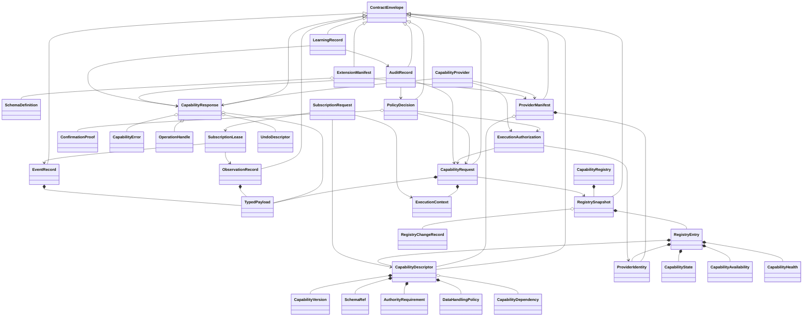
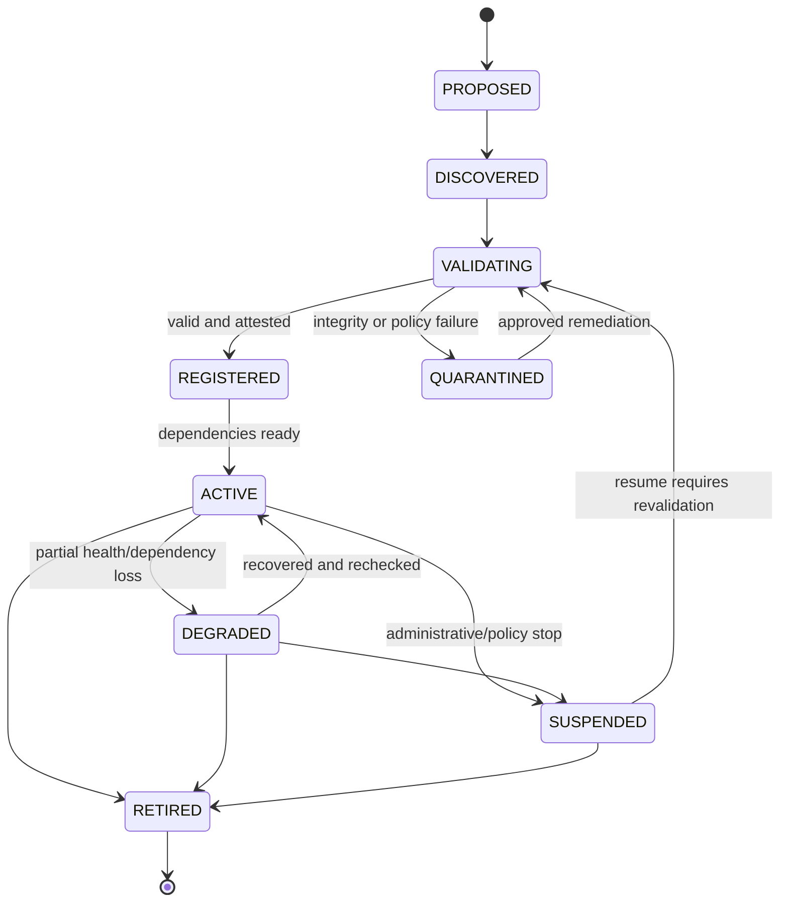
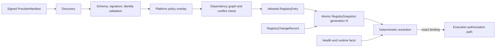
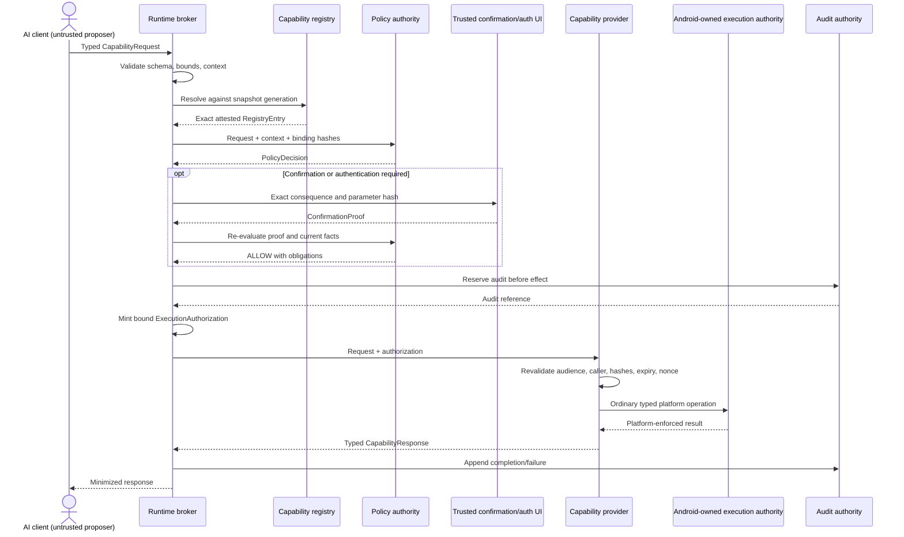
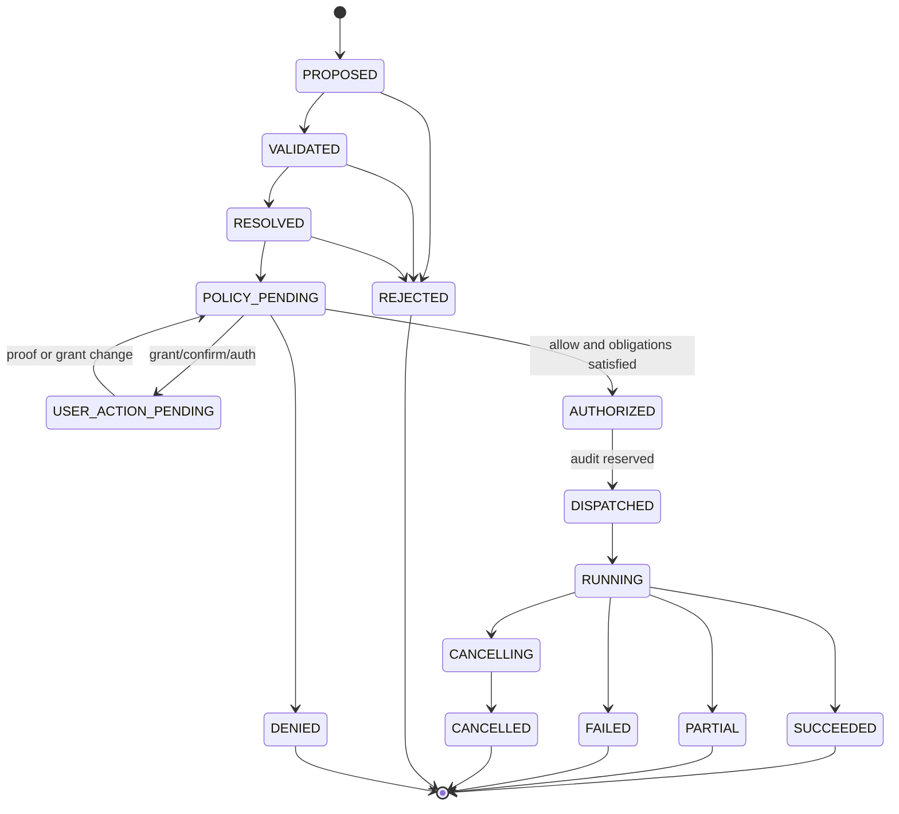
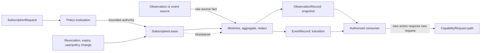
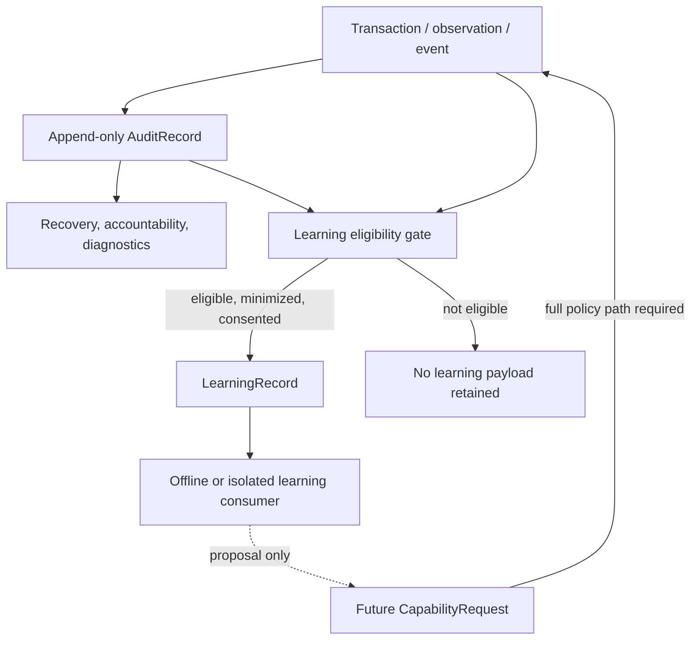
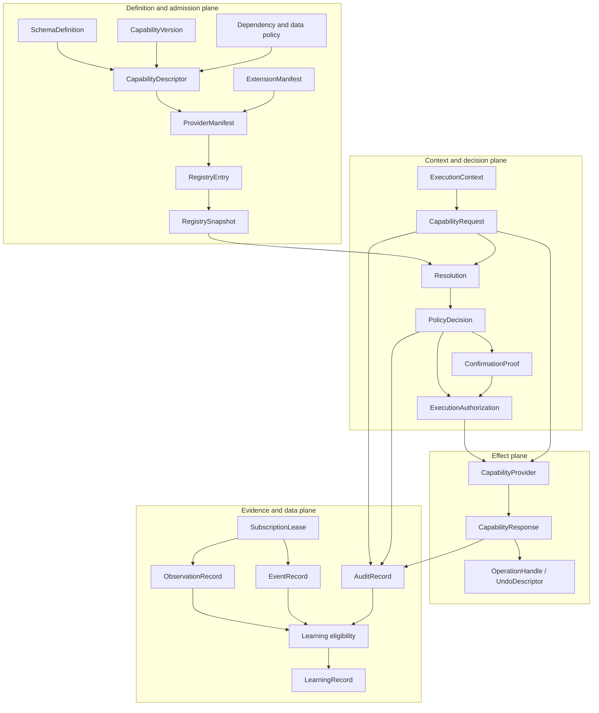

# ProdX Runtime Contract Specification

Version: 1.0.0-draft-freeze  
Date: 2026-07-14  
Status: Implementation-ready architectural contract; no implementation  
Authority: Derived from `ProdX-Runtime-Architecture-Foundation-20260714.zip`

Source archive SHA-256:
`ee03e61c7ffa77c7d0dedf8d5b1e69a972925fd67a5919a83f6e6a8a92c3a2ec`  
Authoritative foundation document SHA-256:
`dd80d78560d72e9b464f9df721a12e1c02fdc4390b60c44a0a00d99e977d8bf1`

## 0. Normative status

This document is the single source of truth for the ProdX Runtime contract
layer. It freezes the transport-neutral object model that every future runtime,
provider, observation source, policy component, learning component, and
extension must share before implementation begins.

This specification defines semantics and data contracts only. It deliberately
defines no Kotlin classes, Binder/AIDL interfaces, Android components, provider
implementations, storage engine, cryptographic library, or deployment code.
Future transports and languages must project this model without changing its
meaning.

The key words **MUST**, **MUST NOT**, **REQUIRED**, **SHALL**, **SHALL NOT**,
**SHOULD**, **SHOULD NOT**, **RECOMMENDED**, **MAY**, and **OPTIONAL** are
normative requirements.

If another design document conflicts with this contract specification:

1. the Architecture Foundation controls security and trust-boundary intent;
2. this specification controls runtime object semantics and compatibility; and
3. a conflict must be resolved by a new reviewed contract version, never by an
   implementation-specific interpretation.

## 1. Frozen architectural invariants

1. A reasoning component proposes; it never owns execution authority.
2. A registry describes and resolves; it never makes Android/platform policy
   disappear.
3. A policy decision can further restrict platform authority but cannot expand
   it.
4. An execution authorization is bound to caller, user scope, capability,
   provider, exact canonical parameters, purpose, registry generation, time,
   and required confirmation/authentication strength.
5. A provider revalidates the authorization and invokes only its declared
   bounded capability. The underlying operating system remains authoritative.
6. Observation and event delivery never implicitly authorizes a later action.
7. Audit is reserved before a high- or critical-risk effect and completed after
   the effect.
8. Learning records are non-authoritative. Learned output can propose future
   policy or plans but cannot grant, authorize, register, or execute.
9. Unknown security semantics fail closed. No fallback may broaden authority.
10. There is no generic shell, intent, Binder transaction, URI, path, property,
    HAL method, reflection, plugin loader, or arbitrary payload execution
    contract.

## 2. Contract classification and evolution authority

| Contract class | Objects | Evolution rule |
|---|---|---|
| Immutable platform core | Identifier grammar, canonical data model, `ContractEnvelope`, `CapabilityDescriptor` core, `CapabilityRequest`, `CapabilityResponse`, `CapabilityError`, `ExecutionContext`, `ExecutionAuthorization`, `PolicyDecision`, `AuditRecord`, registry snapshot semantics | Frozen within major version. Semantic change requires a new major contract version and explicit migration |
| Platform-extensible | Capability payload schemas, `CapabilityDependency`, `CapabilityAvailability` reason details, `ProviderManifest`, `ObservationRecord`, `EventRecord`, `ExtensionManifest`, declared extension blocks | Additions require registered namespaces and schemas; extensions may not alter core security meaning |
| Independently evolvable | Provider implementation version, health measurements, localized presentation metadata, learning feature/model metadata, diagnostic metrics | May evolve without a core contract revision when existing core validation and compatibility guarantees remain true |
| Runtime-generated immutable records | Requests, responses, policy decisions, authorizations, observations, events, audit records, learning records, registry snapshots | Never edited in place. Corrections, revocations, deletion requests, and supersession are new linked records |
| Mutable runtime aggregates | Live registry service, provider process, subscription manager, health evaluator | Mutable behavior is represented externally through immutable snapshot/change/record objects |

No provider or extension may redefine a core enum, identifier, validation rule,
risk tier, confirmation meaning, policy outcome, or error code. Namespaced
metadata is descriptive unless this specification explicitly assigns it
normative force.

## 3. Canonical abstract data model

All objects are defined over the following transport-neutral value system:

| Type | Normative rule |
|---|---|
| Boolean | Exactly `true` or `false` |
| Integer | Signed or unsigned integer with declared bit bound; core counters and timestamps use at most 64 bits |
| Decimal | Canonical base-10 text when exact decimal behavior is required; binary floating point is forbidden in signed/security-critical objects |
| Text | UTF-8, Unicode NFC, no unpaired surrogate, no control character except explicitly allowed whitespace |
| Bytes | Definite-length byte string with schema-defined maximum |
| Timestamp | UTC instant with millisecond precision; canonical text is RFC 3339 `YYYY-MM-DDTHH:MM:SS.sssZ` |
| Duration | Non-negative integer milliseconds unless a field explicitly permits signed duration |
| Identifier | Stable URN or UUIDv7 according to Section 4 |
| Hash | `sha256:` followed by 64 lowercase hexadecimal characters |
| Array | Ordered, definite length, schema-bounded; order has semantic meaning unless declared as canonical set |
| Canonical set | Array sorted by the field's declared comparator with no duplicates |
| Map/object | Text keys only; keys unique; schema closed unless an `extensions` member is explicitly allowed |
| Null | Allowed only where schema explicitly permits it; omission and null are never interchangeable |

Security-critical objects MUST NOT contain local object handles, file
descriptors, executable code, class names, reflection targets, unbounded byte
arrays, arbitrary filesystem paths, raw platform tokens, or transport-specific
references.

### 3.1 Common `ContractEnvelope`

Every top-level serializable object contains a common immutable envelope:

| Field | Meaning |
|---|---|
| `object_type` | Registered immutable type URN |
| `contract_version` | Version of this object contract |
| `object_id` | Stable ID for definitions; UUIDv7 for occurrences/records |
| `created_at` | Trusted creation timestamp |
| `issuer` | Stable principal/provider/authority ID that created the object |
| `schema_ref` | Exact schema ID and digest used for validation |
| `registry_generation` | Registry snapshot generation used, when applicable |
| `content_hash` | Hash of canonical content excluding signatures and this field |
| `extensions` | Optional namespaced, schema-declared, non-authority-expanding map |

`ContractEnvelope` is an immutable platform contract. Occurrence records may
also carry `correlation_id`, `causation_id`, and `transaction_id`; these are
UUIDv7 values and never replace the primary object ID.

## 4. Canonical naming and identifiers

### 4.1 Stable definition IDs

Stable definitions use lowercase ASCII URNs:

`urn:prodx:<kind>:<authority>:<namespace-segment>[:<segment>...]`

Allowed `kind` values are `capability`, `provider`, `schema`, `extension`,
`policy`, `event`, `observation`, `error-detail`, and `principal-class`.

Each segment:

- MUST match `[a-z][a-z0-9]*(?:-[a-z0-9]+)*`;
- MUST contain 1–48 characters;
- MUST NOT contain version numbers, environment names, device serials, user
  names, package signatures, or mutable branding; and
- is case-sensitive with lowercase as the only legal form.

The complete ID is limited to 200 ASCII characters.

Reserved authorities:

| Authority | Ownership |
|---|---|
| `platform` | ProdX core and OS-semantic capabilities |
| `android` | Android-defined semantic adapters owned by the platform build |
| `rom-<name>` | Reviewed ROM namespace, for example `rom-lineage` |
| `oem-<name>` | Reviewed OEM namespace |
| `app-<publisher>` | Dynamically registered publisher namespace; ownership is bound to signing identity |

Examples:

- `urn:prodx:capability:platform:power:battery:observe`
- `urn:prodx:capability:android:calendar:event:create`
- `urn:prodx:capability:rom-lineage:touch:glove-mode:set`
- `urn:prodx:provider:oem-asus:device-controls`
- `urn:prodx:schema:platform:capability-request`

A semantic operation uses one stable capability ID across backward-compatible
versions. A breaking semantic replacement receives either a new major version
or, when its meaning changes rather than merely its representation, a new ID.
Renaming never aliases silently; an explicit deprecation/supersession relation
is required.

### 4.2 Occurrence IDs and correlation

Requests, responses, decisions, authorizations, observations, events, audit
entries, learning records, operations, subscriptions, leases, and registry
changes use lowercase canonical UUIDv7 strings. UUID ordering may be used for
index locality but MUST NOT be treated as proof of trusted time or causality.

Correlation rules:

- `request_id` identifies one invocation attempt.
- `transaction_id` joins policy, confirmation, execution, audit, undo, and
  learning records for one logical effect.
- `correlation_id` joins a broader user workflow.
- `causation_id` points to the immediate immutable object that caused a record.
- retries use new request IDs but retain transaction/correlation identifiers and
  the same idempotency key when retry is permitted.

### 4.3 Namespace governance

Namespace ownership is itself registry data bound to a signing/trust identity.
Ownership cannot be transferred without an explicit authority-approved transfer
record. Package name alone is insufficient proof. Collisions, confusable Unicode,
and case variants are rejected. Display names are localized metadata and never
identifiers.

## 5. Serialization, canonicalization, hashing, and signatures

### 5.1 Normative encoding

The normative canonical encoding is deterministic CBOR using the Core
Deterministic Encoding requirements of RFC 8949, media type
`application/prodx+cbor`. It uses:

- definite-length items only;
- preferred integer and length encodings;
- canonical map-key ordering;
- no duplicate keys;
- no indefinite strings/arrays/maps;
- no floating point in security-critical objects;
- NFC-normalized text; and
- explicitly registered semantic tags only.

Canonical JSON (`application/prodx+json`) is a diagnostic and archival
projection. It uses UTF-8, sorted keys, no insignificant whitespace, canonical
decimal text, and base64url without padding for bytes. JSON is not the signing
input unless a future major contract explicitly says otherwise.

Hash and signature input is canonical CBOR with signature fields, `content_hash`,
and transport metadata omitted according to the object's schema. Implementations
must reproduce the same bytes for the same abstract object.

### 5.2 Size and depth limits

Every schema MUST declare maximum encoded size, nesting depth, collection count,
text/byte length, and numeric range. The platform profile defaults are 64 KiB
per control object, depth 16, 256 map members, and 1,024 array elements. A schema
may only raise a limit through explicit platform review. Bulk data is referenced
through a separately authorized bounded resource contract, never embedded
implicitly.

### 5.3 Signature and attestation neutrality

This specification defines what is bound, not a cryptographic implementation.
A signed object binds its object type, contract/schema versions, content hash,
issuer, subject/provider where applicable, registry generation, validity window,
and canonical content. Algorithm identifiers are allowlisted platform policy.
Unknown, deprecated, or weak algorithms fail closed.

## 6. ProdX Schema Profile 1

Payload and extension schemas are immutable `SchemaDefinition` objects encoded
as canonical JSON for review and hashed/canonically represented for runtime use.
The profile is a closed, security-oriented subset of JSON Schema 2020-12:

- allowed primitives: object, array, string, integer, boolean, null, exact
  decimal text, bounded bytes, identifier, timestamp, duration, and hash;
- object properties are declared and `additionalProperties` is false;
- required members are explicit;
- arrays declare item schema and maximum count;
- strings/bytes declare maximum length;
- integers declare minimum and maximum;
- enumerations are closed unless explicitly defined as an open descriptive enum;
- unions require a declared discriminator;
- references are local or immutable `SchemaRef` values with exact digest;
- recursive, dynamic, remote/network-fetched, executable, and implementation-
  specific schemas are forbidden; and
- regex constraints must use a bounded linear-time profile.

Every schema declares a data classification, redaction behavior, logging rule,
retention maximum, and whether each field participates in authorization,
idempotency, audit hashing, learning eligibility, and user-visible confirmation.

`TypedPayload` consists of an exact `SchemaRef`, the validated value, its
canonical content hash, and classification summary. A payload without an exact
schema digest is invalid.

## 7. Versioning and compatibility

### 7.1 `CapabilityVersion`

Versions use semantic triplets `major.minor.patch` with non-negative integers
and no leading zeros. Pre-release labels are forbidden in active registry
entries; drafts exist only outside active generations.

| Component | Meaning |
|---|---|
| Contract version | Core object semantics and state machines |
| Capability version | Semantic behavior of one capability ID |
| Input/output/event schema versions | Shape and constraints of typed payloads |
| Provider protocol version | Provider behavioral obligations |
| Implementation version | Diagnostic build identity; never a compatibility guarantee |

- Major: backward-incompatible semantic or schema change.
- Minor: backward-compatible optional addition or widened descriptive output
  that old consumers can safely ignore under declared open sections.
- Patch: clarification or defect correction that does not alter valid abstract
  objects or behavior.

### 7.2 Compatibility ranges

Consumers and providers declare closed ranges: minimum inclusive and maximum
exclusive. Resolution chooses the highest mutually supported non-deprecated
version permitted by policy. There is no implicit coercion between major
versions.

### 7.3 Compatibility guarantees

Within one major version:

- required fields are never removed or reinterpreted;
- enum members in closed/security enums are never added through a minor update;
- validation cannot be weakened for authority-bearing fields;
- input schemas may add only optional fields with safe defaults explicitly
  defined by the schema;
- output schemas may add optional descriptive fields only where the consumer
  contract declares them ignorable;
- errors retain their category, retry semantics, and security meaning;
- canonicalization and hash inputs never change; and
- extension data never changes core policy outcome unless promoted by a new
  reviewed core contract.

Deprecation records specify replacement, earliest removal major version,
reason, and migration requirements. Registry generations may carry concurrent
major versions during migration.

## 8. Complete object model

### 8.1 UML class diagram



### 8.2 Object inventory and authority

| Object | Owner/issuer | Mutability | Primary authority |
|---|---|---|---|
| `ContractEnvelope` | Platform specification | Immutable | Object identity, schema and canonical integrity |
| `SchemaDefinition`, `SchemaRef`, `TypedPayload` | Platform or reviewed namespace owner | Definitions immutable; payload occurrences immutable | Type safety and bounds, never execution authority |
| `CapabilityVersion` | Capability owner under registry review | Immutable value | Compatibility only |
| `CapabilityDescriptor` | Platform authority approves; provider supplies candidate metadata | Immutable per version | Declarative semantics; cannot self-authorize |
| `CapabilityDependency` | Descriptor owner; authority validates | Immutable | Availability prerequisite only |
| `AuthorityRequirement` | Platform policy owner | Immutable per descriptor version | Declares prerequisites; does not prove satisfaction |
| `DataHandlingPolicy` | Platform privacy/policy owner | Immutable per descriptor version | Maximum permitted handling; runtime may restrict further |
| `ProviderIdentity` | Platform authority/attestation process | Immutable identity version | Binds namespace and provider subject |
| `ProviderManifest` | Provider signs; authority admits | Immutable per manifest version | Candidate contributions only |
| `CapabilityProvider` | Provider owner; authority supervises | Live behavioral aggregate | Executes only after platform authorization |
| `CapabilityRegistry` | Platform authority | Mutable aggregate represented by immutable snapshots | Authoritative discovery and resolution |
| `RegistrySnapshot`, `RegistryEntry`, `RegistryChangeRecord` | Registry authority | Immutable | Point-in-time registry truth |
| `CapabilityState` | Registry reconciler | Immutable state value in an entry/change | Structural lifecycle |
| `CapabilityAvailability` | Registry/policy availability evaluator | Immutable contextual assessment | Current readiness guidance, not authorization |
| `CapabilityHealth` | Provider reports; authority evaluates | Immutable assessment | Operational condition only |
| `ExecutionContext` | Trusted authority derives | Immutable | Trusted identity/context facts |
| `PolicyDecision` | Deterministic platform policy authority | Immutable | Allow/deny/requirements decision |
| `ConfirmationProof` | Trusted UI/auth authority | Immutable opaque proof | Confirms exact transaction; does not execute |
| `ExecutionAuthorization` | Platform authority | Immutable, short-lived | Constrained permission to dispatch one bounded action |
| `CapabilityRequest` | Broker on behalf of derived principal | Immutable | Invocation proposal, not authority |
| `CapabilityResponse` | Provider, validated by broker | Immutable | Result report, not new authority |
| `CapabilityError` | Detecting trusted component | Immutable | Typed failure information |
| `OperationHandle` | Provider/broker transaction manager | Immutable reference with separate status records | Tracks declared asynchronous work only |
| `SubscriptionRequest`, `SubscriptionLease` | Broker requests; observation authority grants | Immutable | Bounded observation/event delivery scope |
| `ObservationRecord` | Observation provider/hub | Immutable | Snapshot evidence, no action authority |
| `EventRecord` | Event source/hub | Immutable | Transition evidence, no action authority |
| `AuditRecord` | Audit authority and trusted participants | Append-only immutable event | Accountability and recovery evidence |
| `UndoDescriptor` | Provider proposes; authority validates | Immutable | Bounded compensation metadata, not automatic permission |
| `LearningRecord` | Learning pipeline after privacy eligibility | Immutable; deletion represented separately | Non-authoritative learning evidence |
| `ExtensionManifest` | Extension publisher signs; authority admits | Immutable per version | Candidate extension contributions only |

### 8.3 Facet completeness rule

Every object inherits Sections 3 through 7; the per-object sections below add
only object-specific rules. Consequently, every object—also where a subsection
does not repeat the words—uses the canonical envelope where it crosses a trust
or persistence boundary, deterministic serialization, content hashing, closed
schema validation, SemVer compatibility, namespaced non-authoritative
extensions, typed failure, and fail-closed unknown semantics.

Definition objects (`SchemaDefinition`, descriptor, dependency, requirement,
data policy, manifests) are immutable after publication and evolve only through
new linked versions. Occurrence records (request, response, context, decision,
proof, authorization, observation, event, audit, learning, registry snapshot
and change) have the lifecycle `CREATED -> VALIDATED -> ACCEPTED`; rejected
bytes never become a valid object, and correction/supersession is a new record.
Short-lived proofs, authorizations, handles, and leases additionally become
`CONSUMED`, `EXPIRED`, `REVOKED`, or `TERMINATED` as their specific sections
define. Live aggregates (`CapabilityRegistry`, provider, health evaluator) are
not serialized as mutable object graphs; they expose immutable records and
snapshots.

Validation errors before a transaction exists are admission/protocol failures;
after a transaction exists they are represented by `CapabilityError` and an
`AuditRecord` when policy requires. No object permits an extension to replace a
core member, change a state transition, alter validation, or introduce an
authority-bearing interpretation without a reviewed core contract revision.

## 9. Foundational value objects

### 9.1 `SchemaDefinition`, `SchemaRef`, and `TypedPayload`

**Purpose and responsibility.** `SchemaDefinition` freezes the allowed shape,
bounds, classification, canonicalization, and field semantics of data.
`SchemaRef` selects one exact schema ID, version, and digest. `TypedPayload`
binds validated data to that exact reference and its canonical hash.

**Ownership.** Platform schemas are owned by the platform contract authority.
Provider/extension schemas are owned by an admitted namespace but require
registry validation before use.

**Required content.** A definition includes schema ID/version/digest, title and
semantic purpose, closed field model, bounds, compatibility class, data
classification, redaction/logging/retention rules, authorization-relevant field
set, confirmation-display field set, idempotency field set, and supersession
metadata. A reference includes only exact ID/version/digest. A payload includes
the reference, validated value, value hash, encoded size, and classification
summary.

**Lifecycle and states.** Draft definitions are outside active registries.
Reviewed definitions transition `PROPOSED -> VALIDATED -> ACTIVE -> DEPRECATED ->
RETIRED`. Active definitions are immutable; correction creates a new version.

**Relationships.** Descriptors reference input/output/error/event/observation
schemas. Requests, responses, observations, events, error details, extensions,
and learning features carry typed payloads.

**Versioning and compatibility.** Section 7 applies. Schema digest mismatch is
always incompatible even when ID/version text matches.

**Serialization.** Definitions use ProdX Schema Profile 1; payloads use the
canonical data model and encoding in Sections 3–6.

**Validation.** No remote references, unbounded fields, implicit coercion,
unknown properties, ambiguous union, or missing classification is permitted.

**Extensibility.** New schemas and new major versions are allowed within owned
namespaces. Extensions cannot weaken the schema used by a core field.

**Errors.** Invalid schema/payload yields `VALIDATION_FAILED`; unavailable or
unsupported schema yields `UNSUPPORTED_SCHEMA`; digest disagreement yields
`INTEGRITY_FAILED`. None is retryable without different validated input or
registry state.

### 9.2 `CapabilityVersion`

**Purpose.** Expresses the semantic version of a capability and the compatible
versions of its input, output, error, event, observation, provider-protocol, and
core contracts.

**Ownership/lifecycle.** Capability namespace owner proposes it; the platform
authority admits it. A version is immutable and moves through descriptor
lifecycle states rather than being edited.

**Required content.** Semantic triplet; compatible core contract range; exact
schema refs; provider protocol range; stability (`EXPERIMENTAL`, `STABLE`,
`DEPRECATED`); activation/deprecation dates; replacement version/ID when any.
`EXPERIMENTAL` versions are not eligible for critical capabilities.

**Relationships.** Embedded in `CapabilityDescriptor`; selected by registry
resolution; copied into request, authorization, response, audit, observation,
event, and learning provenance.

**Serialization/validation.** Canonical integers and closed stability enum.
Ranges must be nonempty; referenced schemas must exist; no implicit major
compatibility.

**Extensibility/errors.** Independent implementation versions may change
without changing this object. Incompatibility yields `UNSUPPORTED_VERSION` and
never falls back across a major boundary without a fresh resolution/policy
decision.

### 9.3 `AuthorityRequirement`

**Purpose.** Declares every external authority prerequisite that the provider
and underlying platform must enforce.

**Required content.** Requirement ID/type; enforcement owner; mandatory/optional
status; user/profile scope; permission, operation-control, role/default-handler,
device/enterprise policy, lock/foreground/network/hardware/feature conditions;
trusted attribution requirements; grant/confirmation/authentication class; and
failure reason mapping.

**Ownership and authority.** Only the platform policy owner may assign normative
requirements and risk/confirmation consequences. Provider manifests may request
requirements but cannot lower, satisfy, or self-approve them.

**Lifecycle/relationships.** Immutable within descriptor version. Registry
checks structural satisfiability; availability reports current status; policy
rechecks exact request-time facts; provider and underlying platform enforce
again.

**Versioning/serialization.** Closed platform requirement kinds within a major
contract. Namespaced descriptive conditions may be added but have no authority
until promoted by platform contract revision.

**Validation/errors.** Empty enforcement owner, unknown normative kind,
provider-asserted satisfaction, or contradictory scope rejects registration.
Unsatisfied requirements map to typed availability/policy outcomes, never a
generic failure.

### 9.4 `DataHandlingPolicy`

**Purpose.** Defines the maximum data exposure and handling permitted for one
capability and each payload field.

**Required content.** Classification (`PUBLIC`, `SYSTEM`, `PERSONAL`,
`SENSITIVE`, `HIGHLY_SENSITIVE`, `SECRET_PROHIBITED`); collection purpose;
minimization transform; allowed recipients; user/profile boundary; retention
maximum; audit treatment; redaction; exportability; learning eligibility;
aggregation requirements; foreground/indicator rule; and deletion behavior.

**Ownership.** Platform privacy/policy authority. Providers may impose stricter
limits but cannot relax them.

**Lifecycle/relationships.** Immutable in descriptor/schema version; evaluated
when forming request/authorization, producing response, delivering observation/
event, writing audit, and admitting learning data.

**Compatibility.** Relaxing a restriction is security-relevant and requires a
new reviewed capability/schema version. Tightening may occur through runtime
policy immediately and invalidates incompatible active subscriptions/tokens.

**Serialization/validation/errors.** Closed enums and bounded purpose IDs.
Missing or contradictory handling policy rejects registration. Prohibited
secret fields cannot be serialized; attempted inclusion yields
`DATA_POLICY_VIOLATION` and security audit.

### 9.5 `CapabilityDependency`

**Purpose.** Declares typed prerequisites without embedding implementation
logic in a descriptor.

**Required content.** Dependency ID; kind (`CAPABILITY`, `PROVIDER`, `FEATURE`,
`SERVICE`, `SCHEMA`, `POLICY`, `USER_STATE`, `HARDWARE`, `NETWORK`, `ACCOUNT`,
`ROLE`); target stable ID; compatible version range; requirement mode (`HARD`,
`SOFT`, `DEGRADES`, `CONFLICTS`); scope (`GLOBAL`, `PER_USER`, `PER_PROFILE`,
`PER_REQUEST`); readiness predicate ID; timeout; and safe failure mapping.

**Ownership/lifecycle.** Descriptor owner proposes; registry validates and
normalizes. Immutable per descriptor version. Dependency satisfaction is a
separate runtime assessment and never mutates the declaration.

**Relationships.** Registry builds the dependency graph; availability includes
unsatisfied dependencies; policy may add request-specific prerequisites; audit
records resolved versions.

**State transitions.** A dependency assessment is `UNKNOWN -> SATISFIED` or
`UNSATISFIED`; it may become `DEGRADED`, `CONFLICTING`, or `STALE` as registry
generation and runtime facts change.

**Validation.** Cycles among hard dependencies are rejected. Soft/degrading
cycles require an explicit fixed-point rule and bounded evaluation. Targets and
ranges must resolve in at least one supported product configuration.

**Extensibility/errors.** New descriptive dependency evidence may be namespaced;
new normative kinds require a core revision. Failure maps to `DEPENDENCY_FAILED`,
`UNAVAILABLE`, or `DEGRADED`, never to implicit fallback.

## 10. Capability definition and runtime condition

### 10.1 `CapabilityDescriptor`

**Purpose and responsibility.** The descriptor is the immutable, authoritative
definition of one callable, observable, policy, knowledge, event,
infrastructure, or extension capability. It describes *what* can be requested;
it is not a service handle, permission grant, policy decision, or proof that the
capability is currently usable.

**Required content.** Stable capability ID and namespace; `CapabilityVersion`;
role; human-facing label/description references; input, output, error,
observation, and event `SchemaRef`s as applicable; execution semantics
(`QUERY`, `COMMAND`, `STREAM`, `SUBSCRIPTION`, `POLICY`, `KNOWLEDGE`);
idempotency class; synchrony class; maximum duration and payload sizes;
side-effect class (`NONE`, `REVERSIBLE`, `IRREVERSIBLE`); risk class; required
authorities; dependencies; data-handling policy; confirmation/authentication
class; concurrency/rate constraints; cancellation and undo support; provider
selection rule; stability (`PLATFORM_STABLE`, `PRODUCT_STABLE`,
`EXPERIMENTAL`, `PRIVATE`); and deprecation/replacement metadata.

**Provider-role classification.** `role` is exactly one of
`CAPABILITY_PROVIDER`, `OBSERVATION_PROVIDER`, `POLICY_PROVIDER`,
`KNOWLEDGE_PROVIDER`, `EVENT_SOURCE`, `INFRASTRUCTURE_COMPONENT`, or
`EXTENSION_PROVIDER`. One implementation may publish multiple descriptors, but
each registry binding has one primary role so its authority cannot blur at
runtime. Capability providers accept authorized effects or queries;
observation providers emit bounded snapshots; event sources emit transitions;
knowledge providers answer typed read-only knowledge queries; policy providers
produce decisions only when they are platform policy authorities and otherwise
produce explicitly non-authoritative advice; infrastructure components support
registry, broker, audit, or transport operation and are not model-callable
unless a separate descriptor admits a safe surface; extension providers
contribute signed candidates through the extension admission lifecycle. A role
change is a new descriptor major version and cannot be expressed through an
extension field.

**Ownership.** The platform contract authority owns platform namespaces and
normative risk/security fields. An admitted publisher may own its namespace and
schema semantics, but its descriptor is only a proposal until registry
attestation overlays platform-assigned policy.

**Lifecycle.** `DRAFT -> VALIDATED -> PUBLISHED -> ACTIVE -> DEPRECATED ->
RETIRED`. Published content never changes in place. Correction requires a new
version; retirement blocks new resolution but does not erase historical
records.

**Relationships.** Provider manifests claim implementations; registry entries
bind descriptor versions to providers; requests reference one exact or ranged
version; responses, audit, observations, events, and learning records preserve
the resolved exact version.

**Compatibility and extensibility.** Additive optional descriptive metadata is
allowed through namespaced extensions. Any change to schemas, side effects,
authority, privacy, confirmation, error semantics, or idempotency follows
Section 7 and normally requires a capability minor or major version. Extensions
cannot override core fields.

**Validation/failure.** Reject duplicate IDs, namespace/signing mismatch,
unbounded data, generic execution primitives, ambiguous side effects, absent
data policy, incompatible schema directions, unresolved hard dependencies, or
provider-assigned lower risk. Failures are registration errors and never create
a partially callable capability.

### 10.2 `CapabilityState`

**Purpose.** Registry-owned structural lifecycle of one descriptor/provider
binding. It answers whether the binding is admitted—not whether a particular
caller may use it now.

**States.** `PROPOSED`, `DISCOVERED`, `VALIDATING`, `REGISTERED`, `ACTIVE`,
`DEGRADED`, `SUSPENDED`, `QUARANTINED`, `RETIRED`. State includes reason code,
effective time, registry generation, actor, and previous-state reference.

**Rules.** Only registry authority transitions state. `QUARANTINED` requires
fresh validation before activation. `RETIRED` is terminal for that binding.
Provider self-report may trigger assessment but cannot activate itself.
Transitions are append-only `RegistryChangeRecord`s; the current state is a
projection.



### 10.3 `CapabilityAvailability`

**Purpose.** A short-lived, context-specific assessment of whether a capability
can proceed for an identified user/profile and operation. It never grants
execution.

**Required content.** Capability/provider/version; context hash; registry
generation; status; blocking/degrading reason codes; unsatisfied dependencies;
required next action; assessed/expiry times; confidence (`AUTHORITATIVE` or
`ADVISORY`); and evidence references.

**Statuses.** `UNKNOWN`, `UNAVAILABLE`, `LOCKED`, `POLICY_BLOCKED`,
`NEEDS_GRANT`, `NEEDS_CONFIRMATION`, `NEEDS_AUTHENTICATION`, `READY`, and
`DEGRADED`. Precedence is fail-closed: integrity/unavailable, lock, policy,
grant, confirmation/authentication, degraded, ready. Independent blockers are
retained even when only the highest-precedence status is exposed.

**Lifecycle.** Computed on discovery and recomputed before authorization.
Changes in user, lock state, policy, grants, registry generation, provider
health, dependencies, or expiry make it stale. `READY` is not reusable as a
token.

**Compatibility/validation.** Status meanings are immutable within contract
major version. Unknown statuses fail closed. Assessment must identify scope,
generation, expiry, and evidence provenance; otherwise it is `UNKNOWN`.

### 10.4 `CapabilityHealth`

**Purpose.** Bounded operational evidence about provider readiness, kept
separate from policy and availability.

**Required content.** Provider/capability scope; `UNKNOWN`, `HEALTHY`,
`DEGRADED`, or `UNHEALTHY`; authority-assessed and provider-reported facets;
reason codes; probe type; latency/error-window summary; last success/failure;
assessed/expiry times; registry generation; and dependency health references.

**Ownership/lifecycle.** Providers report signals; registry/monitoring authority
owns the normative projection. Reports expire and may move freely among
nonterminal states. Health never reveals sensitive diagnostics to untrusted
callers and never overrides policy.

**Validation/errors.** Bounded windows, monotonic counters, trusted timestamps,
and explicit `UNKNOWN` on missing/stale evidence are required. Health failures
map to availability and typed errors, not stack traces.

## 11. Provider, manifest, and registry contracts

### 11.1 `ProviderIdentity`

Immutable identity containing provider ID, publisher ID, namespace claims,
binary/package identity reference, signing-certificate digest set, trust tier,
installation provenance, product scope, and optional hardware-backed
attestation reference. Registry authority resolves identity; provider claims
alone are non-authoritative. Signing rotation must be an explicitly authorized
lineage and never silently changes publisher ownership.

### 11.2 `ProviderManifest`

**Purpose.** Signed, declarative admission proposal for a provider. It contains
manifest version; `ProviderIdentity`; protocol-version range; descriptor and
schema hashes; abstract endpoint/binding types; lifecycle/health contract;
requested authorities; isolation requirements; data-handling commitments;
dependencies; supported product/user scopes; resource limits; migration and
removal behavior; and extension references.

**Ownership/lifecycle.** Publisher signs it; registry validates, attests, and
creates bindings. `DISCOVERED -> VERIFIED -> ADMITTED -> ACTIVE`, or
`QUARANTINED/REVOKED/REMOVED`. The manifest cannot confer permissions, assign
risk, select policy, or register code in the broker/system authority process.

**Versioning/validation.** Manifest schema uses independent SemVer while every
referenced object is content-hashed. Reject signature/namespace mismatch,
unknown executable binding types, mutable remote schema, missing bounds,
authority escalation, duplicate endpoint ownership, or incompatible runtime
protocol. Unknown extension data is retained only in a namespaced, size-bounded
map and is never interpreted as authority.

### 11.3 `CapabilityProvider`

This is an abstract contract role, not a language interface. A provider accepts
only typed requests plus valid `ExecutionAuthorization`, revalidates binding,
scope, expiry, nonce, user, version, request hash, and caller identity, then
invokes an ordinary platform-owned execution path. It returns typed responses,
health, cancellation status, and audit correlation. It must not accept model
credentials, generic commands, undeclared fields, or direct hardware/kernel
requests.

Provider instances have `STARTING`, `READY`, `DRAINING`, `STOPPED`, and
`FAILED` lifecycle states. `DRAINING` rejects new operations while allowing
bounded in-flight completion. Restart does not invalidate semantic idempotency,
and it never restores expired authorizations.

### 11.4 Registry records

`RegistryEntry` is the attested binding of exact descriptor version, provider
identity, endpoint binding, state, policy overlay, resolved dependencies,
health reference, user/product scope, admission evidence, and generation.

`RegistrySnapshot` is an immutable, atomically published view containing
generation, creation time, previous snapshot hash, Merkle/root hash, entries,
revocations, and compatibility metadata. A resolver operates against one
snapshot only; mixed-generation decisions are invalid.

`RegistryChangeRecord` is the append-only reasoned transition between snapshots
and contains actor, change type, affected IDs, before/after hashes, evidence,
and audit reference.

### 11.5 `CapabilityRegistry`

**Responsibilities.** Discover candidates; validate signatures/contracts;
attest identities; overlay platform policy; build dependency graphs; resolve
provider/version deterministically; publish snapshots; quarantine/revoke;
notify changes; and reconcile boot, package, user, policy, and provider state.
It does not execute capabilities.

**Resolution rules.** Inputs are capability ID, compatible version range,
execution-context facts, and one snapshot generation. Exclude non-active,
incompatible, unhealthy, out-of-scope, revoked, and unsatisfied candidates;
apply platform-owned deterministic preference; never let a model select a
provider by endpoint. Return exact entry or typed reason with no hidden fallback
across major versions or trust tiers.

**Availability and durability.** Registry has a minimal verified bootstrap
snapshot, then reconciles incrementally. Last-known state may support discovery
but never bypass fresh policy/identity checks. Registry unavailability fails
closed for new effects.



## 12. Execution and result contracts

### 12.1 `ExecutionContext`

**Purpose.** Immutable trusted facts used to evaluate one transaction: context
ID; principal and verified caller chain; user/profile/tenant scope; invocation
surface; attribution/purpose; foreground/visibility and lock state; policy and
grant epochs; device/network/hardware facts; locale/time zone where relevant;
registry generation; privacy budget; creation/deadline; and trace/correlation
IDs.

**Authority.** The broker/authority derives it from trusted platform sources.
Caller-supplied context is untrusted input and may only request a purpose. A
context is immutable, hash-bound, short-lived, least-data, and never reusable
across users or transactions.

### 12.2 `CapabilityRequest`

Required fields are request/transaction/correlation IDs; capability ID and
acceptable version range; typed input; requested purpose; idempotency key where
required; response mode; deadline; execution-context reference/hash; registry
generation; and optional prior operation/undo reference. Provider choice is
normally absent and is registry-resolved.

A request is a proposal, never authority. It is accepted only if schema-valid,
bounded, canonical, fresh, internally consistent, and compatible with the
descriptor. Mutating requests require a platform-scoped idempotency key.
Same key + same principal/capability/input/purpose returns the same outcome;
same key with different content is `CONFLICT`.

### 12.3 `PolicyDecision`

An immutable authority record with decision ID; `ALLOW`, `DENY`,
`REQUIRE_GRANT`, `REQUIRE_CONFIRMATION`, `REQUIRE_AUTHENTICATION`, or `DEFER`;
policy/rule versions; exact request, context, descriptor, provider, schema, and
registry hashes; reasons; obligations; risk classification; required trusted UI
text/choices/auth strength; allowed data transforms; expiry; and decision
authority/signature.

Policy decisions are deterministic for recorded inputs but short-lived. A later
stricter policy, revocation, scope change, or failed obligation invalidates an
earlier allow. Provider advice can only add restrictions. Multiple decisions
combine by deny/stronger-obligation precedence.

### 12.4 `ConfirmationProof`

Opaque proof issued only by trusted confirmation/authentication UI. It binds
user/profile, request and parameter hash, purpose, capability/provider/version,
displayed consequence, selected choice, authentication strength/freshness,
policy-decision ID, registry generation, issuance/expiry, and anti-replay nonce.
It contains no reusable biometric, credential, or raw authenticator data.

The proof is single transaction/scope use. Cancellation, timeout, parameter
change, user switch, policy change, or generation-invalidating revocation makes
it unusable. Providers can verify it only through the authorization binding.

### 12.5 `ExecutionAuthorization`

The sole runtime grant for dispatch. It is short-lived, least-privilege,
audience-restricted, single-use unless explicitly bounded otherwise, and binds
authorization ID; issuer; caller/user/profile; capability and exact version;
provider/endpoint; request/input/context/decision/confirmation hashes; purpose;
allowed side effect and resource limits; data transforms; registry/policy/grant
epochs; nonce/replay window; issued/expiry; cancellation channel; and reserved
audit record.

Any mismatch fails closed. Authorization is not transferable, renewable by a
provider, serializable into learning data, or usable for dependency calls unless
those calls are explicitly enumerated and separately policy-valid.

### 12.6 `CapabilityResponse`

Required fields are response ID; request/transaction IDs; exact capability and
provider versions; outcome (`SUCCEEDED`, `PARTIAL`, `FAILED`, `CANCELLED`,
`ACCEPTED`); typed minimized output or `CapabilityError`; completion time;
registry generation; provider result attestation; audit reference; and optional
`OperationHandle`/`UndoDescriptor`.

Output and error are mutually constrained by outcome. `SUCCEEDED` cannot carry
an error; `FAILED` must; `PARTIAL` must include a declared partial-result schema
and error; `ACCEPTED` must include a handle. Responses are immutable and
idempotently retrievable within retention policy. They convey facts, not new
authority.

### 12.7 `CapabilityError`

Errors contain stable code; category (`CALLER`, `POLICY`, `AVAILABILITY`,
`DEPENDENCY`, `PROVIDER`, `DATA`, `INTEGRITY`, `TIMEOUT`, `CANCELLATION`,
`INTERNAL`); origin; safe message key; bounded structured details schema;
retry disposition (`NEVER`, `AFTER_USER_ACTION`, `AFTER_STATE_CHANGE`,
`AFTER_DELAY`, `SAFE_IMMEDIATE`); optional retry time; correlation/audit IDs;
and causation references. No secrets, raw policy internals, paths, or stacks.

Core codes are: `VALIDATION_FAILED`, `UNSUPPORTED_SCHEMA`,
`UNSUPPORTED_VERSION`, `INTEGRITY_FAILED`, `NOT_FOUND`, `UNAVAILABLE`,
`USER_LOCKED`, `POLICY_BLOCKED`, `NEEDS_GRANT`, `NEEDS_CONFIRMATION`,
`AUTHENTICATION_REQUIRED`, `DENIED`, `CONFLICT`, `STALE_GENERATION`,
`DEADLINE_EXCEEDED`, `RATE_LIMITED`, `CANCELLED`, `DEPENDENCY_FAILED`,
`PROVIDER_UNHEALTHY`, `DATA_POLICY_VIOLATION`, `PARTIAL`, `FAILED`, and
`INTERNAL`. Unknown codes in a known major are treated as `FAILED` while the
original namespaced value is retained for diagnostics.

### 12.8 Asynchronous and compensating objects

`OperationHandle` is an opaque, scoped reference with operation ID, owner,
capability/provider, status endpoint class, allowed actions, issue/expiry,
poll/event limits, and audit reference. Status is `ACCEPTED -> RUNNING ->
WAITING` (optional) -> one of `SUCCEEDED`, `PARTIAL`, `FAILED`, `CANCELLED`, or
`EXPIRED`; `CANCELLING` may precede cancellation. Polling/cancellation requires
fresh caller authority; the handle itself is not a bearer grant.

`UndoDescriptor` declares bounded compensation capability, target effect/audit
record, deadline, preconditions, consequence schema, and availability. Undo is
a new request with new policy decision, confirmation when required, and audit;
it is never automatic rollback authority.





## 13. Observation, event, and subscription contracts

### 13.1 `SubscriptionRequest` and `SubscriptionLease`

A subscription request declares source capability, observation/event schema,
purpose, user/profile, filters, aggregation/redaction, maximum frequency,
burst/backpressure policy, duration, event count/data budget, delivery class,
context hash, and idempotency key. Filters use a closed declarative expression
profile—no code, regex with unbounded cost, or arbitrary query language.

A lease is the policy-issued bounded authority for delivery and binds
subscription, principal, source/provider, schemas, transforms, scope, purpose,
budget, sequence start, issue/expiry, policy/registry epochs, and revocation
channel. States are `REQUESTED -> ACTIVE`, then `PAUSED`, `REVOKED`, `EXPIRED`,
or `TERMINATED`; resume requires current policy validation. Leases do not grant
capability execution.

### 13.2 `ObservationRecord`

An immutable bounded snapshot containing record/source IDs; source capability,
provider, exact schema/version; user/profile scope; typed minimized payload;
sample time and effective interval; freshness/expiry; quality/completeness;
aggregation/redaction applied; provenance; lease/policy reference; sequence;
registry generation; and content hash. It says what was observed, never what
action is permitted. Corrections are new records that reference superseded
records.

### 13.3 `EventRecord`

An immutable transition fact containing event/source occurrence IDs; event
type; source capability/provider/schema versions; scope; `happened_at` and
`observed_at`; typed payload; optional previous/new state hashes; monotonic
source sequence; deduplication key; causation/correlation IDs; lease/policy
reference; provenance; registry generation; and content hash.

Delivery can be at-least-once; consumers deduplicate by source occurrence ID.
Gaps are explicit events/metadata, never silently hidden. Ordering is guaranteed
only within the declared source partition. Event payloads cannot carry
`ExecutionAuthorization` or implicitly trigger effects.



## 14. Audit, recovery, and learning contracts

### 14.1 `AuditRecord`

**Purpose.** Tamper-evident, append-only evidence for discovery, decisions,
authorizations, effects, delivery, revocation, cancellation, and recovery.

**Required content.** Audit ID; transaction/correlation/causation IDs; phase
(`RESERVED`, `RESOLVED`, `POLICY_EVALUATED`, `USER_CONFIRMED`, `AUTHORIZED`,
`DISPATCHED`, `COMPLETED`, `FAILED`, `CANCELLED`, `REVOKED`, `UNDO_REQUESTED`,
`UNDONE`); actor and verified scope; capability/provider/schema versions;
request/context/decision/authorization/result hashes; timestamps; outcome/error
code; minimized/redacted summary; policy and registry generations; previous
record hash/partition sequence; retention class; and signer/attestation.

**Rules.** An effect requires a durable `RESERVED` record first. Audit records
are never edited or deleted individually; correction, redaction, retention
expiry, and privacy deletion are explicit tombstone/derivation records under
platform policy. Raw secrets, credentials, biometric data, full sensitive
payloads, and reusable authorization are forbidden. Missing audit durability
fails closed for effects that require it.

### 14.2 `LearningRecord`

**Purpose.** Privacy-governed, non-authoritative evidence suitable for improving
ranking, planning, or models. It cannot be used as policy, permission, identity,
ground truth authority, or execution token.

**Required content.** Learning ID; source audit/observation/event references;
eligibility-policy and consent references; user/profile pseudonymous scope or
declared de-identification; feature/label schema versions; minimized typed
features; outcome/feedback; provenance and quality; producing model/version;
purpose; aggregation; retention/deletion epoch; export prohibition; and content
hash. Direct identifiers and secrets are prohibited unless an explicitly
reviewed schema and policy allow them.

**Lifecycle.** `CANDIDATE -> ELIGIBILITY_CHECKED -> ADMITTED -> CONSUMED ->
EXPIRED/DELETED`; rejection is recorded without retaining prohibited content.
Policy/consent withdrawal creates a deletion marker and excludes future use.
Corrections are new lineage records. Learning schema/model versions evolve
independently but must preserve provenance and eligibility semantics.



## 15. Extension contract

### 15.1 `ExtensionManifest`

**Purpose.** Signed, declarative package that proposes new descriptors,
providers, schemas, knowledge sources, observation/event sources, or policy
advice modules without modifying immutable platform contracts.

**Required content.** Extension ID/version; publisher identity and signing
lineage; claimed namespaces; minimum/maximum runtime protocol; included manifest,
descriptor, and schema hashes; extension roles; isolation class; requested
authorities and data access; data-handling policy; resource quotas; dependencies;
product/user eligibility; discovery metadata; migration, disable, rollback, and
uninstall behavior; support/deprecation dates; and attestation requirements.

**Admission/lifecycle.** `DISCOVERED -> SIGNATURE_VERIFIED -> SCHEMA_VALIDATED ->
POLICY_REVIEWED -> ADMITTED -> ACTIVE`; failures enter `QUARANTINED`; active
extensions may be `SUSPENDED`, `REVOKED`, or `REMOVED`. Every update is a new
version and repeats admission. Removal revokes new resolution, drains operations,
terminates leases, preserves audit, and retains only policy-required data.

**Immutable boundaries.** Extensions cannot add core error/status semantics,
override another namespace, self-assign trust/risk, lower permissions or
confirmation, load into registry/broker/system-authority processes, provide
generic execution, declare themselves policy authority, or bypass the ordinary
platform execution path. Extension policy output is advice unless explicitly
promoted by platform governance.

```mermaid
sequenceDiagram
  participant X as Extension package
  participant D as Discovery authority
  participant V as Contract validator
  participant P as Platform policy authority
  participant R as Capability registry
  X->>D: Signed ExtensionManifest
  D->>V: Identity, namespace, schema and hash set
  V-->>D: Verified candidate or quarantine reasons
  D->>P: Requested authority, risk and data use
  P-->>D: Platform overlay / deny
  D->>R: Attested admitted entries
  R->>R: Dependency/conflict resolution
  R-->>X: Active generation or typed rejection
  Note over X,R: Activation confers discovery only; each invocation still needs policy and authorization
```

## 16. Whole-contract relationships and dependency order



The implementation dependency order mandated by the contracts is:

1. Canonical types, envelopes, identifiers, schema profile, canonical encoding,
   hashing, version ranges, and conformance vectors.
2. Descriptor, authority, dependency, data-policy, manifest, identity, and
   signature validation.
3. Immutable registry entries/snapshots, deterministic resolution, lifecycle,
   revocation, and health/availability projection.
4. Execution context, request validation, policy decision, trusted confirmation,
   authorization binding, and audit reservation.
5. Provider dispatch, response/error/idempotency, asynchronous operation,
   cancellation, and undo contracts.
6. Subscription/lease, observation/event delivery, minimization, sequencing,
   backpressure, and revocation.
7. Learning admission/retention contracts and extension admission lifecycle.

No later layer may invent missing semantics in an earlier layer.

## 17. Contract governance, conformance, and freeze criteria

### 17.1 Global invariants

Every conforming implementation must enforce all of the following:

1. Exact object type, schema, contract version, issuer, scope, generation, and
   content hash are validated before use.
2. Unknown authority-bearing fields, states, decision values, binding types, or
   major versions fail closed.
3. Descriptors/manifests propose; registry admits; policy decides; trusted UI
   confirms/authenticates; authorization grants; provider executes; platform
   authority enforces; audit records. No object may assume another's role.
4. User/profile, caller, purpose, capability, exact parameters, provider,
   registry/policy/grant epochs, and time are bound end to end.
5. Discovery, availability, health, observations, events, audit, and learning
   records never confer execution authority.
6. Providers and extensions may add restrictions but cannot reduce platform
   permissions, AppOps-equivalent policy, isolation, authentication,
   confirmation, privacy, or hardware authority.
7. Every payload is typed, bounded, canonical, and subject to minimization.
   Generic commands, arbitrary code, file paths, shell fragments, and opaque
   unbounded parameter bags are prohibited.
8. Effects are audit-reserved before dispatch; replay, idempotency, cancellation,
   partial completion, timeout, and recovery behavior are explicit.
9. Revocation and stricter policy take precedence over cached readiness,
   decisions, authorizations, and leases.
10. Historical evidence retains exact resolved versions and hashes; mutable
    current state is never substituted into old records.

### 17.2 Contract conformance suite requirements

Before implementation freeze is lifted, the architecture owner must publish
technology-neutral test vectors for canonical CBOR/diagnostic JSON equivalence,
hashes, signatures, UUIDv7/URN validation, schema acceptance/rejection, version
range resolution, compatibility, dependency cycles, registry snapshot roots,
state transitions, policy precedence, confirmation and authorization binding,
replay/idempotency, error mapping, event deduplication/gap behavior, audit hash
chains, privacy minimization, and extension quarantine.

Conformance has four levels: `DATA` (encoding/schema), `REGISTRY` (admission and
resolution), `EXECUTION` (policy/authorization/provider/result), and `FULL`
(observation, audit, learning, extensions). A component must declare level and
contract major/minor; partial conformance cannot call itself a ProdX Runtime.

### 17.3 Change governance

Changes require a numbered contract change proposal containing motivation,
threat analysis, affected objects, wire/schema diff, compatibility assessment,
migration and downgrade behavior, conformance vectors, privacy review, policy
review, and rollout/revocation plan. Security-relevant semantic changes require
a major version even if a serializer could technically decode them.

Immutable platform contracts are the envelope, identity/scope binding,
descriptor authority boundaries, request/decision/proof/authorization semantics,
error safety rules, audit-before-effect rule, and separation of observation from
authority. Platform-extensible contracts are descriptors, schemas, reason
catalogs, obligations, data transforms, and provider binding catalogs under
namespaced admission. Independently evolving contracts are provider/extension
manifests, health probes, learning schemas/models, and diagnostics, provided
their references and boundaries remain compatible.

### 17.4 Implementation-readiness checklist

The contract layer is ready to freeze only when:

- every object in Section 8 has a normative schema and positive/negative test
  vectors;
- every enum, state transition, timeout, size/cardinality bound, and retention
  class has a platform-owned value;
- identifier and namespace ownership is assigned;
- registry selection, policy combination, and error precedence are deterministic;
- all authority-bearing objects have defined issuer, audience, scope, freshness,
  integrity, replay, and revocation semantics;
- privacy classification and minimization cover every payload field;
- extension admission cannot expand authority by interpretation;
- audit/recovery behavior exists for every terminal and partial outcome;
- downgrade, rollback, retirement, provider replacement, and user/profile
  removal have testable behavior; and
- independent security, privacy, platform, OEM/ROM, and provider reviews approve
  the same frozen artifact hash.

## 18. Normative conclusion

This specification freezes the semantic boundary for ProdX Runtime development.
Future implementation may choose platform-appropriate transports, languages,
process placement, and storage, but it may not weaken or reinterpret these
objects. Models remain untrusted proposers. The runtime discovers and binds
typed capabilities, policy and trusted user interaction authorize exact
transactions, providers bridge to ordinary platform-controlled execution, and
immutable evidence records the outcome. Android remains the authority for
execution, permissions, policy, authentication, isolation, and hardware access.

No provider implementation, platform interface, transport binding, or
Android-specific class is defined by this document. Those belong to later design
phases after the contract schemas and conformance vectors are reviewed and
frozen.
