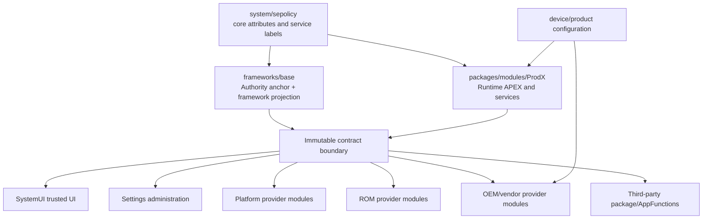
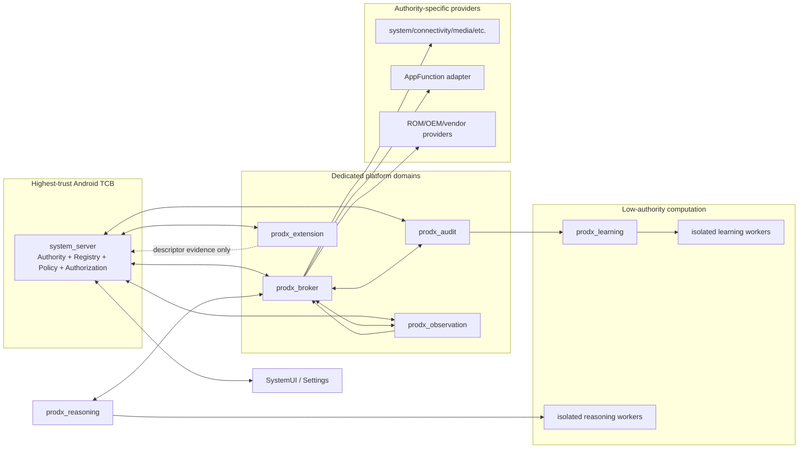
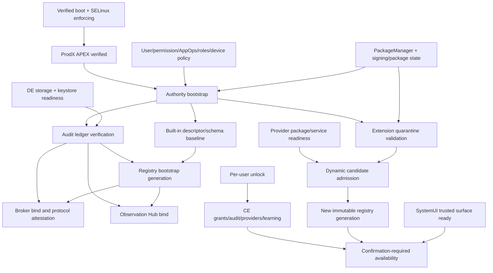
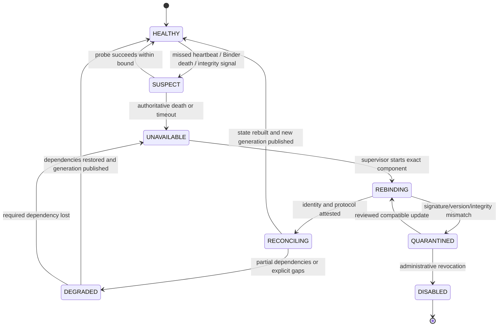
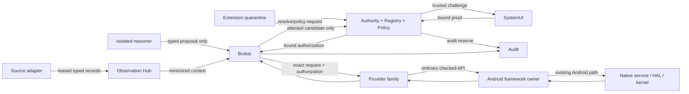
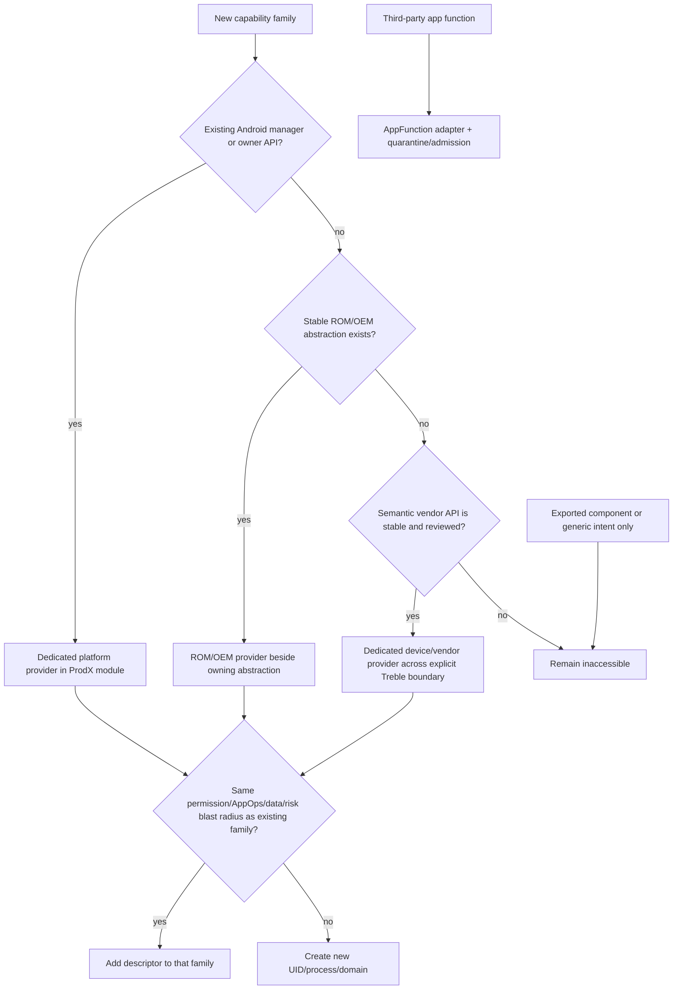
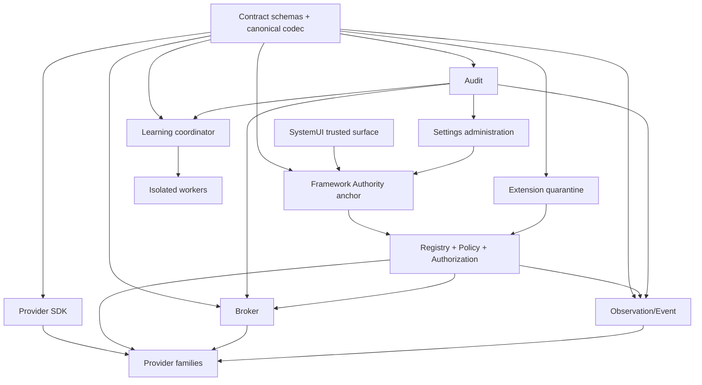
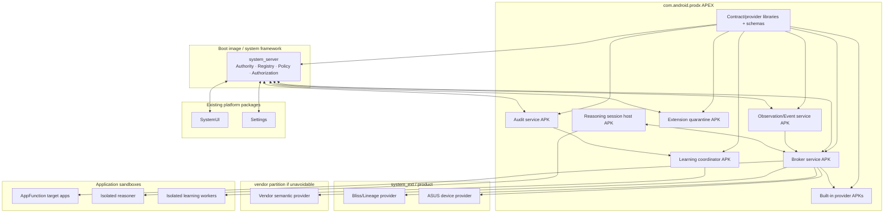

# ProdX Runtime Skeleton Specification

Version: 1.0.0-draft-freeze  
Date: 2026-07-14  
Status: Physical Android architecture; no implementation  
Contract baseline: ProdX Runtime Contract Specification 1.0.0-draft-freeze

Source references and immutable hashes:

- `ProdX-Runtime-Architecture-Foundation-20260714.zip` —
  `sha256:ee03e61c7ffa77c7d0dedf8d5b1e69a972925fd67a5919a83f6e6a8a92c3a2ec`
- `ProdX-Runtime-Contract-Specification-20260714.md` —
  `sha256:7c7743700c468847ef547bbbc22dcc9d1b027df0fee9e92895faee071706d886`

## 0. Normative status and scope

This document is the single source of truth for the *physical placement* of the
ProdX Runtime in Android. The Architecture Foundation remains authoritative for
security intent and subsystem participation. The Runtime Contract Specification
remains authoritative for object semantics, serialization, state, versioning,
and compatibility. This specification determines repositories, Android modules,
processes, SELinux domains, storage ownership, boot phases, lifecycle ownership,
dependency direction, update units, and deployment boundaries.

This phase defines no production code, Kotlin or Java class, AIDL or Binder
method, manifest, SELinux rule, Soong target, build file, resource, database
schema, or provider implementation. Names in this document are proposed
architectural identities and source locations. Later interface and implementation
design must realize them without changing their boundaries.

If the three specifications conflict, precedence is:

1. Architecture Foundation for non-negotiable security and Android-authority
   boundaries;
2. Runtime Contract Specification for wire/object semantics; and
3. this Runtime Skeleton Specification for physical placement and lifecycle.

An implementation convenience may not override a higher-precedence invariant.

## 1. Frozen physical-architecture decisions

1. Only the small Authority/Registry/Policy/Authorization core executes inside
   `system_server`. It contains no model, provider execution, extension parser,
   observation queue, learning workload, or general workflow engine.
2. Broker orchestration executes in a dedicated platform process and SELinux
   domain with a unique UID, no platform shared UID, no direct HAL/device-node/
   `/proc`/`sysfs` access, and no generic Binder proxy.
3. Observation and event ingestion execute outside both `system_server` and the
   broker because callback floods, sensitive payloads, and parser pressure must
   not threaten the authority or execution control path.
4. Audit persistence executes in its own domain. The broker cannot rewrite the
   ledger, and an audit outage prevents effects that require audit reservation.
5. Extension discovery and schema parsing execute in a quarantine process. Only
   the Authority admits an attested result to the Registry.
6. Learning coordination has no execution authority. Model/training workers run
   under isolated UIDs; they receive only policy-admitted `LearningRecord`s and
   cannot access the registry, providers, Android managers, or authorization
   material directly.
7. SystemUI owns trusted, transaction-bound confirmation/authentication and
   active-operation indicators. Settings owns durable administration, grants,
   provider state, history, revocation, and emergency disablement. Neither owns
   policy or execution.
8. Provider code is partitioned by risk and Android authority family. It does
   not run in `system_server`, the broker, SystemUI, Settings, or a model process.
9. Third-party extensions remain in their package processes. AppFunctions is
   the preferred third-party capability mechanism. No extension code is loaded
   into a ProdX process.
10. Android framework managers and owning services remain the last software
    authority before native services/HAL/kernel. ProdX never creates a parallel
    hardware or permission path.
11. The immutable contract boundary is transport-neutral. Physical transports
    may evolve only within the compatibility rules of the Contract
    Specification.
12. Base boot must succeed when every optional ProdX component is absent or
    disabled. ProdX is never a dependency of PackageManager, ActivityManager,
    SystemUI boot, Settings, telephony, networking, storage, or hardware bring-up.

## 2. Deployment tiers and update units

The optimal architecture uses a stable framework anchor plus a Mainline-style
runtime module. This contains change while preserving trusted access to
`system_server` facts.

| Tier | Source owner | Installed/update unit | Contents | Update rule |
|---|---|---|---|---|
| Framework anchor | `frameworks/base` | `framework`/`services` in platform OTA | Authority bootstrap, identity derivation, registry authority, policy/token core, minimal manager-facing API projection | Platform OTA; highest compatibility stability |
| ProdX runtime module | `packages/modules/ProdX` | Proposed `com.android.prodx` APEX | Contract codec/schema assets, broker, observation/event, audit, extension quarantine, learning coordinator/worker assets, shared provider framework, conformance metadata | APEX update/rollback only when framework anchor accepts contract/protocol range |
| Trusted UI integrations | `frameworks/base/packages/SystemUI`, `packages/apps/Settings` | Their existing platform packages | Confirmation/auth/indicator surface; administration/history/grants/kill switch | Updated with their owning package/platform; UI never defines contract semantics |
| Built-in platform providers | `packages/modules/ProdX/providers` or existing owning module | Provider APK/APEX payload with unique UID/domain | Framework-manager adapters grouped by risk family | Same or independently versioned APEX where compatibility permits |
| ROM providers | `lineage-sdk`, `lineage`, `vendor/bliss`, `packages/apps/*Parts` as owner dictates | `system_ext`/product module or ROM APEX | Stable Bliss/Lineage capabilities and settings bridges | ROM OTA; requires exact signing/namespace lineage |
| OEM/device providers | `device/<oem>/<product>`, `vendor/<oem>/prodx`, existing OEM module | `system_ext`, product, or vendor partition as Treble boundary requires | Device-semantic provider only; stable abstraction preferred | OEM OTA/vendor OTA; VINTF and platform contract compatibility both required |
| Third-party extensions | Owning application | APK | AppFunctions or reviewed extension service | PackageManager lifecycle; quarantined on update until re-attested |

### 2.1 Why not place the whole runtime in an APEX or in `system_server`?

An all-APEX design cannot safely derive every trusted Binder caller, user,
permission, AppOps, role, DevicePolicy, and boot-phase fact without a small
framework authority. An all-`system_server` design would expose Android's most
privileged process to model-adjacent orchestration, extension metadata, event
floods, parsers, and provider failure. The split anchor/module architecture
keeps the trusted computing base small while permitting rollback-compatible
runtime evolution.

### 2.2 APEX boundary rules

- The APEX is mounted before the runtime components are used, but its services
  are lifecycle-managed through explicit Android service binding, not arbitrary
  init daemons.
- The framework anchor does not load extension/provider code from the APEX into
  `system_server`. If shared contract code is ever loaded through a
  system-server classpath fragment, it is restricted to value validation and
  must preserve the anchor's accepted API/hash range.
- An APEX update cannot change the immutable contract major, service meaning,
  trust boundary, SELinux domain ownership, or provider risk mapping without a
  compatible platform OTA.
- Rollback restores binaries and schemas together. Persistent data formats must
  support the declared downgrade window or remain unread until the prior
  compatible module is restored; they must never be interpreted permissively.

## 3. Canonical repository map

The following paths are proposed ownership roots, not files to create in this
phase.

```text
frameworks/base/
  core/java/android/app/prodx/                         Stable framework-facing contract projection
  services/core/java/com/android/server/prodx/         Authority, Registry, Policy, token core
  packages/SystemUI/src/com/android/systemui/prodx/    Trusted confirmation/auth/indicator UI

packages/apps/Settings/src/com/android/settings/prodx/ Grants, provider admin, audit/history, kill switch

packages/modules/ProdX/
  framework/                              Canonical contract codec and validation library
  service/broker/                         Dedicated orchestration service package
  service/observation/                    Observation Hub and Event Pipeline package
  service/audit/                          Audit/recovery package and storage mediator
  service/extension/                      Extension quarantine and descriptor validator
  service/learning/                       Learning coordinator and isolated worker launcher
  service/reasoning/                      Unprivileged session host and isolated model launcher
  sdk/                                    Provider SDK/API surface without privileges
  providers/                              Built-in providers grouped by authority family
  apex/                                   Runtime module packaging ownership
  sepolicy/                               Module-owned public/private policy fragments
  tests/                                  Host/device conformance and negative-test ownership

system/sepolicy/                          Core service types/attributes and cross-partition policy ABI
frameworks/base/data/etc/                 Core signature permission/allowlist ownership if required

lineage-sdk/ or lineage/                  Stable ROM abstraction contracts and managers
vendor/bliss/ or ROM-owned repository/    Bliss provider and product policy overlays
device/<oem>/<product>/                   Product availability/configuration only
vendor/<oem>/prodx/                       Optional vendor-side semantic provider
```

### 3.1 Repository ownership rules

- `frameworks/base` owns only contracts that must be synchronized with Android
  framework identity and lifecycle. It must not become the general ProdX feature
  repository.
- `packages/modules/ProdX` owns runtime behavior, validation, dedicated services,
  and platform provider families. It is the default home for new ProdX work.
- `system/sepolicy` owns core domain/service attributes and neverallow intent;
  the module owns concrete rules for its packaged processes. Device/vendor
  repositories own only their side of Treble-compliant device-specific edges.
- A provider that adapts an existing modular Android service should live with
  the ProdX runtime unless the owning Android module intentionally exposes and
  maintains that provider as part of its own API lifecycle.
- Product makefiles/configuration select modules and feature flags but contain
  no capability semantics.

### 3.2 Package namespace proposal

| Source namespace | Ownership |
|---|---|
| `android.app.prodx` | Stable framework-facing manager and contract projection |
| `com.android.server.prodx` | Authority, Registry, Policy, authorization and boot/user lifecycle |
| `com.android.prodx.contract` | Module-private canonical codec/schema validation |
| `com.android.prodx.runtime.broker` | Broker orchestration process |
| `com.android.prodx.runtime.observation` | Observation Hub and Event Pipeline |
| `com.android.prodx.runtime.audit` | Audit/recovery service |
| `com.android.prodx.runtime.extension` | Extension quarantine/validation |
| `com.android.prodx.runtime.learning` | Learning coordinator and worker launcher |
| `com.android.prodx.runtime.reasoning` | Reasoning session host and model launcher |
| `com.android.prodx.provider.<family>` | One namespace per built-in authority family |
| `com.android.systemui.prodx` | Trusted SystemUI surfaces |
| `com.android.settings.prodx` | Administration/history surfaces |

These are Java/source ownership namespaces, not permission grants or finalized
APK package names. A source namespace cannot be used as identity; installed
package/module identity and signing lineage are independently attested.



## 4. Process and SELinux topology

SELinux names below are proposed domain identities. Exact type declarations and
allow rules belong to the later security implementation design. All domains are
enforcing and default-deny.

| Component | Process/UID | Proposed SELinux domain | May directly access | Must never directly access |
|---|---|---|---|---|
| Authority/Registry/Policy/Authorization | Existing `system_server`/system UID | `system_server` with dedicated service label and narrow type attributes | Trusted framework state, Package/User/Permission/AppOps/Role/DevicePolicy services, registry/grant storage, dedicated runtime services | Provider implementation, model/learning code, raw HAL/device node, arbitrary extension parsing |
| Broker Service | Dedicated runtime process, unique package UID | `prodx_broker` | Authority, Registry resolution, Audit, Observation control, admitted provider service names | HALs, device nodes, raw native-daemon sockets, arbitrary Binder enumeration, provider private storage, user content |
| Observation Hub/Event Pipeline | Dedicated process, unique UID | `prodx_observation` | Authority lease validation, registered source adapters, bounded queue/storage, Audit metadata | Capability execution, token minting, model storage, generic broadcast/content/Binder access |
| Audit Engine | Dedicated direct-boot-aware process, unique UID | `prodx_audit` | Its append-only DE/CE stores, Authority/Broker/Hub audit clients, approved keystore operation through Android API | Provider execution, extension loading, learning/model access, arbitrary user content |
| Extension Manager quarantine | Dedicated on-demand process, unique UID | `prodx_extension` | Package/AppFunction metadata exposed through checked APIs, read-only candidate payloads, Authority admission endpoint | Token minting, registry mutation, provider execution, arbitrary APK code loading, package-private data |
| Learning coordinator | Dedicated on-demand process, unique UID | `prodx_learning` | Admitted learning records, retention/model metadata store, isolated worker control | Authority token APIs, providers, Android managers carrying user authority, raw observations/audit payloads |
| Learning/model worker | Android isolated UID, per job/session | `prodx_learning_isolated` | Sealed input/model/output handles explicitly delegated for one job | Binder service manager discovery, network unless separately reviewed, persistent app data, credentials, providers, Authority |
| Reasoning session host | Dedicated unprivileged process, unique UID | `prodx_reasoning` | Broker session endpoint and reviewed model asset broker only | Authority/Registry direct calls, providers, Android capability managers, user content stores |
| Reasoning/model worker | Android isolated UID, per session | `prodx_model_isolated` | Broker's bounded planning/session channel and minimized context | Android permissions, system service discovery, provider/Audit/Registry direct calls, persistent privileged storage |
| Built-in provider family | Unique UID/process per family | `prodx_provider_<family>` | Declared Android managers/services and its own bounded state | Other provider family privileges, Authority storage, model process, generic HAL/kernel access |
| AppFunction adapter | Unique UID/process | `prodx_appfunctions` | Checked AppFunction manager path and Authority/Broker | Arbitrary intents/components, target private data, provider privileges |
| Vendor device provider | Vendor-owned UID/process if required | `prodx_vendor_provider_<oem>` | Only declared stable vendor service/HAL and system-side ProdX endpoint allowed by Treble | Framework private Binder, broad vendor devices, factory/debug/secure-world interfaces |
| SystemUI integration | Existing SystemUI process/UID | Existing `system_app`-class SystemUI domain | Authority trusted-confirmation endpoint, Android authentication/UI primitives | Provider execution, Registry mutation, ledger storage |
| Settings integration | Existing Settings process/UID | Existing Settings domain, normally `system_app` class | Authority admin API, Audit read/export mediator, Android settings/auth UI | Direct registry files, provider calls, token minting, learning data |
| Third-party extension | Owning app UID/process | Existing app domain | AppFunction/declared reviewed extension contract only | ProdX internal services, other providers, runtime storage, inherited runtime UID |

### 4.1 Mandatory Binder/service-manager policy shape

The Authority publishes one framework-facing service label. Dedicated runtime
services publish separate labels or are bound explicitly by the Authority. Only
named, compiled, reviewed edges receive `find`, `call`, or `add` permission.
Providers receive no service-manager enumeration capability. The model and
isolated learning workers receive no general service-manager access. Binder
caller UID/PID/SID is preserved and checked at every boundary; attribution is
not accepted from a model payload.

Dedicated runtime services are privileged only in the packaging sense needed to
bind protected platform APIs. Each is a separate APK identity and unique UID,
signed by the ProdX module/platform-approved lineage, granted only explicit
signature permissions and narrowly justified privileged allowlist entries. None
uses the platform shared UID. A package that needs an existing platform-signature
API may use the platform certificate only after review; signing never substitutes
for SELinux, Registry admission, or callee enforcement.

### 4.2 Storage ownership

| Data | Owner/domain | Proposed physical class | Boot/user behavior |
|---|---|---|---|
| Built-in descriptor/schema baseline | Runtime APEX, read-only | Verified module data | Available after APEX mount; content-hash checked |
| Registry snapshot and admission cache | Authority/`system_server` | `/data/system/prodx/registry` with dedicated label | DE global metadata only; rebuildable from authoritative sources |
| Per-user grants/policy epochs | Authority | `/data/system_de/<user>/prodx` for direct-boot-safe metadata; `/data/system_ce/<user>/prodx` for sensitive state | CE content unavailable until unlock; user removal destroys it |
| Broker transaction checkpoints | Broker | `/data/misc/prodx/broker/<user-scope>` | Minimal, encrypted/labelled, crash-recovery only; no user content cache |
| Observation queues | Observation Hub | Bounded DE queue for explicitly direct-boot-safe events; CE otherwise | Purged on expiry, revocation, user stop/removal, schema/policy incompatibility |
| Audit ledger | Audit Engine | `/data/misc/prodx/audit` partitioned into DE metadata and CE detail | Append-only/tamper-evident; retention and privacy tombstones apply |
| Extension quarantine cache | Extension Manager | `/data/misc/prodx/extension` | Rebuildable; no executable extraction/loading; invalidated on package change |
| Learning records/model state | Learning coordinator | `/data/misc/prodx/learning` with per-user eligibility partitions | CE by default; removal/consent withdrawal creates enforced deletion workflow |
| Provider state | Owning provider UID | Provider-private data only | Broker/Authority cannot read it; migration owned by provider |

No component shares writable database files across UIDs. Cross-process state is
exchanged only through immutable contract objects. File locking is not an IPC
protocol.



## 5. Subsystem placement matrix

### 5.1 Authority Service

**Repository/module.**
`frameworks/base/services/core/java/com/android/server/prodx`;
compiled into the platform services module. Its small framework-facing value
projection belongs under `frameworks/base/core/java/android/app/prodx`.

**Process/domain.** `system_server`; existing domain plus a distinct Binder
service label and narrowly scoped ProdX data types.

**Responsibilities.** Derive caller/user/profile/attribution; own platform
policy epochs, grants, confirmation challenges, authorization mint/verification,
trusted component identity, emergency disablement, and coordination of registry
publication. It is the only ProdX component that can turn a valid policy result
and trusted proof into `ExecutionAuthorization`.

**Lifecycle/start.** Started by `SystemServiceManager` in the other/core-services
portion after PackageManager, UserManager, permission, AppOps, roles, and
DevicePolicy dependencies exist. `onStart` publishes a non-ready service;
boot-phase callbacks progressively enable registry and bindings. User lifecycle
callbacks create/destroy per-user state.

**Dependencies.** PackageManager internal checked surfaces, UserManager,
PermissionManager, AppOps, RoleManager, DevicePolicy, LockSettings/auth result,
Activity/foreground facts, module/package metadata, keystore-mediated signing,
and Audit durability. It does not use arbitrary `LocalServices`; every
dependency is an explicit owned framework relationship.

**Crash/update.** A `system_server` restart invalidates all authorizations,
confirmation challenges, leases, and in-memory generations. Durable epochs and
the last verified baseline rebuild state. Framework OTA governs updates.

**Placement justification.** Trusted caller identity and framework policy facts
are already authoritative here; exporting them to a more privileged external
daemon would expand the attack surface. Keeping the service small limits
`system_server` risk.

### 5.2 Capability Registry

**Repository/module/process.** Registry authority and immutable generation
publication live with the Authority in `frameworks/base`/`system_server`.
Canonical descriptor/schema validators and built-in catalog assets live in the
ProdX APEX. Extension parsing stays outside in the Extension Manager.

**Responsibilities.** Combine verified built-in catalog, package/AppFunction/
ROM/OEM candidates, provider liveness, exact version/signature, current user,
feature/hardware readiness, policy prerequisites, and health into atomic
`RegistrySnapshot`s. Resolve deterministically; never execute.

**Lifecycle.** Bootstrap from a verified read-only baseline; reconcile APEX and
provider identities; publish generation; then add per-user dynamic entries only
after applicable boot/user phases. Package replacement, signature change,
provider death, role/grant/AppOps/policy change, user state, hardware state, and
module rollback create a new generation.

**Storage/update.** Persistent cache is rebuildable and never more authoritative
than current Android/package state. Contract-major mismatch quarantines the
module rather than weakening validation.

### 5.3 Policy Engine and authorization core

**Repository/process.** Platform-owned deterministic evaluator inside the
Authority package in `frameworks/base`; risk/obligation catalog is verified
platform/APEX data accepted only within the anchor's known schema.

**Responsibilities.** Combine Android permissions/AppOps/roles/device policy,
ProdX grants, descriptor risk, exact parameters, purpose, foreground/lock/
network facts, quotas, confirmation/auth strength, and deny precedence. Emit
immutable `PolicyDecision`s and narrowly bound authorizations.

**Boundary.** External policy providers may contribute signed facts or advice in
their own process; they cannot issue final allow or lower risk. Policy does not
call providers or models. It fails closed when required facts, Audit, trusted UI,
or registry generation are stale.

**Update.** Core evaluation semantics require platform OTA/contract review.
Signed catalog data may update through the ProdX APEX only when changes are
strictly compatible and cannot lower existing protection without explicit
platform approval.

### 5.4 Broker Service

**Repository/module.** `packages/modules/ProdX/service/broker`; packaged in the
ProdX APEX as a dedicated, direct-boot-aware platform service package.

**Process/domain.** Unique UID and `prodx_broker`; explicitly bound and supervised
by the Authority. Not `system`, `platform`, or a shared provider UID.

**Responsibilities.** Validate/canonicalize proposals, expand declared
dependencies, request resolution/policy, coordinate trusted confirmation,
reserve Audit, dispatch an exact authorized request, manage timeout/cancellation/
idempotency/partial completion, minimize results, and recover transaction state.
It cannot mint authority, inspect Registry files, or reach Android managers for
capability execution.

**Lifecycle.** Bound after registry bootstrap and Audit readiness. Per-user
sessions begin only when the Authority declares that user's applicable state.
Binder death invalidates in-flight non-idempotent dispatch unless the provider/
Audit record proves outcome. Restart recovers only from bounded transaction
checkpoints and re-resolves policy before any retry.

**Update.** APEX-updatable within accepted protocol/contract range. The
Authority rejects incompatible versions before binding.

### 5.5 Provider Framework

**Repository/module.** Transport-neutral validation and provider lifecycle
framework in `packages/modules/ProdX/framework`; provider-side runtime helpers
in `packages/modules/ProdX/sdk`. It is a library, not a process or authority.

**Responsibilities.** Canonical contract encoding, schema/bounds validation,
authorization verification hooks, caller/attribution checks, structured errors,
health/lifecycle conventions, cancellation, audit correlation, and conformance
metadata. It contains no permission bypass, policy evaluator, service locator,
generic manager adapter, or provider implementation.

**Distribution/update.** Platform providers consume the module-private library;
ROM/OEM and approved third parties consume a stable SDK projection. Version
skew is handled through explicit protocol ranges and exact hashes, never
classpath coincidence.

### 5.6 Observation Hub and Event Pipeline

**Repository/module.** `packages/modules/ProdX/service/observation`, with logical
Hub and Pipeline submodules but one initial dedicated package/process because
they share lease, queue, redaction, sequence, and backpressure invariants.

**Process/domain.** Unique UID, `prodx_observation`. Source-specific adapters
remain in their owning provider processes; the Hub never gains all source
permissions.

**Responsibilities.** Validate subscription leases with Authority; register
admitted source endpoints; enforce per-user/purpose queues, sampling,
aggregation, redaction, rate, backpressure, deduplication, ordering/gap markers,
expiry, revocation, and consumer death cleanup; form `ObservationRecord` and
`EventRecord`; write metadata-only audit.

**Lifecycle.** Bound after Authority and Audit, before ordinary extensions are
activated. Direct-boot sources are explicitly allowlisted; all personal sources
wait for user unlock. On user stop/switch/revocation, the Hub first stops
delivery, then unregisters callbacks, purges queues, and acknowledges cleanup.

**Crash/update.** Providers treat Hub death as mandatory unregister/lease pause.
Hub restart obtains fresh leases and source sequences; gaps are explicit. APEX
update drains/revokes subscriptions before process replacement.

### 5.7 Audit Engine

**Repository/module.** `packages/modules/ProdX/service/audit`; separate service
package in the ProdX APEX.

**Process/domain.** Direct-boot-aware unique UID, `prodx_audit`, separate from
broker/Authority/providers. It alone writes the ledger.

**Responsibilities.** Reserve transactions before protected effects, append
policy/confirmation/dispatch/result/recovery records, maintain tamper-evident
partitioned sequences, enforce redaction/retention/export, expose minimized
history through an Authority-mediated Settings path, and coordinate undo
evidence. It does not decide policy or execute undo.

**Lifecycle.** Started early after secure storage/keystore prerequisites. DE
metadata ledger opens before users unlock; CE detail partitions open per user.
Unclean shutdown triggers journal verification before effects resume.

**Failure/update.** If reservation is unavailable, high/critical and any
descriptor-marked audit-required effect fails closed. Low-risk read-only
operations follow descriptor policy. Corruption isolates the affected partition,
raises a security health state, and never resets history silently. APEX rollback
must preserve ledger readability or keep execution disabled.

### 5.8 Learning Engine

**Repository/module.** `packages/modules/ProdX/service/learning`.

**Process/domain.** A no-authority coordinator under unique UID/domain
`prodx_learning`, spawning `prodx_learning_isolated` workers with Android
isolated UIDs. Reasoning workers use a separate `prodx_model_isolated` domain.

**Responsibilities.** Apply learning eligibility/consent/retention gates,
construct sealed job inputs from admitted `LearningRecord`s, schedule isolated
work under resource/thermal/charging policy, validate outputs, retain model
provenance, and submit only non-authoritative proposals or model artifacts for
later review.

**Lifecycle.** Never boot-critical or persistent by default. Runs on demand or
through Android-owned scheduling after unlock and eligibility. User stop,
consent withdrawal, thermal/resource pressure, kill switch, or module update
cancels workers and seals/deletes inputs according to policy.

**Boundary/update.** No execution authorization, provider endpoint, raw Audit
record, or Android privileged manager enters this process. Model updates are
content-addressed and rollbackable independently only when accepted by the
runtime module's compatibility/policy metadata.

### 5.9 Extension Manager

**Repository/module.** `packages/modules/ProdX/service/extension`; dedicated
quarantine service in the ProdX APEX.

**Process/domain.** Unique UID, on-demand `prodx_extension` process.

**Responsibilities.** Receive PackageManager/AppFunction/module change work
from Authority; parse only bounded signed `ExtensionManifest`/descriptor/schema
content; verify declared hashes/namespace/signing lineage/protocol; return an
attested candidate report. It neither mutates Registry nor binds execution
endpoints.

**Lifecycle.** Spawned for boot reconciliation and package/module changes;
terminates when queues drain. Parser failure, timeout, malformed input, signature
change, downgrade, or resource excess produces quarantine. Package removal
causes Authority to revoke first, then cleanup asynchronously.

**Boundary/update.** It reads metadata through checked Android APIs or sealed
descriptors, never loads application code/classes/native libraries. APEX update
can improve parsing only within immutable schema semantics.

### 5.10 Provider SDK

**Repository/module.** `packages/modules/ProdX/sdk`; technology-specific
projections are generated later from the immutable Contract Specification.

**Placement.** Compile-time/runtime library delivered through the ProdX module
or approved SDK distribution. It has no process, UID, SELinux privilege,
permission, service-manager access, or authority by itself.

**Contents by architecture.** Contract value projection, canonical codec,
descriptor/schema validator, provider lifecycle/conformance hooks, structured
error and cancellation conventions, authorization verifier client, health and
audit correlation helpers, and test vectors. It explicitly excludes manager
wrappers, generic intents/URIs/Binder operations, policy decisions, risk
assignment, permission grants, and signing secrets.

**Compatibility.** Provider manifests declare SDK/protocol ranges; runtime uses
wire semantics, not library version, as truth. An old SDK remains safe because
unknown core semantics fail closed.

### 5.11 SystemUI integration

**Repository/module/process.** Existing
`frameworks/base/packages/SystemUI/.../prodx`; existing SystemUI package,
process, UID, and domain.

**Responsibilities.** Render Authority-supplied canonical previews, requesting
surface, provider, exact targets/parameters, purpose, consequences, selected
choice, authentication strength, active-operation/observation indicators,
emergency stop, and time-limited confirmation result. Model prose is visually
untrusted context and never replaces canonical text.

**Lifecycle/dependencies.** Registers readiness after SystemUI start and user
switch. Authority queues no hidden confirmation; transactions wait or fail when
trusted UI is unavailable. Authentication uses Android-owned lock/credential/
biometric result paths without exposing secrets.

**Boundary/update.** SystemUI never receives provider credentials, executes a
capability, writes policy, or mints authorization. UI protocol updates must stay
compatible with the framework anchor; an unavailable/mismatched UI disables
confirmation-required operations.

### 5.12 Settings integration

**Repository/module/process.** Existing `packages/apps/Settings/.../prodx` in
the existing Settings package/process/domain.

**Responsibilities.** Durable runtime enablement, per-user grants, provider and
extension inventory/health/quarantine reasons, policy explanations, history,
revocation, observation controls, learning consent/deletion, export, undo entry
points, and emergency disablement. All writes call Authority; history reads use
an Audit-mediated minimized API.

**Lifecycle/update.** Not boot-critical. Pages tolerate runtime absence and
version mismatch. Settings does not bind providers, read their storage, parse
extension schemas, or define policy. Platform/package update governs UI;
framework anchor governs semantics.

### 5.13 Framework client manager façade

**Repository/module.** The stable client projection belongs under
`frameworks/base/core/java/android/app/prodx`; module-private clients may live in the
ProdX framework library. It is a library façade in the caller's process, not a
service, UID, domain, or authority.

**Responsibilities.** Discover runtime protocol compatibility, submit typed
requests/subscriptions, expose cancellation and operation state, and translate
transport failure into contract-defined errors. The Authority still derives
the real caller/user/attribution at the process boundary. The façade cannot
cache readiness as authority, manufacture context, choose an endpoint, or
bypass trusted UI.

**Exposure.** Initial API is system/private to approved platform reasoning
surfaces. Broader SDK exposure requires separate Android API/privacy review and
does not imply that an ordinary app may access privileged capabilities.

### 5.14 Reasoning session host

**Repository/module.** `packages/modules/ProdX/service/reasoning`; optional
runtime package in the ProdX APEX. The base Runtime can operate in inventory,
policy-shadow, provider, and direct client modes without any model installed.

**Process/domain.** A low-authority coordinator under unique UID/domain
`prodx_reasoning`, spawning per-session `prodx_model_isolated` workers. Model
artifacts are content-addressed and read through sealed handles; isolated
workers have no general network or service-manager access.

**Responsibilities.** Manage model/session resource limits, pass minimized
context from Broker/Observation Hub, accept structured proposals, validate only
session framing, and terminate workers on user switch, revocation, pressure,
timeout, update, or kill switch. Broker performs canonical request validation;
Authority performs identity/policy/authorization.

**Boundary/update.** The host communicates only with Broker and its workers. It
never calls Authority, Registry, Audit, providers, or Android capability
managers directly. Reasoning host and model artifacts may evolve independently
within the declared proposal schema and runtime policy; their outputs remain
untrusted.

## 6. Logical service registration and ownership

The proposed logical service identities are reserved for architecture and do
not define Binder interfaces:

| Logical service | Publisher/lifecycle owner | Consumers | Registration condition |
|---|---|---|---|
| `prodx_authority` | `system_server`/SystemServiceManager | Framework manager, trusted UI, dedicated runtime services | Published non-ready at Authority `onStart`; readiness is separate |
| `prodx_broker` | Broker package, bound/supervised by Authority | Approved reasoning surfaces, Authority | Exact package/signature/protocol attested; Registry/Audit ready |
| `prodx_observation` | Observation package, supervised by Authority | Broker, admitted source providers | Authority/Audit ready and lease protocol compatible |
| `prodx_audit` | Audit package, supervised by Authority | Authority, Broker, Hub; Settings through mediator | Ledger verified and storage partition opened |
| `prodx_extension` | On-demand extension package | Authority only | Candidate work exists and package identity attested |
| `prodx_learning` | On-demand learning coordinator | Authority/Audit eligibility mediator only | User unlocked, consent/policy/resource eligibility |
| `prodx_reasoning` | Optional reasoning host supervised by Broker/Authority enablement | Broker only | Approved model/session policy and compatible proposal schema |
| `prodx_provider.<family>` | Owning provider package | Broker and Hub only as declared | Provider attested and RegistryEntry active |

Service names do not imply universal `find` access. The Authority may use
explicit binding rather than global registration for high-risk/internal
services. No ProdX `LocalServices` object is exposed to non-owning
`system_server` code; internal dependencies remain private to the Authority.

## 7. Boot and initialization architecture

### 7.1 Boot-phase contract

| Phase | Android owner/state | ProdX action | Explicitly forbidden |
|---|---|---|---|
| B0: kernel/first-stage init | Kernel, init, SELinux, mounts | None; ProdX is inert | Init control capability, property-driven authorization, direct kernel probe |
| B1: APEX activation/core daemons | `apexd`, service managers, keystore/storage prerequisites | Mount and verify ProdX APEX; no provider activation | Runtime daemon with raw sockets/devices; accepting mutable registry state |
| B2: zygote/`system_server` creation | Zygote and SystemServer | Load framework anchor; construct Authority only after declared dependencies | Loading model/provider/extension code into `system_server` |
| B3: Authority publish | SystemServiceManager | Publish non-ready Authority identity; initialize kill switch and durable epochs | Reporting capability `READY`; minting authorization |
| B4: system-services ready | Package/User/Permission/AppOps/Role/DevicePolicy sufficiently ready | Verify contract/APEX baseline; open Registry bootstrap; bind/verify Audit | Dynamic third-party admission; personal CE access |
| B5: activity-manager ready | Process/package binding available | Bind Broker and Observation Hub; establish death monitoring; publish infrastructure health | Effect dispatch before Audit and registry generation |
| B6: third-party apps may start | PMS/AMS ordinary package lifecycle | Discover built-in/ROM/OEM providers; Extension Manager validates package/AppFunction candidates; publish initial dynamic generation | Auto-enable unknown extensions; execute during discovery |
| B7: boot complete | Stable foreground/SystemUI/Settings state | Enable eligible direct-boot-safe and system-user capabilities; surface health | Treat boot completion as universal readiness |
| U1: user starting | Android user lifecycle | Create per-user registry view and DE state; keep locked capabilities unavailable | Cross-user state reuse |
| U2: user unlocked | CE storage/auth state available | Open CE Audit/grants/queues; activate personal-data providers and learning eligibility | Replay pre-unlock decisions/tokens |
| U3: user stopping/removed | Android user lifecycle | Revoke tokens/leases, drain, unregister, close/purge partitions, publish generation | Retain active subscriptions or provider bindings |

### 7.2 Startup sequence

```mermaid
sequenceDiagram
  participant K as Kernel/init/SELinux
  participant AX as apexd
  participant SS as system_server
  participant A as Authority/Registry/Policy
  participant AU as Audit Engine
  participant BR as Broker
  participant OB as Observation Hub
  participant EX as Extension Manager
  participant PR as Providers
  participant UI as SystemUI/Settings
  K->>AX: Mount and verify platform/APEX partitions
  AX-->>SS: ProdX module available with version/hash
  SS->>A: Start after identity/policy dependencies
  A->>A: Publish non-ready service; load epochs/kill switch
  A->>A: Verify contract and built-in baseline
  A->>AU: Bind exact package/signature/protocol
  AU-->>A: Ledger verified / readiness
  A->>BR: Bind and attest runtime protocol
  A->>OB: Bind and attest lease/event protocol
  A->>UI: Register trusted UI/admin readiness channels
  A->>EX: Validate installed candidate metadata
  EX-->>A: Attested candidate reports only
  A->>PR: Attest built-in/ROM/OEM provider identities
  PR-->>A: Descriptor hashes, health, declared endpoints
  A->>A: Resolve dependencies and publish generation N
  A-->>BR: Registry generation N available
  A-->>OB: Source bindings and policy epochs available
  Note over A,PR: Each user/profile becomes ready independently
```

### 7.3 Initialization dependency graph



### 7.4 Readiness is capability-scoped

There is no global boolean meaning “ProdX ready.” Infrastructure publishes
health independently, and every capability remains the conjunction required by
the Foundation: built, installed, feature-present, owner-started,
service-resolvable, protocol-compatible, enabled for the user, user-state
satisfied, Android-policy-eligible, dependency-satisfied, and provider-healthy.
An infrastructure failure creates a new Registry generation and precise
`CapabilityAvailability`; it never triggers a broader fallback.

## 8. Runtime lifecycle and service recovery

### 8.1 Component lifecycle ownership

| Component | Creator/supervisor | Restart policy | State restoration authority |
|---|---|---|---|
| Authority/Registry/Policy | SystemServer/SystemServiceManager | Follows `system_server` restart | Durable epochs + verified Android state + Audit |
| Broker | Authority explicit bind | Rebind with bounded exponential backoff; circuit break on repeated incompatibility | Audit + idempotency/provider reconciliation; never raw checkpoint alone |
| Observation Hub | Authority explicit bind | Rebind; all leases paused/revoked until revalidation | Authority lease state + source sequences; gaps explicit |
| Audit Engine | Authority explicit bind, early priority | Rebind immediately; effect path disabled until verified | Its journal/hash chain only |
| Extension Manager | Authority on-demand work | Restart only for bounded candidate queue; poison candidate quarantined | Package state and content hashes; cache is disposable |
| Learning coordinator/workers | Android scheduler/Authority eligibility | Best-effort, never boot-critical | Eligible records/model provenance; jobs restart only when idempotent |
| Reasoning host/workers | Broker session supervisor and Android process lifecycle | Per-session; terminate/recreate, never boot-critical | No authoritative restoration; conversation/session state is minimized and policy-bounded |
| Built-in provider | Normal package/service lifecycle plus Registry death tracking | Owning package policy; Registry marks unavailable immediately | Provider-owned durable state + Android service truth |
| Extension provider | Owning application lifecycle | No ProdX restart privilege; normal app rules | App-owned state; re-attestation required after change |
| SystemUI/Settings integration | Their existing Android lifecycle | Existing package recovery | Authority is semantic source; no UI-owned authorization state |

### 8.2 Crash containment rules

- Authority death means `system_server` death. All tokens, proofs, leases, and
  current-generation handles are invalid; providers reject them until the new
  Authority publishes fresh epochs.
- Broker death does not imply an effect failed. Recovery queries Audit and the
  exact provider operation status using a fresh authorized reconciliation path.
  Non-idempotent unknown outcomes are surfaced as `PARTIAL`/indeterminate and
  never retried automatically.
- Provider death immediately removes readiness in the next Registry generation.
  In-flight calls terminate through Binder death and are reconciled according to
  descriptor idempotency and Audit state.
- Hub death causes every source adapter to stop or bound its local buffer. No
  provider may continue accumulating an unbounded stream while disconnected.
- Audit death blocks required effects. Broker and provider cannot create a local
  substitute ledger.
- Extension parser death quarantines only the current candidate; it cannot
  affect the active immutable generation.
- Learning/model failure affects no Registry availability or Android function.

### 8.3 Recovery state machine



### 8.4 Shutdown and reboot behavior

Shutdown is coordinated but never assumed. When Android announces orderly
shutdown/reboot, Authority atomically disables new authorization, increments a
shutdown epoch, and asks Broker to stop admission. Broker cancels pending user
interaction, drains only bounded safe operations, and records unresolved
operations. Observation Hub revokes leases and unregisters listeners. Extension
and learning jobs stop. Providers enter `DRAINING`. Audit appends shutdown
markers, checkpoints and synchronizes its journal last. Authority then closes
per-user state.

Power loss at any point must recover from durable Audit reservation/result
records and immutable Registry state. No graceful-shutdown callback is required
for correctness. Reboot invalidates all confirmation proofs, authorizations,
leases, ephemeral operation handles, and model sessions.

## 9. IPC and trust-boundary architecture

This specification names relationships but intentionally does not define AIDL
or method signatures.

| Caller -> callee | Purpose | Required boundary behavior |
|---|---|---|
| Framework manager -> Authority | Discover, request, cancel, query state | Derive Binder identity/user; reject caller-supplied identity; typed schemas only |
| Authority -> Audit | Reserve/append/verify transaction evidence | Exact object hashes, durable acknowledgment, no raw secret payload |
| Authority -> Broker | Start/cancel transaction with exact resolution/policy state | Broker cannot mint or widen authorization |
| Authority -> SystemUI | Render canonical confirmation/auth challenge | Exact parameter/purpose/provider hash; trusted result bound to transaction |
| Settings -> Authority | Administer grants/providers/runtime | Signature permission plus Android user/admin/auth checks; no direct storage |
| Authority -> Extension Manager | Validate sealed candidate | Read-only bounded input; attested report is still non-authoritative |
| Authority -> Observation Hub | Issue/revoke lease and admitted source binding | Per-user/purpose/epoch binding; Hub cannot create leases |
| Broker -> Provider | Dispatch exact typed request + authorization | Provider verifies caller/audience/hash/expiry/nonce and rechecks Android policy |
| Provider -> Android manager/service | Execute semantic Android operation | Valid attribution; owning service permission/AppOps/user/role/device-policy check |
| Source provider -> Observation Hub | Deliver typed observation/event | Lease, source identity, schema, sequence, rate and minimization enforced |
| Observation Hub -> Broker/model session | Deliver minimized context | Consumer lease and purpose; no execution token in payload |
| Audit eligibility mediator -> Learning | Deliver admitted `LearningRecord` | No raw Audit access; sealed bounded records; consent/retention attached |
| Isolated reasoner -> Broker | Propose typed request/plan | No direct Authority/Registry/provider/system-service access |
| Registry -> provider | Health/descriptor attestation only | Provider cannot register itself active or assign risk |

### 9.1 Prohibited IPC topology

The architecture has no model-to-Authority, model-to-provider,
model-to-service-manager, broker-to-HAL, broker-to-content-provider,
extension-to-Registry-mutation, provider-to-token-minting, Settings-to-provider,
SystemUI-to-provider, learning-to-provider, provider-to-provider privilege
sharing, or generic Binder/intent/URI/property/path bridge.



## 10. Provider-family deployment plan

Each provider family is a distinct package/process/UID/domain unless an existing
Android module owns an equally strong isolation boundary. Read and write facets
may share a family only when their Android permissions, AppOps, data sensitivity,
and compromise impact are materially identical. A descriptor never justifies
merging authority families.

### 10.1 Built-in provider matrix

| Family/module proposal | Source repository/partition | Process/domain | Android bridge | Initial role/scope | Separation rationale |
|---|---|---|---|---|---|
| Runtime self-observation | `packages/modules/ProdX/providers/runtime`; ProdX APEX | `prodx_provider_runtime` | Authority's minimized health/availability projection | Observation/Knowledge: capability state, reasons, provider health | Cannot inspect Registry files or policy internals |
| Power/thermal/health | `.../providers/power`; ProdX APEX | `prodx_provider_power` | Battery, Power, Thermal, PowerStats and stable health managers | Observation/Event; later bounded charge/power controls | Isolates hardware-adjacent policy and continuous callbacks |
| System/configuration knowledge | `.../providers/system`; ProdX APEX | `prodx_provider_system` | Build/module/feature/configuration managers with allowlists | Knowledge/Observation: device, time, locale, configuration | No arbitrary property/DeviceConfig/package inventory |
| Connectivity/network state | `.../providers/connectivity`; ProdX APEX | `prodx_provider_connectivity` | Connectivity and network-policy managers | Observation/Event; later bounded VPN/tether actions | Network control and metadata have distinct high impact |
| Nearby radios | `.../providers/nearby`; ProdX APEX | `prodx_provider_nearby` | Wi-Fi/Bluetooth/NFC/UWB/Companion managers | Capability/Observation/Event | Scanning/pairing/location AppOps kept out of generic connectivity provider |
| Media session/playback | `.../providers/media`; ProdX APEX | `prodx_provider_media` | MediaSession/Audio manager surfaces | Observation/Event and safe transport controls | No camera/microphone/capture permission in this family |
| Capture/projection/speech | Future `.../providers/capture`; ProdX APEX | `prodx_provider_capture` | Camera/Audio capture/MediaProjection/Speech consent paths | High-risk Capability/Observation | Separate from playback; visible consent and privacy indicators mandatory |
| Personal content | `.../providers/personal`; ProdX APEX or tightly split subfamilies | `prodx_provider_personal_<authority>` | Fixed Contacts/Calendar/Media/Downloads provider contracts | Knowledge and separately confirmed writes | Split by content authority when permission/data blast radius differs |
| Scoped storage | `.../providers/storage`; ProdX APEX | `prodx_provider_storage` | SAF/Documents/MediaStore/StorageManager with persisted URI grants | Capability/Knowledge | Owns scoped grants; no arbitrary path access |
| Notifications | `.../providers/notification`; ProdX APEX | `prodx_provider_notification` | Notification manager and separately user-approved listener/assistant role | Capability/Observation/Event/Knowledge | Notification content/access role must not leak to other providers |
| Scheduling | `.../providers/scheduling`; ProdX APEX | `prodx_provider_scheduling` | AlarmManager/JobScheduler and registered workflow callbacks | Capability/Event | Models cannot register arbitrary callback code; durable IDs only |
| Communications | Future `.../providers/communications`; ProdX APEX | `prodx_provider_communications` | Telecom/Telephony/SMS role-holder APIs | Critical Capability/Knowledge/Event | Calls/messages/subscriptions require strongest isolated authority |
| Package/role/update administration | Future `.../providers/admin`; platform/APEX | `prodx_provider_admin` | PackageInstaller/Role/DomainVerification/update/rollback checked flows | Critical Capability/Policy/Knowledge | Never merged with ordinary app/function discovery |
| Diagnostics | `.../providers/diagnostics`; engineering/admin-enabled payload | `prodx_provider_diagnostics` | Predeclared stats/DropBox/incident/perf queries | Observation/Knowledge | Raw logs/dumps prohibited; export and redaction independently reviewed |
| AppFunction adapter | `packages/modules/ProdX/providers/appfunctions`; ProdX APEX | `prodx_appfunctions` | AppFunctionManager checked discovery/execution | Extension plus per-function role | No arbitrary intent/component fallback |
| ROM/Lineage/Bliss | ROM-owned repo, `system_ext`/product | `prodx_provider_rom` | Stable Lineage/Bliss managers/settings | Capability/Knowledge/Observation/Policy facts | Preserves ROM signing/permission model and update cadence |
| ASUS/I001D semantic device | Device/ROM owner; normally `system_ext`, vendor only if required | `prodx_provider_device_asus` or vendor domain | Lineage abstraction first; stable vendor service only when absent | Capability/Observation: touch, charge, display semantic controls | No QTI factory/debug/QSEE/radio/motor primitive by default |

### 10.2 Provider placement decision tree



### 10.3 Extension-provider topology

- AppFunctions execute in the target application's normal process and UID under
  Android's AppFunction lifecycle. The ProdX adapter is a separate platform
  domain and does not inherit target or broker authority.
- Reviewed ROM/OEM extension providers are privileged only for their declared
  family and use signature permission plus Registry admission. Platform signing
  alone is not admission.
- Ordinary APK extensions remain ordinary app domains. If a capability needs a
  privilege the app does not already lawfully possess, installation metadata
  cannot supply it.
- Package update, signing-lineage change, enabled-state change, user removal,
  permission/AppOp revocation, service death, or schema/protocol downgrade first
  makes the binding unavailable; revalidation happens before a new generation.

### 10.4 Complete future-family allocation

The following families complete the Foundation inventory. They are physical
allocation decisions, not approval to make the capability executable.

| Future family | Placement | Required Android owner bridge | Default release posture |
|---|---|---|---|
| Location/GNSS/geocoder/ambient context | Dedicated `prodx_provider_location` in ProdX module | Location/Geocoder/AmbientContext managers with permission/AppOps/foreground precision enforcement | Observation only after explicit grant; background/high precision deferred |
| Sensors/motion/ContextHub | Dedicated `prodx_provider_sensors` | Sensor/ContextHub/SensorPrivacy managers and fixed sampling profiles | Aggregated low-rate observations first; body/high-rate/inference-sensitive streams deferred |
| Accounts/profile identity metadata | Dedicated `prodx_provider_accounts` or split per authenticator risk | Account/User managers returning identifiers only under existing visibility | Knowledge metadata only; tokens, passwords, authenticators and secrets inaccessible |
| Clipboard/text/autofill/content capture/translation | Separate `prodx_provider_text_context` | Foreground/session-owned framework APIs | Disabled by default; no background global text feed; each surface separately reviewed |
| Activity/task/window/display/UI state | Dedicated `prodx_provider_ui` | Activity/Task/Window/Display managers and role-controlled organizers | Read-mostly/reversible UI operations only; no input injection/arbitrary task manipulation |
| Launcher/QuickStep/widgets/wallpaper/dreams | Existing signed launcher integration plus optional `prodx_provider_ui_customization` | Existing managers and signed launcher/SystemUI extension contracts | Reversible user-scoped customization; launcher never Authority |
| Accessibility/voice/assist/UI automation | Dedicated user-enabled compatibility package/domain, never core | Existing Accessibility/VoiceInteraction/Assist lifecycle | Last resort, visible/revocable/high risk; unavailable for secure surfaces |
| Search/prediction/Smartspace/content suggestions | Dedicated `prodx_provider_contextual_knowledge` | Configured service/role manager APIs | Knowledge/observation with inferred-context privacy; owning configured provider controls availability |
| Device policy/managed profile/cross-profile | Dedicated critical `prodx_provider_enterprise` only if needed | DevicePolicy/CrossProfile/Restrictions owners | Policy snapshot first; actions future after enterprise review; enterprise denial always wins |
| Overlay/theme/feature configuration | ROM/platform configuration provider, not generic Registry access | OverlayManager/theme APIs and fixed DeviceConfig allowlist | Reversible allowlisted settings only with provenance/rollback |
| Power action/reboot/shutdown/recovery | Dedicated critical admin provider, separate from power observation | Existing Power/Recovery/Update owners and trusted UI/auth | Future only; never needed for base runtime |
| VPN/firewall/tether/network policy | Dedicated critical network-admin provider, separate from connectivity observation | Connectivity/VPN/NetworkPolicy owner APIs | Future; contextual confirmation/strong auth/enterprise policy |
| Credentials/keystore/security state/remote provisioning | No general provider; outcome-only dedicated provider if later proven safe | Android credential/auth/provisioning UI and owner services | Raw secrets and key material permanently inaccessible |
| Biometrics/trusted UI/secure world | No provider | Android authentication result only through trusted SystemUI/Authority | Hardware/templates/QSEE/TUI interfaces permanently inaccessible |
| Raw logs/dumps/bugreport/Perfetto | Diagnostics family with predeclared query/export profiles | statsd/DropBox/incident/bugreport owners | Admin/user-visible export only; arbitrary commands/configs inaccessible |
| Factory/radio-debug/QTI performance/motor primitives | No provider by default; one semantic OEM family per reviewed exception | Stable ROM/OEM abstraction or VINTF service | Inaccessible until independent threat, stability, SELinux and recovery review |
| Cross-device/federated/remote execution | Separate future networked delegation service and domain | Android companion/account/attestation owners | Not part of base skeleton; local Authority remains final gate |

Family names are semantic authority boundaries. A later API may split a row into
smaller processes, but it may not merge rows whose permissions, AppOps, data,
risk, vendor boundary, or recovery impact differ without revising this skeleton.

## 11. Android framework integration map

| Existing Android owner | ProdX relationship | Physical integration rule |
|---|---|---|
| SystemServer/SystemServiceManager | Starts Authority and supplies boot/user phases | Only the Authority joins `system_server`; no model/provider/extension code |
| PackageManager/PackageInstaller | Identity, signature, component/function/module change evidence | Authority consumes checked facts; Extension Manager parses bounded metadata; admin provider uses normal install sessions |
| UserManager/ActivityManager | User lifecycle, UID/process/foreground facts | Authority derives context; all runtime state partitioned by user/profile |
| PermissionManager/AppOps/attribution | Android eligibility and execution enforcement | Authority assesses; provider and callee recheck; no permission laundering |
| RoleManager/DevicePolicy/Restrictions | Default-role and enterprise/user constraints | Policy Engine treats denial/stronger constraint as authoritative |
| LockSettings/Biometric/auth surfaces | Authentication result | SystemUI obtains opaque Android-owned result; no credential enters ProdX |
| AppFunctionManager | Dynamic third-party discovery/execution | AppFunction adapter only; no intent fallback |
| ContentService/providers | Personal knowledge/event sources | Provider-specific fixed schemas/projections; ContentObserver stays in provider adapter |
| Broadcast/manager callbacks | Events and observations | Source provider verifies sender/UID/user and sends leased typed records to Hub |
| JobScheduler/AlarmManager | Runtime maintenance and registered workflows | Learning/maintenance uses Android scheduler; scheduling provider exposes only declared durable workflows |
| Keystore | Ledger integrity/key operations where approved | Audit/Authority use Android API; raw key material never shared |
| statsd/DropBox/Perfetto/incident | Diagnostics evidence | Diagnostics provider exposes predeclared redacted queries only |
| Native daemons/HAL/kernel | Final Android-owned implementation path | Reached only through existing framework owner or separately reviewed device provider; never broker/model direct |
| APEX/rollback/watchdog | Module activation, health and rollback | Runtime module declares compatibility; bad update disables/rolls back without weakening contract |

## 12. Module dependency architecture

Dependencies point toward lower-level contracts and never toward privileged
feature implementations.



Forbidden dependency inversions include Authority depending on Broker/provider/
learning code; contract codec depending on Android managers; provider SDK
depending on a specific provider; Audit depending on Broker; and SystemUI or
Settings defining policy/catalog semantics.

## 13. Deployment view



## 14. Update, rollback, and compatibility architecture

### 14.1 Compatibility handshake

Every cross-process binding is admitted only after exact identity/signing,
contract major/minor range, transport protocol version/hash, descriptor/schema
hashes, partition/APEX provenance, and required feature declarations are
verified. The Authority records the resolved versions in the Registry
generation. Unknown major, downgraded security semantics, signature discontinuity,
or missing required feature quarantines the component.

### 14.2 Update behavior by unit

| Update event | Required behavior |
|---|---|
| Framework OTA | Invalidates all runtime epochs; verifies APEX and provider compatibility during fresh boot; migrates only reviewed durable formats |
| ProdX APEX update | Stop new work, drain/revoke, checkpoint Audit, activate atomically, re-attest every contained service/provider, publish new generation |
| APEX rollback | Restore matching binaries/schemas; reject newer unreadable state rather than reinterpret; preserve/verify Audit; disable effects until consistent |
| SystemUI/Settings update | Trusted UI/admin endpoint becomes unavailable during replacement; affected operations wait/fail; re-attest package/signature/protocol |
| Built-in/ROM/OEM provider update | Mark bindings unavailable before replacement; cancel/drain; attest new identity/version/schema; publish new generation |
| Third-party package update | Remove active extension binding immediately; quarantine new metadata; never carry confirmation/token across update |
| Policy/catalog update | Increment policy epoch; invalidate affected decisions/tokens/leases; never retroactively authorize |
| Schema/descriptor update | Coexist by compatible version where allowed; no implicit major migration; historical records keep exact hashes |

### 14.3 Mainline and VINTF constraints

The ProdX APEX may not depend on private implementation details of another
updatable module. Provider adapters use public/system stable manager surfaces or
an explicitly governed module interface. Vendor placement does not grant access
to framework-private APIs; system placement does not grant vendor HAL access.
Any cross-system/vendor provider relationship uses a stable Treble-compatible
contract and both VINTF and ProdX compatibility checks. A VINTF declaration is
necessary but never sufficient for capability admission.

### 14.4 Emergency disable and safe mode

Authority owns a verified-boot-backed product default plus a durable emergency
disable epoch. Disablement stops new authorizations and leases immediately,
asks services/providers to drain, and publishes a disabled Registry generation.
The control remains available through Settings and recovery/administrative
policy as defined later. Android safe mode does not activate third-party
extensions; the base ProdX runtime defaults to inventory/diagnostic-only or
disabled according to platform policy. Disabling ProdX does not disable Android
services themselves.

## 15. Performance and resource architecture

- `system_server` work is bounded to identity/policy lookup, immutable Registry
  publication, hash verification, and authorization. No model inference,
  content query, schema compilation, event payload processing, or blocking
  provider execution occurs on its critical threads.
- Broker transaction state is bounded by per-caller/user/global quotas and uses
  asynchronous provider calls for operations that can block. It cannot hold
  Android system-service locks.
- Observation Hub owns bounded queues and backpressure; source providers must
  aggregate/drop according to declared semantics rather than block Android
  callback threads.
- Audit acknowledgments required before effect use durable batching only where
  the descriptor's risk contract permits it. Critical reservations require a
  durable boundary.
- Extension validation and learning are on-demand, CPU/memory/time bounded, and
  killable without affecting Authority health.
- Dedicated provider processes may be cached/stopped by Android unless their
  declared active lease/operation requires a reviewed foreground or binding
  policy. There is no blanket persistent process entitlement.

## 16. Source-tree and module manifest for engineering handoff

This table is the deterministic pre-implementation allocation. “Module” is an
architectural module name, not a Soong declaration.

| Subsystem | Owning repository | Architectural module | Runtime placement | Update unit |
|---|---|---|---|---|
| Contract projection | `frameworks/base` | `prodx-framework-contract` | Framework API/value layer, no process | Platform OTA |
| Authority | `frameworks/base` | `prodx-authority-service` | `system_server` | Platform OTA |
| Registry | `frameworks/base` + catalog assets in `packages/modules/ProdX` | `prodx-registry-core` | Authority aggregate in `system_server` | Anchor by OTA; catalog by compatible APEX |
| Policy Engine | `frameworks/base` | `prodx-policy-core` | Authority in `system_server` | Platform OTA; compatible catalog data by APEX |
| Authorization/token core | `frameworks/base` | `prodx-authorization-core` | Authority in `system_server` | Platform OTA |
| Canonical codec/schema validator | `packages/modules/ProdX/framework` | `prodx-contract-runtime` | Shared library, no service process | ProdX APEX |
| Broker | `packages/modules/ProdX/service/broker` | `prodx-broker-service` | Dedicated `prodx_broker` | ProdX APEX |
| Provider Framework | `packages/modules/ProdX/framework` | `prodx-provider-runtime` | Library in each provider | ProdX APEX/SDK compatibility |
| Observation Hub | `packages/modules/ProdX/service/observation` | `prodx-observation-hub` | Dedicated `prodx_observation` | ProdX APEX |
| Event Pipeline | Same observation repository | `prodx-event-pipeline` | Same initial observation process, logical isolation | ProdX APEX |
| Audit Engine | `packages/modules/ProdX/service/audit` | `prodx-audit-service` | Dedicated `prodx_audit` | ProdX APEX |
| Extension Manager | `packages/modules/ProdX/service/extension` | `prodx-extension-manager` | On-demand `prodx_extension` | ProdX APEX |
| Learning Engine | `packages/modules/ProdX/service/learning` | `prodx-learning-coordinator` | `prodx_learning` + isolated workers | ProdX APEX/model artifact policy |
| Reasoning session host | `packages/modules/ProdX/service/reasoning` | `prodx-reasoning-host` | `prodx_reasoning` + isolated model workers | ProdX APEX/model artifact policy |
| Provider SDK | `packages/modules/ProdX/sdk` | `prodx-provider-sdk` | Library/tooling only | SDK/APEX release |
| SystemUI integration | `frameworks/base/packages/SystemUI` | `prodx-systemui` | Existing SystemUI process | Platform/SystemUI update |
| Settings integration | `packages/apps/Settings` | `prodx-settings` | Existing Settings process | Platform/Settings update |
| AppFunction adapter | `packages/modules/ProdX/providers/appfunctions` | `prodx-appfunctions-provider` | Dedicated `prodx_appfunctions` | ProdX APEX |
| Platform provider families | `packages/modules/ProdX/providers/<family>` | `prodx-provider-<family>` | Unique family UID/process/domain | ProdX APEX or owning module |
| ROM provider | ROM/Lineage/Bliss owning repo | `prodx-provider-rom` | Unique `system_ext`/product process/domain | ROM OTA |
| OEM/device provider | Device/OEM owning repo | `prodx-provider-device-<oem>` | Unique system/vendor process/domain | OEM/ROM/vendor OTA |
| Core SELinux ABI | `system/sepolicy` | `prodx-sepolicy-core` | Policy, no process | Platform OTA |
| Module SELinux policy | `packages/modules/ProdX/sepolicy` | `prodx-sepolicy-module` | Policy, no process | Compiled platform policy; platform OTA |
| Conformance/negative tests | `packages/modules/ProdX/tests` plus platform test infrastructure | `prodx-contract/security-tests` | Host/device test only | Release gate |

## 17. Security and placement acceptance criteria

The skeleton is acceptable for interface design only when review confirms:

1. `system_server` contains only Authority, Registry, Policy, and authorization
   responsibilities and has no provider/model/extension/event payload code.
2. Every executable process has a unique owning UID/domain or a documented
   existing Android domain, explicit supervisor, storage owner, and update unit.
3. No model, learning worker, extension, or broker can enumerate or transact
   arbitrary Android services.
4. Audit, observation, extension, learning, and every high-risk provider have
   crash/flood/parser compromise boundaries independent of Authority.
5. Provider-family grouping follows actual permission/AppOps/data/risk blast
   radius; a convenience shared process is rejected when privileges differ.
6. All system/vendor edges respect Treble; no platform signature assumption
   crosses SELinux or VINTF boundaries.
7. Boot order has no dependency cycle and Android boots normally when ProdX is
   disabled, absent, quarantined, or rolled back.
8. No capability becomes ready solely because its package/APEX is installed or
   boot completed.
9. Update, rollback, user switch/removal, policy change, package replacement,
   Binder death, Audit failure, and unclean reboot all invalidate stale
   authority and publish deterministic availability.
10. SystemUI and Settings can be replaced/restarted without creating hidden
    consent, losing policy authority, or granting execution.
11. Persistent state is single-writer by domain, per-user where required,
    bounded, migration-versioned, and safe under power loss.
12. The proposed source ownership does not create circular module dependencies
    or make existing Android services depend on ProdX.

## 18. Interface-design entry criteria

No Binder/AIDL or production module design begins until the following skeleton
artifacts receive platform, security, SELinux, Mainline/APEX, SystemUI, Settings,
privacy, multi-user, ROM/OEM, and provider review:

- the repository/module allocation in Sections 3 and 16;
- the process/domain/storage matrix in Section 4;
- boot/start/user/shutdown lifecycle in Sections 7 and 8;
- allowed and prohibited IPC topology in Section 9;
- provider-family partitioning in Section 10;
- update/rollback compatibility in Section 14; and
- an agreed decision on whether the first release uses the proposed APEX or a
  platform-OTA-only staging package while preserving the same boundaries.

The last item affects packaging cadence, not contract semantics or process
placement. If Mainline readiness is deferred, `packages/modules/ProdX` remains
the source owner and its dedicated packages install on `/system_ext` or
`/system` for the staging release; migration into `com.android.prodx` later must
preserve UIDs only where safe, storage ownership, signatures, protocol ranges,
and rollback behavior.

## 19. Normative conclusion

The ProdX Runtime physically consists of a minimal Android framework authority,
a set of independently contained platform services, trusted existing Android UI
surfaces, isolated computation, and authority-specific providers. The Authority
inside `system_server` owns identity, registry truth, policy, grants, and exact
authorization. The broker orchestrates but cannot execute Android operations by
itself. Audit, observation/event handling, extension parsing, and learning are
separate failure domains. Providers translate one reviewed semantic family into
ordinary Android managers and services, whose permissions, AppOps, policy,
authentication, native services, HALs, and kernel paths remain authoritative.

This skeleton tells later engineers where every subsystem belongs, who starts
and updates it, what it may communicate with, how it fails, and which Android
owner remains in control. It intentionally stops before interface and code
design.
