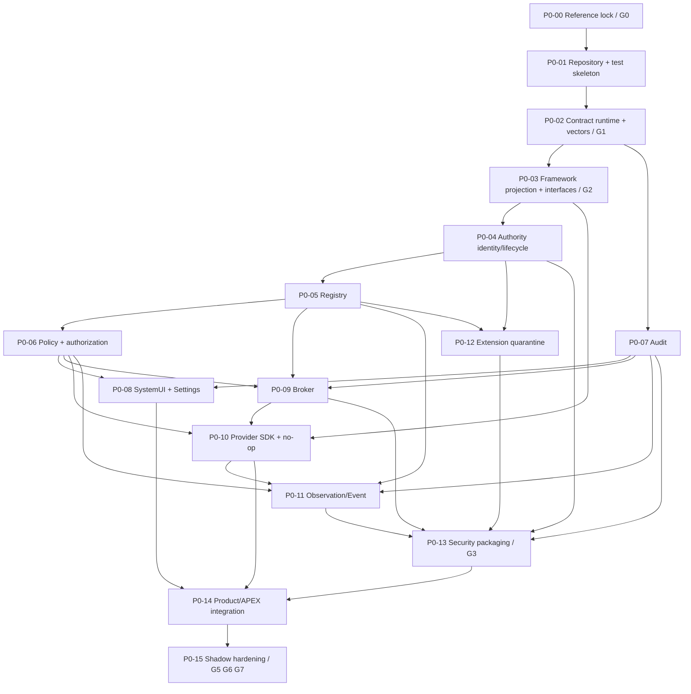

# P0 Implementation Dependency Graph

This graph is normative for milestone readiness. Dotted relationships represent
parallel work that must join before integration.

## Parallel lanes

- After G1: framework interface planning, Audit and SDK/Extension test-vector
  scaffolding may proceed in parallel.
- After P0-04: Registry and Audit may proceed independently.
- After Registry/Policy interface freeze: Broker, SystemUI/Settings, SDK,
  Observation and Extension teams may work against reviewed fakes.
- Security policy may be designed early but no final allow is added before the
  real endpoint/process/storage graph stabilizes.
- Packaging metadata may be prepared early but no product graph is installed
  before component G4 and G3.

Critical path:

`P0-00 -> P0-01 -> P0-02/G1 -> P0-03/G2 -> P0-04 -> P0-05 -> P0-06 ->
P0-09 -> P0-13/G3 -> P0-14 -> P0-15/G7`

